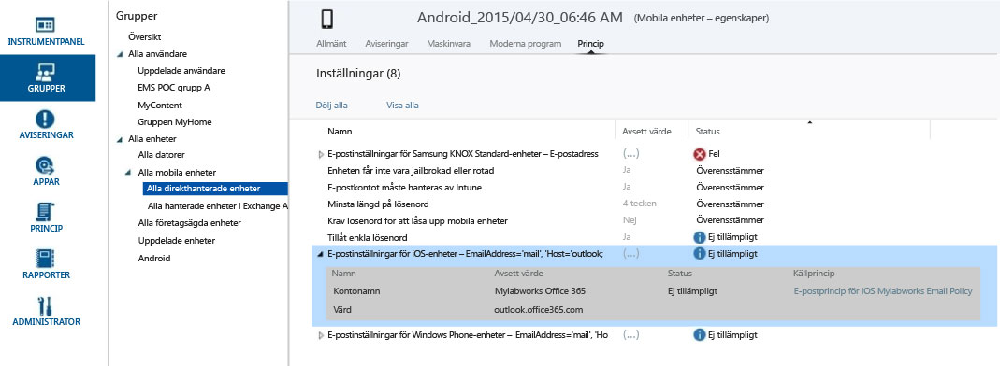

---
# required metadata

title: Felsökningsprinciper | Microsoft Intune
description:
keywords:
author: Nbigman
manager: jeffgilb
ms.date: 04/28/2016
ms.topic: article
ms.prod:
ms.service: microsoft-intune
ms.technology:
ms.assetid: 99fb6db6-21c5-46cd-980d-50f063ab8ab8

# optional metadata

#ROBOTS:
#audience:
#ms.devlang:
ms.reviewer: jeffgilb
ms.suite: ems
#ms.tgt_pltfrm:
#ms.custom:

---

# Felsökningsprinciper i Microsoft Intune

Det här avsnittet innehåller information om problem relaterade till din Microsoft Intune-principkonfiguration samt information om hur du felsöker dessa problem.

Om du inte lyckas lösa problemet med hjälp av den här informationen läser du [Ta reda på hur du kan få support för Microsoft Intune](how-to-get-support-for-microsoft-intune.md), som beskriver hur du kan få hjälp på fler sätt.

## Tillämpas principen för enheten?
**Problem:** Det är oklart om en viss princip används för en enhet eller så beter sig en enhet på ett sätt som strider mot en princip.

Kontrollera den principinformation som är tillgänglig för varje enhet för att förstå hur  en princip påverkar en viss enhet.

I Intune-administratörskonsolen har varje enhet en principflik under **Egenskaper för enhet**. Om så inte är fallet kan enheten fortfarande hålla på att registrera eller kanske inte har några principer som tillämpas. Varje princip har ett **Avsett värde** och en **Status**. Det avsedda värdet är vad du hade för avsikt att uppnå när du tilldelade principen. Statusen är vad som i själva verket har uppnåtts när samtliga principer som gäller för enheten och de begränsningar och krav som gäller för maskinvara och operativsystem bedöms tillsammans. Möjliga statusar:

-   **Överensstämmer**: Enheten har tagit emot principen och rapporterar till tjänsten att den överensstämmer med inställningen.

-   **Inte tillämpligt**: Principinställningen är inte tillämplig. Till exempel kan e-postinställningar för iOS-enheter inte tillämpas för en Android-enhet.

-   **Väntar**: Principen skickades till enheten men har inte rapporterat statusen till tjänsten. Exempelvis kräver kryptering på Android att användaren aktiverar kryptering och kan därför vara ”väntande”.

På skärmbilden nedan ser du två tydliga exempel:

-   **Tillåt enkla lösenord** har getts värdet **Ja**, vilket kan ses i kolumnen **Avsett värde** , men dess **Status** är **Saknas**. Detta beror på det faktum att enkla lösenord inte stöds för Android-enheter.

-   Den utökade principposten **E-postinställningar för iOS-enheter** tillämpas inte heller på den här enheten, eftersom det är en Android-enhet.

> Kom ihåg att om två principer med olika begränsningsnivåer tillämpas på samma enhet eller användare, så tillämpas i praktiken den mer restriktiva principen.

## Uppdateringsintervall för principer
Tänk på att principer uppdateras enligt regelbundna intervall. I allmänhet ska principer registreras på enheter inom 15 minuter från ändringen. Här finns mer information om regelbundna intervall för principuppdatering:

-   **Windows-enhet registrerad för MDM**: Åtgärden utlöses av en schemalagd aktivitet kl. 03:00 lokal tid på enheten och utförs varje dag.

-   **Windows Phone**: Principen uppdateras var åttonde timme. Detta kan framtvingas av en uppdatering på företagsportalen, under **Inställningar**

-   **iOS**: Principen uppdateras en gång om dagen med ett slumpmässigt tidsintervall. Detta kan också framtvingas genom att du öppnar företagsportalen, markerar enheten och klickar på **Synkronisera**

-   **Android**: Principen uppdateras en gång om dagen med ett slumpmässigt tidsintervall. Detta kan också framtvingas genom att du öppnar företagsportalen, markerar enheten och klickar på **Synkronisera**

## Principrelaterade Microsoft Intune-fel i policyplatform.log
För icke-MDM Windows-enheter kan principfel i filen policyplatform.log bero på att andra inställningar än standardinställningarna används i Windows User Account Control (UAC) på enheten. Andra inställningar än UAC-standardinställningarna kan påverka Microsoft Intune-klientinstallationer och principkörning.

### Så här löser du problem i UAC

1.  Återkalla datorn genom att följa anvisningarna i [Dra tillbaka enheter från hantering i Microsoft Intune](/intune/deploy-use/retire-devices-from-microsoft-intune-management)

2.  Vänta 20 minuter tills klientprogrammet har tagits bort.

    > Försök inte att ta bort klienten från Program och funktioner.

3.  Skriv **UAC** på startmenyn för att öppna inställningarna för User Account Control.

4.  Dra meddelandereglaget till standardinställningen.

## Fel 0x87D1FDE8 för KNOX-enheter
**Problem**: Efter att en Exchange Active Sync-e-postprofil  har skapats och distribuerats för Samsung KNOX för olika Android-enheter rapporterar de felet **0x87D1FDE8** eller **Reparationen misslyckades** på fliken Egenskaper &gt; Princip på enheten.

Granska konfigurationen av din EAS-profil för Samsung KNOX och källprincipen. Synkroniseringsalternativet för Samsung Note stöds inte längre och det alternativet bör inte väljas i din profil. Se till att enheterna har fått tillräckligt med tid för att behandla principen, upp till 24 timmar.

## Avisering: Det gick inte att spara åtkomstregler i Exchange
**Problem**: Du får aviseringen **Det gick inte att spara åtkomstregler i Exchange**  i administrationskonsolen.

Om du har skapat principer på arbetsytan Exchange On-premises-princip under administrationskonsolen men använder O365, tillämpas inte de konfigurerade principinställningarna av Intune. Observera principkällan från aviseringen.  Ta bort de gamla reglerna under arbetsytan för Exchange On-premises-princip då dessa är globala Exchange-regler i Intune för lokal Exchange och inte är relevanta för O365. Skapa sedan en ny princip för O365.

## Fel: Det går inte att hämta värdet från datorn, 0x80041013
Detta kan inträffa om tiden på det lokala systemet är felsynkroniserat med fem minuter eller mer. Om tiden på den lokala datorn inte är rätt synkroniserad misslyckas säkra transaktioner eftersom tidsstämplarna blir ogiltiga.

Du löser problemet genom att ange en tid i det lokala systemet så nära Internettiden som möjligt, eller genom att ange tiden på domänkontrollanterna i nätverket.

## Det går inte att ändra säkerhetsprincip för olika MDM-enheter
Windows Phone och Windows RT-enheter tillåter inte att säkerheten minskas för säkerhetsprinciper som har ställts in via MDM eller EAS när de väl har ställts in. Som om du exempelvis ställer in **minsta antalet tecken för lösenord** till 8 och sedan försöker att minska det till 4. Den mer restriktiva principen har redan tillämpats för enheten.

Du kan, beroende på enhetsplattform, vara tvungen att återställa säkerhetsprinciperna om du vill ändra principen till ett mindre säkert värde.
I Windows RT sveper du till exempel från höger på skrivbordet för att öppna menyraden för **snabbknapparna** och klickar på **Inställningar** &gt; **Kontrollpanelen**.  Välj appleten **Användarkonton** .
I den vänstra navigeringsmenyn finns länken **Återställ säkerhetsprinciper** längst ned. Klicka på den och klicka sedan på knappen **Återställ principer** .
Andra MDM-enheter, som Android, Windows Phone 8.1 och senare och iOS, kan behöva dras tillbaka och sedan registreras på nytt för tjänsten för att du ska kunna tillämpa en mindre begränsande princip.

## Android-enheter framtvingar inte säkerhetsprincipsändringar utan slutanvändarens godkännande
Android MDM tillåter inte att tjänsten framtvingar initiala principändringar på enheter som andra plattformar gör. Detta beror på Android-funktionerna och är inte relaterat till Intune-tjänsten. Android-enheter uppmanar slutanvändaren via meddelandefönstret för den relaterade principändringen (d.v.s. lösenord, kryptering osv.).  Slutanvändaren måste svara på uppmaningen och när principen har godkänts ska den tillämpas.

## Det går inte att skapa en princip eller registrera klienter om företagets namn innehåller specialtecken
**Problem:** Du kan inte skapa en princip eller registrera klienter.

**Lösning:** I [administrationscenter för Office 365](https://portal.office.com/) tar du bort specialtecknen från företagets namn och sparar företagsinformationen.

### Nästa steg
Om du inte lyckas lösa problemet med hjälp av den här felsökningsinformationen kontaktar du Microsoft Support. Mer information finns i [Ta reda på hur du kan få support för Microsoft Intune](how-to-get-support-for-microsoft-intune.md)

<!--HONumber=May16_HO2-->

