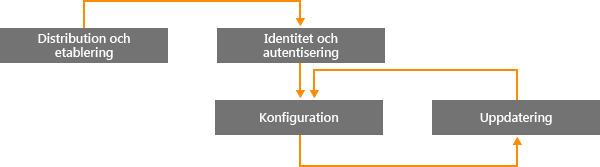
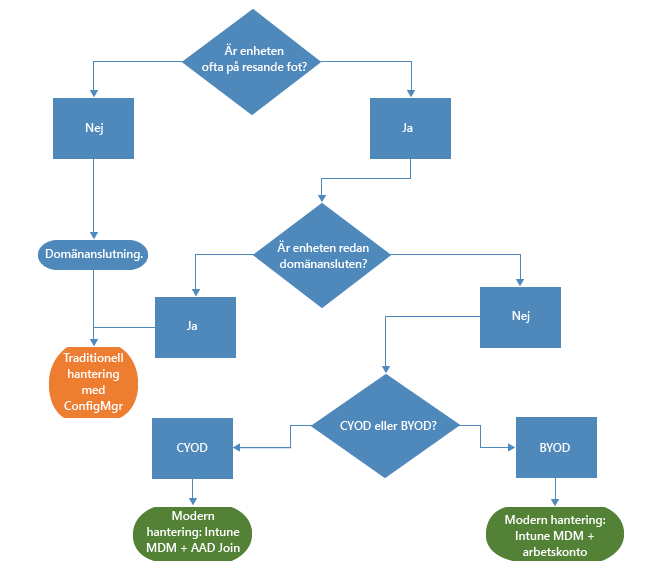
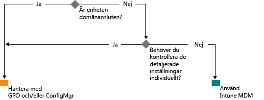

# En väg till modern Windowshantering med Microsoft Intune

Användning av personliga enheter för arbete och att anställda arbetar på andra platser än från kontoret ändrar hur organisationer hanterar enheter. Medan vissa delar av vissa organisationer kräver kontroll på detaljnivå över enheter, anammar andra organisationer enklare, scenariobaserad hantering som den moderna medarbetare vill ha.

Windows 10 fortsätter Windowstraditionen att tillhandahålla det bäst hanterade operativsystemet för organisationer. Windows har stöd för utvecklad hanterbarhet och säkerhet via tekniker som Grupprincip, Active Directory och System Center Configuration Manager. Det ger också en "mobil- och molnprioriterad" metod för förenklad, modern hantering med molnbaserade enhetshanteringslösningar som till exempel Microsoft Enterprise Mobility Suite (EMS). Framtida Windows-innovationer som levereras via Windows som en tjänst kompletteras med snabba molntjänster som Microsoft Intune, Azure Active Directory, Azure Rights Management Service, Office 365 och Windows Store för företag.

IT-organisationer har större flexibilitet och möjligheter att dra fördel av innovationer och besparingar. Det här dokumentet ger vägledning om strategier för att distribuera och hantera Windows 10. Det innehåller också information om Microsofts strategiska idéer om enhetshanteringsverktyg. Överväg följande fyra faser i en enhets livscykel när du funderar över grunderna för hantering och hur du vill använda dem på olika enheter:

## Distribuera och etablera

Till skillnad från vanlig OS-distributionen som kräver komplexa IT-åtgärder, öppnar modern enhetshantering dörren till "flexibel hantering". IT-avdelningen vill enkelt kunna omvandla nya enheter till fullständigt konfigurerade, fullständigt hanterade enheter, utan att behöva ta bort och installera om all programvara.  Dynamisk etablering är lättare än någonsin, gjort möjligt med molnbaserade enhetshanteringstjänster som Microsoft Intune. Du kan även skapa fristående etableringspaket som har byggts med Windows Imaging and Configuration Designer (ICD). Naturligtvis stöder vi fortfarande traditionella avbildningstekniker så att organisationer kan distribuera anpassade bilder med System Center Configuration Manager.

## Identitet och Autentisering

Windows 10 och tjänster som Azure Active Directory öppnar nya möjligheter för molnbaserad identitet, autentisering och hantering. Scenarier som BYOD och CYOD låter företag ompröva sina metoder för hur användare kommer åt företagets resurser och appar. Du kan tänka på det som att användare och enhetshantering passar in i dessa två kategorier:

- Företags- (CYOD) eller personliga (BYOD) enheter används av mobila användare för SaaS-appar som Office 365.

  Windows 10 låter anställda tillhandahålla enheter själva. Företagsenheter kan enkelt konfigurera företagsåtkomst med Azure AD Join. På samma sätt kan en ny, förenklad BYOD-upplevelse låta användarna lägga till sina arbetskonton i Windows och komma åt arbetsresurser genom sina personliga enheter. Om du kombinerar Azure AD Join och automatisk Intune MDM-registrering kan du låta enheter hamna i ett tillstånd där de hanteras av företaget med endast [ett enkelt steg](https://blogs.technet.microsoft.com/ad/2015/08/14/windows-10-azure-ad-and-microsoft-intune-automatic-mdm-enrollment-powered-by-the-cloud/), allt från molnet. Azure AD Join är också en bra lösning för tillfälligt anställda, partners och andra deltidsanställda. De här kontona kan hållas separata från det lokala AD-domänet men fortfarande ha åtkomst till de företagsresurser som behövs.
- Domänanslutna datorer och surfplattor som använder traditionella program och resurser som kräver autentisering eller åtkomst till mycket känslig eller klassificerade resurser lokalt

  Windows 10-enheter som är anslutna till ett lokalt Active Directory-domän kommer automatiskt att registreras i Azure AD så att användarna kan få ytterligare fördelar med Windows 10. Exempel på fördelar är enkel inloggning till lokala resurser och resurser i molnet från var som helst, företagsnätverksväxling av inställningar, Microsoft Passport for Work och Windows Hello. Domänanslutna datorer och surfplattor bör fortsätta att hanteras med System Center Configuration Manager-klienten eller en Grupprincip.

Granska rollerna i din organisation. Identifiera användare eller enheter som kräver domänanslutning och överväg att växla andra till Azure AD. Du kan läsa mer i [this article](https://azure.microsoft.com/en-us/documentation/articles/active-directory-azureadjoin-windows10-devices/) (den här artikeln) om hur Windows 10 och AD Azure optimerar åtkomst till arbetsresurser via en blandning av enheter och scenarier.

Här är ett exempel på hur ett generaliserat beslutsträd kan se ut så. Undantag finns naturligtvis i vissa fall.

## Inställningar och konfiguration

Den nivå av hantering som behövs, enheterna och data som hanteras samt alla branschkrav kan definiera konfigurationskraven. Anställda är ofta bekymrade över att IT-avdelningen tillämpar strikta principer för deras personliga enheter, men de vill ändå ha åtkomst till företagets e-post och dokument. Windows 10 ger en konsekvent uppsättning konfigurationer över datorer, surfplattor, och telefoner via ett gemensamt MDM-lager. MDM-metoden påkallar inställningar som uppfyller administratörens avsikt utan att exponera alla möjliga inställningar. I kontrast exponerar Grupprincip detaljerade inställningar som administratören kontroller individuellt. En fördel med MDM är att det gör det möjligt för administratören att tillämpa mer sekretess, säkerhet och programhanteringsinställningar via enklare och effektivare verktyg. Detta gör MDM det bästa valet för enheter som alltid är på resande fot.

Många organisationer behöver fortfarande hantera domänanslutna datorer på en detaljerad nivå, till exempel Internet Explorers 1500 konfigurerbara inställningar för grupprinciper eller mycket specifika regler för Windows-brandväggen. I dessa fall kan fortsätter Grupprincip och System Center Configuration Manager att vara utmärkta hanteringsval. Grupprincip är det bästa sättet att detaljerat konfigurera domänanslutna Windows-datorer och surfplattor som är anslutna till företagets nätverk med hjälp av Windows-baserade verktyg. Microsoft fortsätter att lägga till inställningarna för Grupprincip med varje ny version av Windows. För detaljerad konfiguration med robust programvarudistribution, Windows-uppdateringar och distribution av operativsystem förblir Configuration Manager den rekommenderade lösningen.

## Uppdatera Windows-enheter

Med Windows som en tjänst behöver IT-organisationer inte längre utföra komplexa processer för avbildning (rensa och läs) med varje ny Windows-version. Oavsett om du använder Current Branch (CB) eller Current Branch for Business (CBB) tar enheterna emot de senaste funktionerna och kvalitetsuppdateringarna via enkla, ofta automatiska, korrigeringsprocesser. MDM med Intune tillhandahåller verktyg för att tillämpa Windows-uppdateringar på klientdatorer i företaget. Configuration Manager gör det möjligt att utföra omfattande hantering och spårning av dessa uppdateringar, inklusive underhållsperioder och regler för automatisk distribution.

## Sammanfattning

När du tänker på hur du kan modernisera enhetshanteringen i din organisation tänk på de första stegen som du kan ta för att påbörja processen.

1. **Det finns investeringar som du kan göra redan i dag.** Vilka komponenter för traditionell hantering av enheter behöver du behålla och vad kan du modernisera? Om du vidtar åtgärder för att minimera anpassad avbildning, omvärdering av hantering av inställningar eller omvärderar autentisering och efterlevnad, kan det omedelbart löna sig.

2. **Utvärdera olika användningsärenden i din miljö.** Finns det grupper av enheter som skulle kunna dra fördel av lättare, förenklad hantering? Till exempel BYOD-enheter är naturliga kandidater för molnbaserad hantering. Användare eller enheter som hanterar mycket reglerad data kan kräva lokala AD-domän för autentisering. Configuration Manager och EMS tillhandahåller flexibilitet för implementering av moderna hanteringsscenarier och riktar sig till olika enheter på det sätt som bäst passar din verksamhet. Valet är ditt.

## Vad jag bör göra härnäst

- **Utvärdera hanteringsbehoven i din miljö.** En lösning kanske inte passar alla dina behov beroende på personer, deras rörlighet, enheterna och de data som de har åtkomst till.
- **Tänk på kraven.** Med Windows 10 Configuration Manager och Enterprise Mobility Suite har du flexibiliteten att hantera avbildnings-, autentiserings-, inställnings- och hanteringsverktyg för alla scenarion.
- **Ta små steg.** Övergången till modern enhetshantering behöver inte vara förändring som sker över en natt.
- **Optimera dina befintliga investeringar.** På vägen från traditionell, lokal hantering till modern, molnbaserad hantering kan du utnyttja den flexibla hybridarkitekturen i Configuration Manager och Intune. I takt med att ytterligare funktioner blir tillgängliga i moln-identitet/MDM-modellen, strävar Microsoft efter att tillhandahålla en enkel process från traditionell till modern hantering.

<!--HONumber=Sep16_HO2-->

