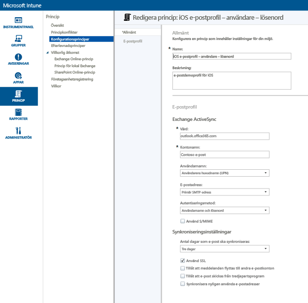
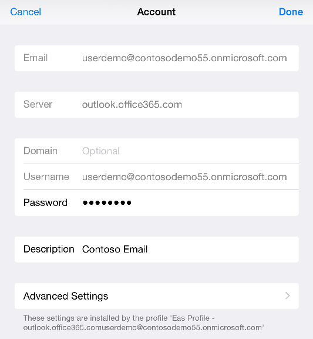
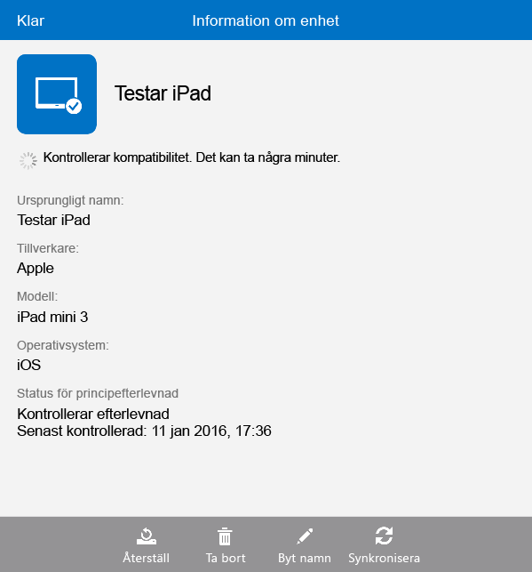

# Konfigurera e-poståtkomst för iOS-enheter med Microsoft Intune
När enheterna har registrerats med Intune kan du konfigurera dem så att användarna kan komma åt företagets e-post. Ett sätt att göra det för specifika enhetstyper är att skapa och distribuera en **e-postprofil**. E-postprofiler är en typ av Intune-princip som ställer in och ansluter en användares enhet till ditt företags e-posttjänst.
Med en e-postprofil blir e-poståtkomsten automatisk för registrerade enheter, vilket gör att du slipper konfigurera enheten manuellt. En e-postprofil ser dessutom till att alla slutanvändare konfigurerar åtkomsten på samma sätt och med samma grundläggande inställningar.

## Mål med den här genomgången

- Så här skapar du och distribuerar en e-postprofil för iOS-enheter
- Så här kontrollerar du att principen för e-postprofiler har tillämpats korrekt

## Vad du behöver innan du börjar den här genomgången

- En Exchange-server, antingen lokal eller värdbaserad i Azure som en del av din Office-/E3-prenumeration.
- Värdnamnet för ditt företags Exchange-server. Detta är det fullständigt kvalificerade domännamnet (FQDN), till exempel **contosodemo55.onmicrosoft.com**.
- En användargrupp som e-postprofilen ska distribueras till. Om du har slutfört genomgången [Starta en utvärdering av Microsoft Intune och distribuera PIN-principen för iOS](start-a-microsoft-intune-trial-and-deploy-ios-pin-policy.md) kan du använda den **GroupDemo**-användargrupp som du skapade då.
- Registrerade iOS-enheter som du ska distribuera profilen till. Om du har slutfört genomgången [Starta en utvärdering av Microsoft Intune och distribuera PIN-principen för iOS](start-a-microsoft-intune-trial-and-deploy-ios-pin-policy.md) har du redan registrerat några iOS-enheter.

## Stegvisa anvisningar för att skapa och distribuera en e-postprofil för iOS-enheter

I den här genomgången ska vi använda den värdbaserade Exchange-servern som medföljer en utvärderingsprenumeration.
1. I Intune-administrationskonsolen klickar du på **Princip** och sedan på **Lägg till princip**.

2. Expandera **iOS** i dialogrutan **Skapa en ny princip**, välj **E-postprofil** och klicka sedan på **Skapa princip**.

3. På sidan Skapa princip anger du ett namn för principen, t.ex. **E-postprofil för iOS – användarlösenord** och en beskrivning. Du kan ha flera e-postprofiler för olika enhetstyper och olika autentiseringsmetoder och använda namnet för att indikera vad profilen gäller.
4. Ange värdnamnet för Exchange. Eftersom vi använder Exchange-servern i Azure skriver vi bara följande som värdnamn: **outlook.office365.com**

5. Ange det kontonamn som ska visas för användare av enheten så att det blir lättare för dem att identifiera e-posttjänsten. Till exempel **E-post för Contoso**.
6. Eftersom vi använder användarnamn och lösenord för att autentisera användaren för Exchange-tjänsten lämnar du bara inställningarna för användarnamn och lösenord som de är.
7. Justera synkroniseringsinställningarna efter behov. Använd bara standardvärdena för tillfället, om det inte finns en specifik inställning som du vill ändra.  
8. Klicka på **Spara princip**.
9. En dialogruta visas där du tillfrågas om du vill distribuera principen nu. Klicka på **Ja**.

10. Välj den grupp som du vill distribuera e-postprofilen till i fönstret som visas, klicka på **Lägg till** och sedan på **OK**.
 När du klickar på **OK** börjar principen flöda till registrerade enheter efter en minut eller två.

## Så här kontrollerar du att profilen har tillämpats

Om du vill kontrollera att profilen har installerats behöver du åtkomst till någon av de enheter som du har distribuerat e-postprofilen till.
1. Öppna appen E-post på iOS-enheten.
Du uppmanas att ange användarens användarnamn och lösenord för e-post.

2. Ange användarnamnet och lösenordet för användarens Exchange-e-postkonto och tryck på **OK**.
 E-postappen öppnas under Exchange-kontot och e-posten börjar synkroniseras till enheten.

3. Gå till kontoinställningarna för e-postappen och kontrollera att kontonamnet är samma som det namn du angav i e-postprofilen (t.ex. **E-post för Contoso**) och att synkroniseringsinställningarna är rätt inställda.

 Om det verkar som e-postprofilen inte har tillämpats automatiskt på enheten kan du tillämpa principen manuellt via företagsportalappen på enheten.
1. Öppna företagsportalappen.
2. Tryck på **Mina enheter**.
3. Tryck på namnet på din enhet.

4. Tryck på **Synkronisera** > **Kontrollera efterlevnad**.
 Efter en liten stund tillämpas e-postprofilen på enheten. Därefter kan du följa verifieringsstegen för att kontrollera att profilen har tillämpats korrekt.

## Se även
[Utvärderingsguiden för Intune](get-started-with-a-30-day-trial-of-microsoft-intune.md)

<!--HONumber=Jun16_HO4-->

