---
# required metadata

title: Starta en utvärdering av Microsoft Intune och distribuera en PIN-princip för iOS | Microsoft Intune
description:
keywords:
author: Staciebarker
manager: jeffgilb
ms.date: 04/28/2016
ms.topic: article
ms.prod:
ms.service: microsoft-intune
ms.technology:
ms.assetid: 06cb9a73-0f17-44b3-b334-86c98020316e

# optional metadata

#ROBOTS:
#audience:
#ms.devlang:
ms.reviewer: jeffgilb
ms.suite: ems
#ms.tgt_pltfrm:
#ms.custom:

---

# Starta en utvärdering av Microsoft Intune och distribuera PIN-principen för iOS
Dessa stegvisa anvisningar hjälper dig att konfigurera en Intune-utvärdering och att konfigurera en PIN-princip för iOS-enheter. En lista över andra vanliga Intune-utvärderingsaktiviteter som du kan prova finns i [Vanliga Microsoft Intune-utvärderingsaktiviteter](common-microsoft-intune-evaluation-tasks.md)

## Granska kraven för den här aktiviteten

-   Windows-dator med Internet Explorer – för att utföra administrativa uppgifter

-   iOS 7.1 eller senare enhet för att testa verifieringen av användarprinciper

-   Telefonnummer för att autentisera dig under utvärderingsregistreringen

## Skapa ett kostnadsfritt utvärderingskonto för Intune
> Om du redan har en Intune-prenumeration hoppar du över det här avsnittet och går till nästa avsnitt.

1.  På en Windows-dator högerklickar du på **Internet Explorer** (IE) och väljer **InPrivate-surfning**

    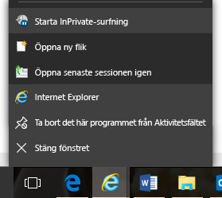

2.  Gå till [registreringsportalen för Intune](https://portal.office.com/Signup/Signup.aspx?OfferId=40BE278A-DFD1-470a-9EF7-9F2596EA7FF9&dl=INTUNE_A&ali=1), ange den begärda informationen och klicka på **Nästa**.

    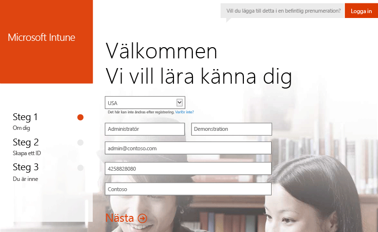

3.  Ange ett användar-ID och lösenord för administratörskontot och klicka sedan på **Nästa**. Du ska använda det här ID:t för att logga in på Intune-portalen där du kan utföra dina administratörsuppgifter.

    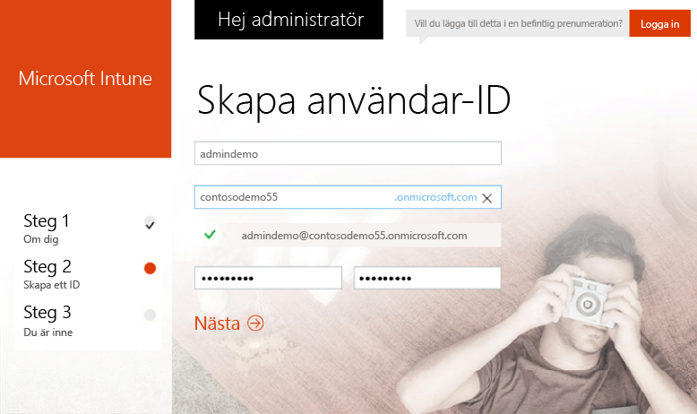

4.  Ange ditt mobiltelefonnummer och klicka på **SMS:a mig** för att verifiera ditt nummer.

    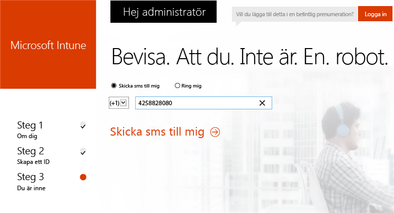

5.  Spara informationen som visas på skärmen och klicka sedan på **Allt är klart**.

    

## Skapa en testanvändare

1.  På en Windows-dator klickar du på **Starta** för att gå till sidan för användarhantering.

    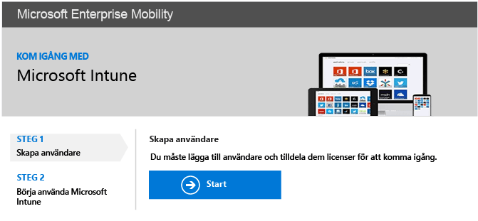

2.  Klicka på knappen **+** för att lägga till en användare.

    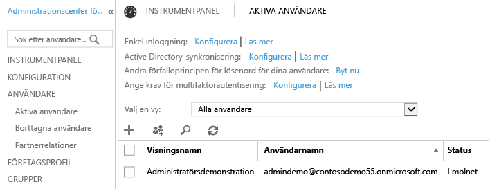

3.  På sidan **Skapa nytt användarkonto**:

    1.  Ange information om testanvändaren.

    2.  Välj alternativet **Ange lösenordet**.

    3.  Avmarkera kryssrutan **Användaren måste byta lösenord vid nästa inloggning**.

    4.  Klicka på **Skapa**

    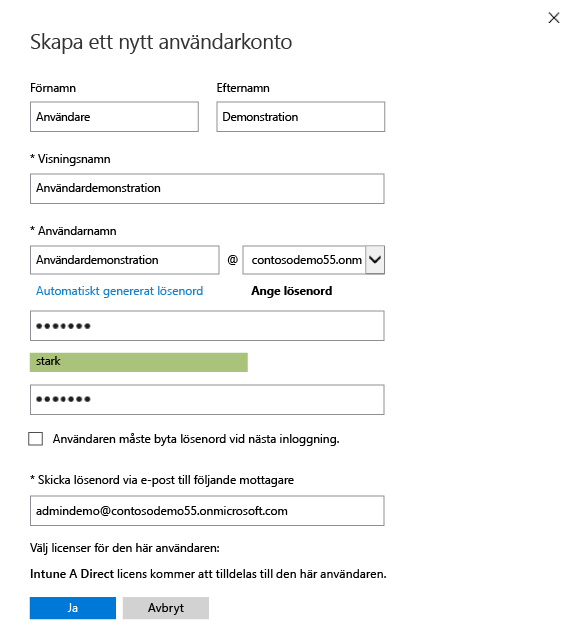

4.  Klicka på **Stäng** på bekräftelsesidan

    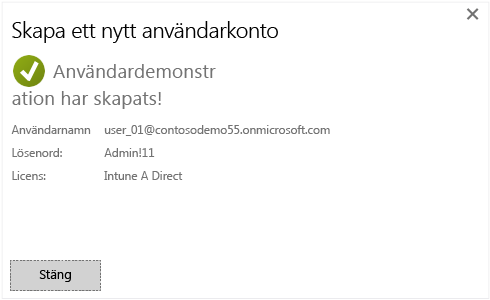

5.  Klicka på **Uppdatera** för att visa testanvändaren som du skapat.

    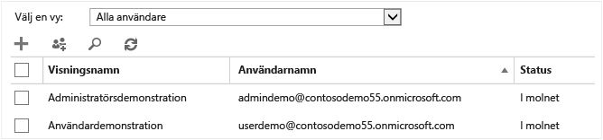

## Konfigurera en PIN-princip för iOS för testanvändaren

1.  På en Windows-dator anger du Intune som MDM-utfärdare:

    1.  Gå till [Intune-hanteringskonsolen](http://manage.microsoft.com/), logga in med ditt administratörskonto och klicka på **Börja hantera mobila enheter**. Sidan Utfärdare av Hantering av mobila enheter öppnas.

        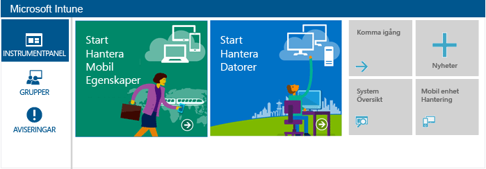

    2.  Klicka på länken **Ange utfärdare för hantering av mobila enheter**.

        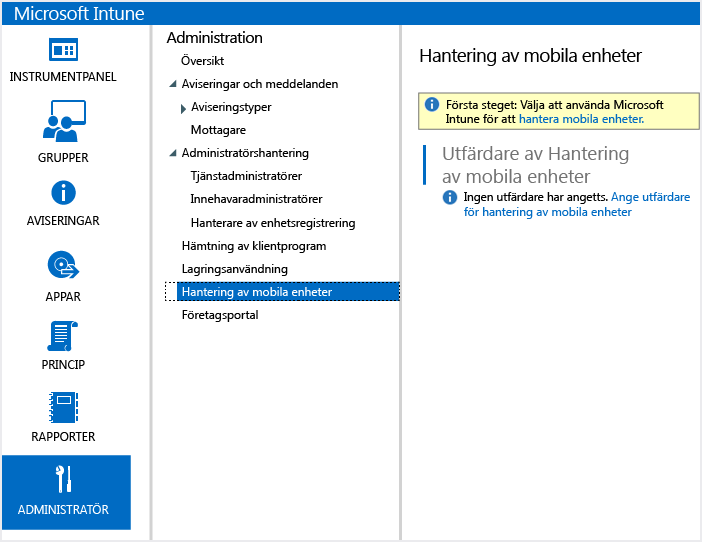

2.  Aktivera iOS-enheter för registrering. Den här processen ställer in ett betrott certifikat mellan Apple Push Notification Service (APNs) och din Intune-prenumeration.

    1.  Klicka på **Aktivera iOS- och Mac OS X-plattformen**

        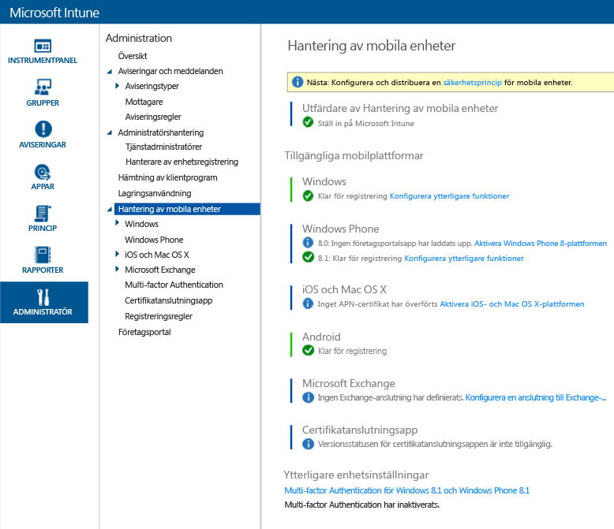

    2.  Klicka på **Hämta begäran om APN-certifikat**

        

    3.  Ange ett filnamn och en plats för certifikatsigneringsförfrågan och klicka på **Spara**. Den här filen innehåller den offentliga nyckeln som motsvarar en privat nyckel som innehas av Intune-prenumerationen.

        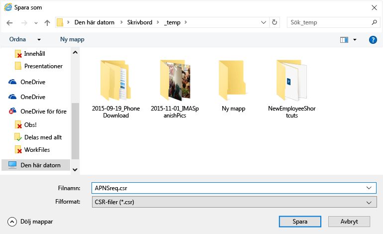

    4.  Öppna en ny flik genom att klicka på **Apple Push Certificates-portalen**.

        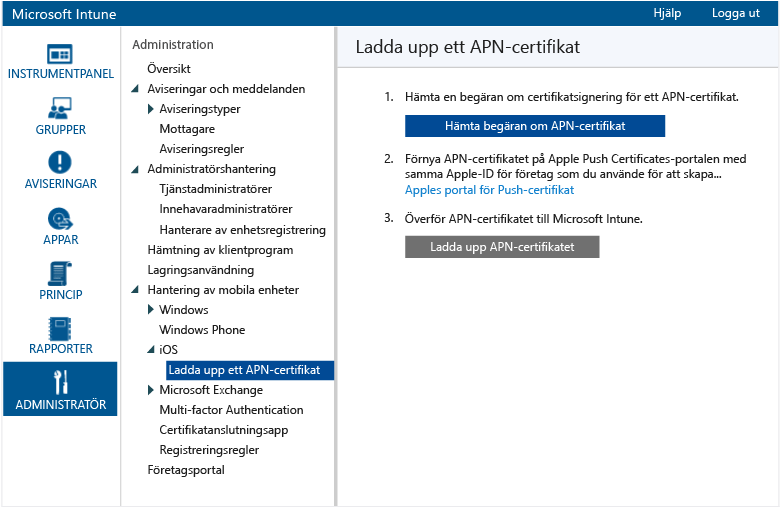

    5.  Ange ditt Apple-ID och lösenord och klicka på **Logga in**. Det här ID:t kan vara det som du använder på din iOS-enhet för att hämta appar från iOS App Store.

        

    6.  Klicka på **Skapa ett certifikat**

        

    7.  Läs Apples användningsvillkor, markera kryssrutan och klicka på **Acceptera**

        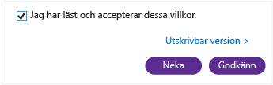

    8.  Klicka på **Bläddra**

        

    9. Välj CSR-filen som du sparade tidigare och klicka på **Öppna**

        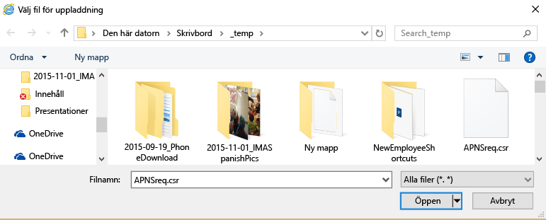

    10. Klicka på knappen **Ladda upp**.

        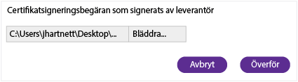

    11. När du uppmanas att hämta en JSON-fil klickar du på **Spara som**

        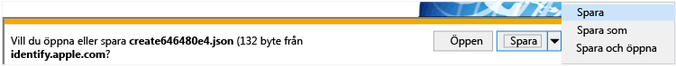

    12. Ange en plats för JSON-filen och klicka på **Spara**

        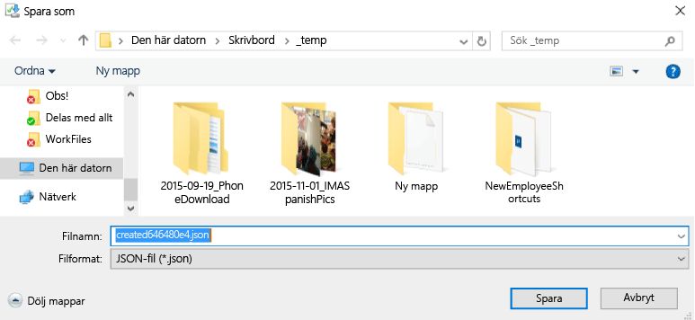

        Om du inte omdirigeras automatisk efter några sekunder klickar du på **Avbryt**

        

    13. Hämta den nya certifikatfilen genom att klicka på **Ladda ned**

        

    14. När du uppmanas att ladda ned en PEM-fil klickar du på **Spara som**

        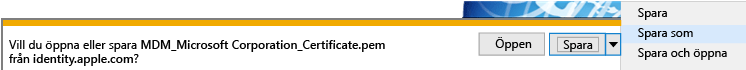

    15. Ange en plats för PEM-filen och klicka på **Spara**

        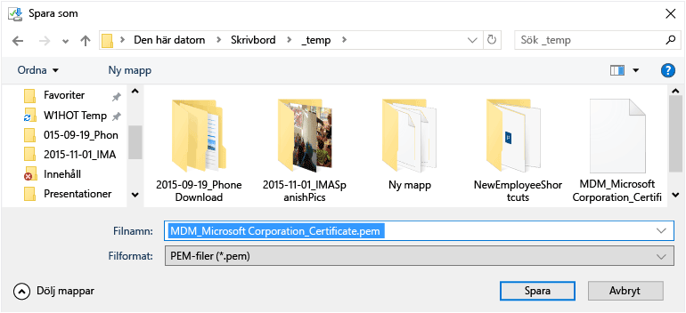

    16. Gå tillbaka till fliken för Intune-hanteringskonsolen och klicka på **Överför ett APN-certifikat**

        

    17. Ange ditt Apple-ID och klicka på **Bläddra**

        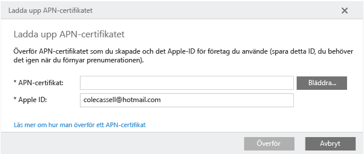

    18. Välj PEM-filen som du precis sparat och klicka på **Öppna**

        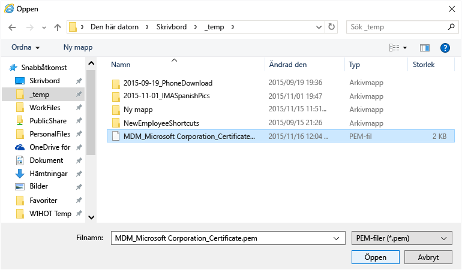

    19. Klicka på **Överför**

        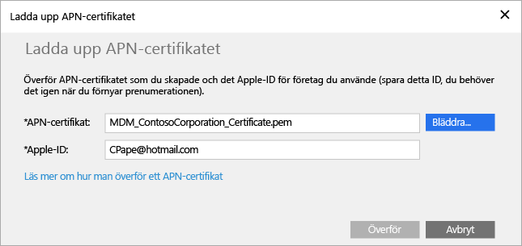

        Nu har ditt APN-certifikat konfigurerats.

        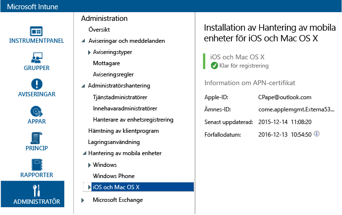

3.  Skapa en testanvändargrupp för riktad principtillämpning:

    1.  I den vänstra rutan klickar du på **Grupper**

        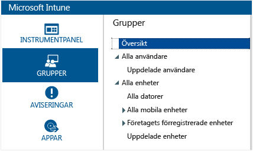

    2.  Längst till höger klickar du på **Skapa grupp**

        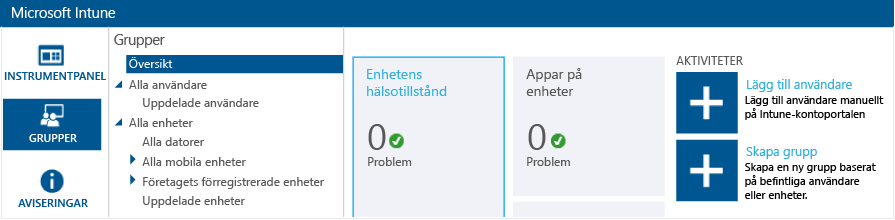

    3.  Ange ett gruppnamn, välj **Alla användare** som den överordnade gruppen och klicka på **Nästa**

        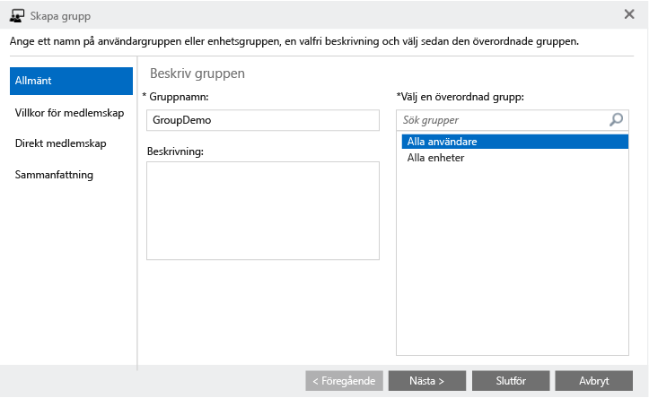

    4.  I fältet **Starta gruppmedlemskap med** väljer du **Alla användare i den överordnade gruppen** och klickar på **Slutför**

        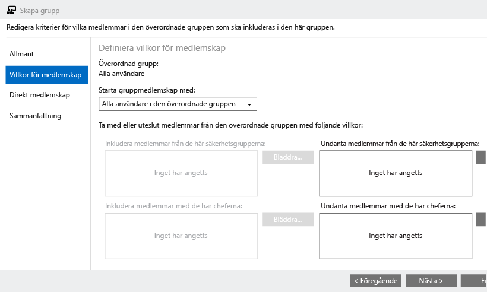

4.  Skapa en PIN-princip för iOS och aktivera den för testanvändargruppen:

    1.  I den vänstra rutan klickar du på **Princip**

        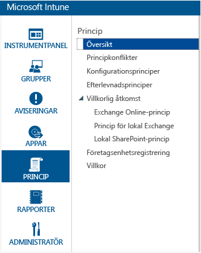

    2.  Längst till höger klickar du på **Lägg till princip**

        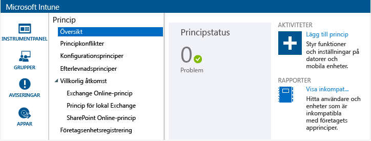

    3.  Expandera iOS-noden, välj raden **Allmän konfiguration** och klicka på **Skapa princip**

        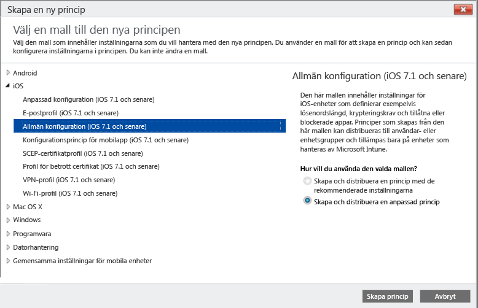

    4.  Ange ett namn för principen, aktivera alternativet **Kräv lösenord för att låsa upp mobila enheter** och ange **Minsta längd på lösenord** till **4**

        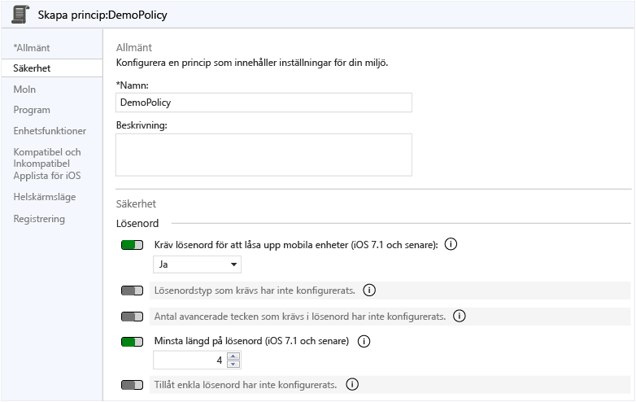

    5.  Distribuera principen genom att klicka på **Ja**.

        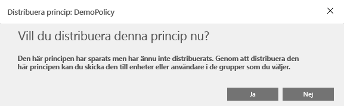

    6.  Klicka på användargruppen som du skapade tidigare, klicka på **Lägg till** och sedan på **OK**

        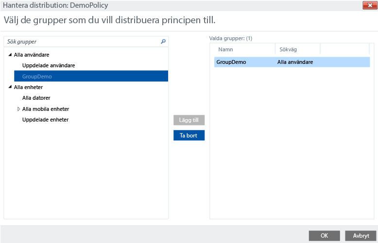

        Nu har du en PIN-princip för iOS som tillämpas på testanvändargruppen.

        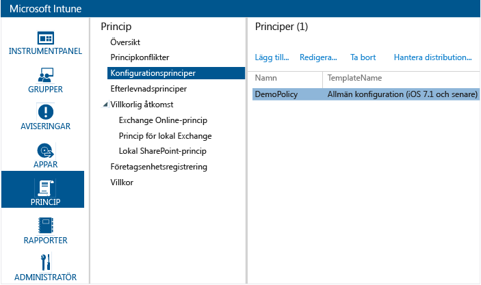

## Kontrollera att principen tillämpas på en iOS-enhet

1.  På en iPad startar du App Store för iOS och installerar den kostnadsfria appen **Microsoft Intune-företagsportal** och öppnar den.

    

2.  Ange namnet på ditt testanvändarkonto och tryck på **Logga in**

    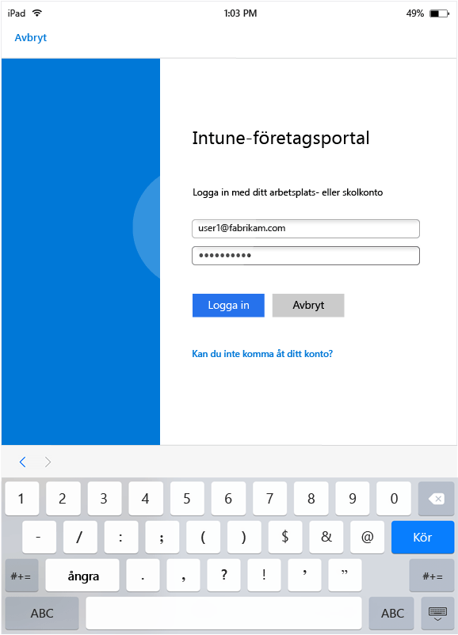

3.  Tryck på **Registrera** för att börja registrera enheten i Intune.

    

4.  Tryck på **Installera** på skärmen **Installera profil**

    

5.  Tryck på **Installera** i dialogrutan **Installera profil**

    

6.  Tryck på **Installera** på skärmen **Varning**

    

7.  Tryck på **Förtroende** i dialogrutan **Fjärrhantering**

    

8.  När hanteringsprofilen har installerats trycker du på **Klart**. Registreringen är klar.

    

9. När registreringen är klar trycker du på **OK** och stänger sedan företagsportalappen.

    

10. När du uppmanas att konfigurera ett lösenord trycker du på **Fortsätt**

    

11. Ange ditt lösenord, tryck på **Fortsätt**, ange lösenordet igen och tryck på **Spara**

    

12. Tryck på strömknappen för att låsa iPad-enheten och dra sedan för att låsa upp den. Som du ser måste du nu ange ditt lösenord för att låsa upp enheten.

### Se även
[Utvärderingsguiden för Intune](get-started-with-a-30-day-trial-of-microsoft-intune.md)

<!--HONumber=May16_HO2-->

