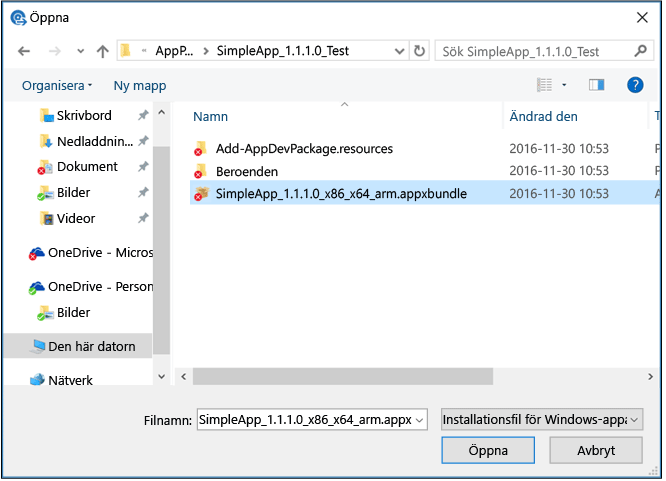

# Lägg till appar med Microsoft Intune

[!INCLUDE[classic-portal](../includes/classic-portal.md)]

Innan du börjar distribuera appar med Microsoft Intune är det bra om du bekantar dig med de olika begreppen i det här avsnittet. Det hjälper dig att förstå vilka appar som du kan distribuera till vilken plattform. Det hjälper dig också att förstå de krav som måste vara uppfyllda innan du börjar distribuera appar.

## Apptyper som du kan distribuera

### Installationsprogram för programvara

|Typ av app|Information|
|----------------|-------|
|**Windows Installer (&#42;.exe, &#42;.msi)**|Den här typen av app måste ha stöd för obevakad installation utan användarindata. Dokumentationen till din app ska innehålla relevanta kommandoradsalternativ för obevakad installation av appen (t.ex. **/q**). En lista över vanliga kommandoradsalternativ finns i [Kommandoradsväxlar för Microsoft Windows Installer-verktyget](https://support.microsoft.com/en-us/kb/227091).  Alla eventuella ytterligare filer och mappar som krävs för appens installationsprogram måste vara tillgängliga från den plats som du anger för appens installationsfiler.  I de flesta fall kräver inte Windows Installer-filer (.msi) eller Windows Installer Patch-filer (.msp) att Intune installerar några kommandoradsargument. Läs dokumentationen till din app.  Om det krävs kommandoradsargument måste de anges som Name=Value pairs (t.ex. TRANSFORMS=custom_transform.mst).|
|**Appaket för Android (&#42;.apk)**|För att kunna distribuera Android-appar måste du ha ett giltigt APK-paket.|
|**Appaket för iOS (&#42;.ipa)**|Om du vill distribuera iOS-appar måste du ha ett giltigt IPA-paket.  IPA-paketet måste ha signerats av Apple och det utgångsdatum som anges i etableringsprofilen måste vara giltigt. Intune kan distribuera iOS-appar med företagscertifikat  Inte alla Apple-utvecklarcertifikatsappar stöds.  Ditt företag måste vara registrerat för iOS Developer Enterprise-programmet.  Kontrollera att din organisations brandvägg tillåter åtkomst till iOS-etablerings- och certifieringswebbplatserna.  Du behöver inte distribuera en manifestfil (.plist) med appen.|
|**Appaket för Windows Phone (&#42;.xap, .appx, .appxbundle)**|För att kunna distribuera appar behöver du ett företagskodsigneringscertifikat för mobila enheter. Mer information finns i [Konfigurera hantering av Windows Phone med Microsoft Intune](set-up-windows-phone-management-with-microsoft-intune.md).|
|**Windows-app-paket (.appx, .appxbundle)**|För att kunna distribuera appar behöver du ett företagskodsigneringscertifikat för mobila enheter. Mer information finns i [Konfigurera hantering av Windows-enheter med Microsoft Intune](set-up-windows-device-management-with-microsoft-intune.md).|
|**Windows Installer via MDM (&#42;.msi)**|Med den här appen kan du skapa och distribuera Windows Installer-baserade appar till registrerade datorer som kör Windows 10. Dessa datorer hanteras via hantering av mobila enheter (MDM).  Du kan bara överföra en enstaka fil med filnamnstillägget .msi.  Filens produktkod och produktversion används för appidentifiering.  Appens standardbeteende för omstart används. Intune styr inte det här.  MSI-paket per användare installeras för en enskild användare.  MSI-paket per dator installeras för alla användare på enheten.  MSI-paket för dubbla lägen installeras för närvarande endast för alla användare på enheten.  Appuppdateringar stöds om MSI-produktkoden för respektive version är densamma. 
Alla typer av programinstallationsappar överförs till ditt molnlagringsutrymme.

### **Extern länk**
Använd en extern länk om du har en:
- URL som låter användarna ladda ned en app från en appbutik.
- Länk till en webbaserad app som körs från webbläsaren.

Appar som är baserade på externa länkar lagras inte i Intune-molnlagringsutrymmet.
### **Hanterade iOS-appar från App Store**
Du kan använda hanterade iOS-appar till att hantera och distribuera kostnadsfria iOS-appar från App Store. Och även till att associera [hanteringsprinciper för mobila program](configure-and-deploy-mobile-application-management-policies-in-the-microsoft-intune-console.md) med [kompatibla appar](https://www.microsoft.com/en-us/server-cloud/products/microsoft-intune/partners.aspx) och granska deras status i administratörskonsolen.  Hanterade iOS-appar lagras inte i ditt Intune-molnlagringsutrymme.

> [!TIP]
> Alternativ för mobila enheter är inte tillgängliga förrän du [anger Intune som MDM-utfärdare](prerequisites-for-enrollment.md).

## Intune-programvaruutgivare
Microsoft Intune programvaruutgivare startar när du lägger till eller ändrar appar från Intune-administratörskonsolen. Från utgivaren väljer du en typ av installationsprogram som gör något av följande:

- Överför appar (program för datorer eller appar för mobila enheter) som ska lagras i Intunes molnlagring.
- Länkar till en onlinebutik eller ett webbprogram.

Innan du börjar använda programvaruutgivaren måste du installera den kompletta versionen av [Microsoft .NET Framework 4.0](https://www.microsoft.com/download/details.aspx?id=17851). Efter att du har installerat .NET Framework måste du starta om innan programvaruutgivaren kan starta korrekt.

## Molnlagringsutrymme
Alla appar som du skapar med installationstypen Programinstallation (till exempel en verksamhetsspecifik app) måste paketeras och överföras till Microsoft Intunes molnlagring. En utvärderingsprenumeration på Intune inkluderar 2 GB molnbaserad lagring som används för att lagra hanterade appar och uppdateringar. 20 GB lagringsutrymme ingår i den fullständiga prenumerationen.

Du kan se hur mycket utrymme som du använder i noden **Lagringsanvändning** i arbetsytan **Admin**. Du kan köpa ytterligare lagringsutrymme för Intune med din ursprungliga köpmetod.  Om du betalade via faktura eller med kreditkort besöker du [prenumerationshanteringsportalen](https://portal.office.com/adminportal/home?switchtomodern=true#/subscriptions).  Annars kontaktar du din partner eller säljrepresentant.

Krav för lagringsutrymme i molnet:

-   Alla appinstallationsfiler måste finnas i samma mapp.
-   Den maximala filstorleken för en fil som du överför är 2 GB.

## Stöd för UWP-appar (Universal Windows Platform)
Windows 10-datorer kräver inte en nyckel för att installera verksamhetsspecifika appar. Dock måste registernyckeln **HKEY_LOCAL_MACHINE\Software\Policies\Microsoft\Windows\Appx\AllowAllTrustedApps** ha värdet **1** för att aktivera separat inläsning.

Om registernyckeln inte är konfigurerad ställer Intune automatiskt in värdet på **1** första gången du distribuerar en app till enheten. Om det här värdet anges till **0** kan Intune inte automatiskt ändra värdet och distributionen av verksamhetsspecifika appar kommer att misslyckas.

Verksamhetsspecifika appar för UWP måste vara signerade med ett kodsigneringscertifikat som är betrott på varje enhet där appen har distribuerats. Du kan använda ett certifikat från en intern infrastruktur för offentliga nycklar (PKI) eller ett certifikat från offentliga rotcertifikat från tredje part som har installerats på enheten.

På Windows 10 Mobile-enheter kan du använda ett icke-Symantec-kodsigneringscertifikat för att logga universella **.appx**-appar. För **.xap**-appar och även **.appx**-paket som skapats för Windows Phone 8.1 som du vill installera på Windows 10 Mobile-enheter måste du använda ett Symantec-kodsigneringscertifikat.

### Beroenden för UWP-appar

När du lägger till ett paket för Windows 10 Universal appxbundle till Intune, måste du också se till att alla beroenden för appen överförs.
Om du vill göra detta måste du kontrollera att mappen **Beroenden** som skapades när appen skapades är i samma mapp som filen .appxbundle.
När du överför appen till Intune, kommer filer i mappen **Beroenden** också att överföras. Följande skärmbild visar detta:

## Nästa steg

Du måste lägga till appar i Intune-konsolen innan du kan distribuera dem. Du kan lägga till appar för [registrerade enheter](add-apps-for-mobile-devices-in-microsoft-intune.md) eller för [Windows-datorer som du hanterar med Intune-klientprogrammet](add-apps-for-windows-pcs-in-microsoft-intune.md).

<!--HONumber=Feb17_HO2-->

