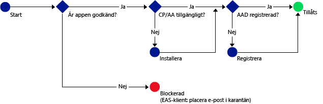

# Tillåt endast åtkomst till Office 365-tjänster för mobila appar som stöder Intunes MAM-principer
[Intunes hanteringsprinciper för mobilappar (MAM)](protect-apps-and-data-with-microsoft-intune.md) hjälper dig att skydda företagets data på enheter som är registrerade för hantering i Intune. Du kan även använda MAM-principer på **medarbetares enheter som inte har registrerats för hantering i Intune**.  Även om du inte hanterar enheten i det här fallet behöver du fortfarande se till att företagets data och resurser är skyddade. Men hjälp av villkorlig åtkomst för MAM (MAM CA) kan du skapa en princip som endast tillåter att mobila appar som stöder Intunes MAM-principer får åtkomst till O365-tjänster som Exchange Online.

Till exempel kan du genom att bara tillåta **Microsoft Outlook-appen** att få åtkomst till Exchange Online **blockera inbyggda e-postappar på iOS och Android**, som inte har dataskydd från Intune MAM-principer, från att hämta e-post från **Exchange Online**.

Diagrammet nedan illustrerar flödet som används av MAM-principer för att avgöra om åtkomst ska tillåtas eller blockeras: .

Beskrivning av förkortningarna som används i diagrammen:
* **CP**: Företagsportalappen
* **AA**: Azure Authenticator-appen
* **AAD**: Azure Active Directory
* **EAS**: Exchange Active Sync

## Förutsättningar
**Innan** du kan konfigurera MAM CA-principer måste du ha en **Enterprise Mobility + Security- eller Azure Active Directory Premium-prenumeration**, och användarna måste ha licens för EMS eller Azure AD. Mer information finns på [sidan med priser för Enterprise Mobility](https://www.microsoft.com/en-us/cloud-platform/enterprise-mobility-pricing) eller [sida med priser för Azure Active Directory](https://azure.microsoft.com/en-us/pricing/details/active-directory/).

## Appar som stöds
**Exchange Online**: **Microsoft Outlook** för Android och iOS.

Mer information om användarupplevelsen med en app som har MAM-principer finns i [Vad du kan förvänta dig när du använder en app med MAM CA](use-apps-with-mam-ca.md).

## Nästa steg
[Skapa en Exchange Online-princip för MAM-appar](mam-ca-for-exchange-online.md)

[Blockera appar som inte har modern autentisering](block-apps-with-no-modern-authentication.md)

### Se även

[Skydda appdata med MAM-principer](protect-app-data-using-mobile-app-management-policies-with-microsoft-intune.md)

<!--HONumber=Oct16_HO4-->

