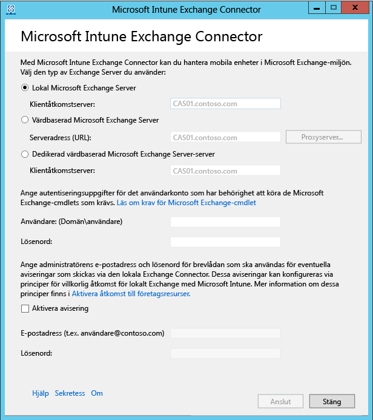

# Installera Intune On-premises Exchange Connector

[!INCLUDE[classic-portal](../includes/classic-portal.md)]

Om du vill skapa en anslutning som gör det möjligt för Microsoft Intune att kommunicera med Exchange-servern som är värd för postlådorna för de mobila enheterna måste du ladda ned och konfigurera den lokala Exchange Connector från Intunes administratörskonsol. Intune har endast stöd för en Exchange Connector-anslutning av valfri typ per prenumeration.

## Krav för den lokala Exchange Connector
Följande tabell innehåller kraven för datorn där du installerar den lokala Exchange Connector.

|Krav|Mer information|
|---------------|--------------------|
|Operativsystem|Intune stöder lokal Exchange Connector på datorer som kör någon utgåva av Windows Server 2008 SP2 64-bitars, Windows Server 2008 R2, Windows Server 2012 eller Windows Server 2012 R2.  Connector stöds inte i Server Core-installationer.|
|Microsoft Exchange|Lokala anslutningar kräver Microsoft Exchange 2010 SP1 eller senare, eller äldre Exchange Online Dedicated. Om du vill ta reda på om Exchange Online Dedicated-miljön har den **nya** eller **äldre** konfigurationen kontaktar du din kontoansvariga.|
|Utfärdare för hantering av mobila enheter| [Ange utfärdare för hantering av mobila enheter till Intune](prerequisites-for-enrollment.md#step-2-set-mdm-authority).|
|Maskinvara|Datorn där du installerar anslutningen måste ha en 1,6 GHz-processor med 2 GB RAM-minne och 10 GB ledigt diskutrymme.|
|Active Directory-synkronisering|Innan du kan använda Connector-anslutningen för att ansluta Intune till Exchange Server måste du [konfigurera Active Directory-synkronisering](/intune/get-started/start-with-a-paid-subscription-to-microsoft-intune-step-3) så att dina lokala användare och säkerhetsgrupper synkroniseras med din Azure Active Directory-instans.|
|Tilläggsprogramvara|En fullständig installation av Microsoft .NET Framework 4.5 och Windows PowerShell 2.0 måste installeras på den dator som är värd för anslutningen.|
|Nätverk|Datorn där du installerar anslutningen måste finnas i en domän som har en förtroenderelation till domänen som är värd för Exchange Server.  Datorn kräver konfigurationer för att kunna komma åt Intune-tjänsten genom brandväggar och proxyservrar via portarna 80 och 443. Exempel på domäner som används av Intune är manage.microsoft.com, &#42;manage.microsoft.com och &#42;.manage.microsoft.com.|

### Krav för Exchange-cmdlet

Du måste skapa ett Active Directory-användarkonto som används av Intune Exchange Connector. Kontot måste ha behörighet att köra följande obligatoriska Exchange för Windows PowerShell-cmdlets:

 -   Get-ActiveSyncOrganizationSettings, Set-ActiveSyncOrganizationSettings
 -   Get-CasMailbox, Set-CasMailbox
 -   Get-ActiveSyncMailboxPolicy, Set-ActiveSyncMailboxPolicy, New-ActiveSyncMailboxPolicy, Remove-ActiveSyncMailboxPolicy
 -   Get-ActiveSyncDeviceAccessRule, Set-ActiveSyncDeviceAccessRule, New-ActiveSyncDeviceAccessRule, Remove-ActiveSyncDeviceAccessRule
 -   Get-ActiveSyncDeviceStatistics
 -   Get-ActiveSyncDevice
 -   Get-ExchangeServer
 -   Get-ActiveSyncDeviceClass
 -   Get-Recipient
 -   Clear-ActiveSyncDevice, Remove-ActiveSyncDevice
 -   Set-ADServerSettings
 -   Get-Command

## Ladda ner programinstallationspaketet för den lokala Exchange Connector

1. I ett Windows Server-operativsystem som stöder den lokala Exchange Connector öppnar du [Microsoft Intune-administratörskonsolen](http://manage.microsoft.com) (http://manage.microsoft.com) med ett användarkonto som är en administratör i Exchange-klientorganisationen och som har en licens för att använda Exchange Server.

2.  I rutan med genvägar till arbetsytor väljer du **Admin**>**Hantering av mobila enheter** > **Microsoft Exchange**>**Installera Exchange Connection**.

3.  På sidan **Konfigurera Exchange-anslutning** väljer du **Hämta lokal anslutning**.

4.  Den lokala Exchange Connector finns i en komprimerad mapp (.zip) som kan öppnas eller sparas. I dialogrutan **Filhämtning** klickar du på **Spara** för att spara den komprimerade mappen på en säker plats.

> [!IMPORTANT]
> Byt inte namn på eller flytta filerna i mappen för den lokala Exchange Connector. Installationen misslyckas om du flyttar eller byter namn på mappens innehåll.

## Installera och konfigurera den lokala Intune Exchange Connector
Utför följande steg för att installera den lokala Intune Exchange Connector. Den lokala Exchange Connector kan bara installeras en gång per Intune-prenumeration och bara på en dator. Om du försöker konfigurera ytterligare en lokal Exchange Connector ersätts den ursprungliga anslutningen med den nya.

1.  På ett operativsystem med stöd för den lokala Exchange Connector extraherar du filerna i **Exchange_Connector_Setup.zip** till en säker plats.

2.  När filerna har extraherats öppnar du den extraherade mappen och dubbelklickar på **Exchange_Connector_Setup.exe** för att installera den lokala Exchange Connector.

    > [!IMPORTANT]
    > Om målmappen inte är en säker plats bör du ta bort certifikatfilen **WindowsIntune.accountcert** när du har installerat den lokala anslutningen.

3.  I dialogrutan **Microsoft Intune Exchange Connector** väljer du antingen **On-premises Microsoft Exchange Server** eller **Hosted Microsoft Exchange Server**.

  

  För en lokal Exchange-server anger du antingen servernamnet eller det fullständigt kvalificerade domännamnet för Exchange-servern som är värd för **klientåtkomstserverrollen**.

  För en värdbaserad Exchange-server anger du adressen till Exchange-servern. Så här hittar du URL-adressen till den värdbaserade Exchange-servern:

    1. Öppna Outlook Web App för Office 365.

    2. Välj ikonen **?** längst upp till vänster och välj sedan **Om**.

    3. Leta upp värdet för **POP extern server** .

    4. Välj **Proxyserver** om du vill ange proxyserverinställningar för den värdbaserade Exchange-servern.
        1. Välj **Använd en proxyserver vid synkronisering av information om mobila enheter**.

        2. Ange **proxyserverns namn** och **portnummer** som används för att logga in på servern.

        3. Om det är nödvändigt att ange autentiseringsuppgifter för att ansluta till proxyservern väljer du **Använd autentiseringsuppgifter för att ansluta till proxyservern**. Ange **domän\användare** och **lösenordet**.

        4. Välj **OK**.

    5. I fälten **Användare (domän\användare)** och **Lösenord** anger du autentiseringsuppgifterna som krävs för att ansluta till Exchange-servern.

    6.  Ange nödvändiga administrativa autentiseringsuppgifter för att skicka meddelanden till en användares Exchange Server-postlåda. Du kan konfigurera dessa meddelanden med principer för villkorlig åtkomst i Intune.

        Kontrollera att tjänsten för automatisk upptäckt och Exchange Web Services har konfigurerats på Exchange-klientåtkomstservern. Mer information finns i avsnittet om [klientåtkomstservern](https://technet.microsoft.com/library/dd298114.aspx).

    7.  I fältet **Lösenord** anger du lösenordet för detta konto för att möjliggöra för Intune att ansluta till Exchange-servern.

    8. Välj **Anslut**.

Det kan ta några minuter innan anslutningen har konfigurerats.

Under konfigurationen lagrar Exchange Connector dina proxyinställningar för att möjliggöra åtkomst till Internet. Om proxyinställningarna ändras måste du konfigurera om Exchange Connector för att kunna tillämpa de uppdaterade proxyinställningarna på Exchange Connector.

När Exchange Connector har konfigurerat anslutningen synkroniseras automatiskt mobila enheter som är kopplade till användare som hanteras i Exchange Connector och läggs till i Exchange Connector. Synkroniseringen kan ta lite tid att slutföra.

> [!NOTE]
> Om du har installerat den lokala Exchange Connector och du någon gång tar bort Exchange-anslutningen måste du avinstallera den lokala anslutningen från datorn där programmet installerades.

## Validera Exchange-anslutningen

När du har konfigurerat Exchange Connector kan du se status för anslutningen och det senaste lyckade synkroniseringsförsöket. I [Microsoft Intune-administrationskonsolen](http://manage.microsoft.com) väljer du arbetsytan **ADMIN**. Under **Hantering av mobila enheter** väljer du **Microsoft Exchange** och kontrollerar sedan att informationen som du angett visas under **Anslutningsinformation för Exchange**.

Du kan också kontrollera datum och tid för det senaste lyckade synkroniseringsförsöket.

<!--HONumber=Dec16_HO2-->

