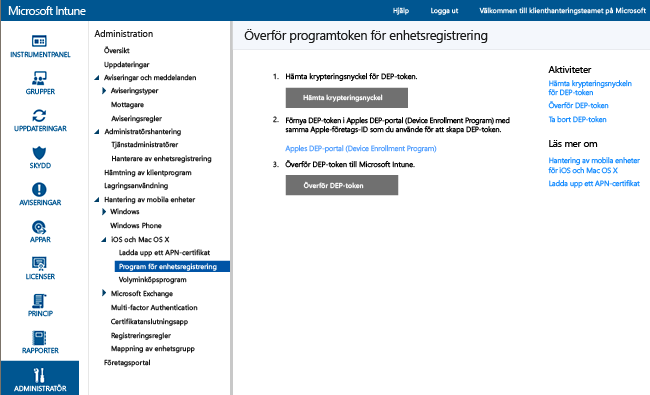

# Registrera företagsägda iOS-enheter i Enhetsregistreringsprogrammet

[!INCLUDE[classic-portal](../includes/classic-portal.md)]

Microsoft Intune kan distribuera en registreringsprofil som registrerar iOS-enheter som köpts via enhetsregistreringsprogrammet (DEP) ”over the air” (trådlöst). Registreringspaketet kan innehålla installationsassistentalternativ för enheten.

>[!NOTE]
>DEP-registreringen kan inte användas med [enhetsregistreringshanterarens](enroll-corporate-owned-devices-with-the-device-enrollment-manager-in-microsoft-intune.md) metod.
>Även om användarna registrerar iOS-enheter (t.ex. med företagsportalsappen) och dessa enheters serienummer sedan importeras och tilldelas en DEP-profil, så måste enheten avregistreras från Intune.

## Förutsättningar för att registrera iOS-enheter med Apple DEP-hantering

- [Installera ett APNs-certifikat](set-up-ios-and-mac-management-with-microsoft-intune.md)

- Din organisation måste ansluta sig till Apple DEP och få enheter via programmet. Information om den här processen finns på:  [https://deploy.apple.com](https://deploy.apple.com). Exempel på fördelar med programmet är obevakade enhetsinstallationer utan användning av en USB-kabel för att ansluta varje enhet till en dator.

- Innan du kan registrera företagsägda iOS-enheter med DEP behöver du en DEP-token från Apple. Med denna token kan Intune synkronisera information om enheter som är anslutna till DEP och som ditt företag äger. Intune kan även utföra överföringar av registreringsprofilen till Apple och tilldela enheter till dessa profiler.

## Steg för att registrera iOS-enheter med Apple DEP-hantering

Följande steg beskriver hur du registrera iOS-enheter på den första agen med hjälp av Apples DEP-hantering. När enheter läggs till och tas bort från din organisation kommer du troligen att upprepa några av de här stegen, som att lägga till eller ta bort serienummer enligt beskrivningen nedan.

### Skaffa en krypteringsnyckel

1. Som en administratörsanvändare öppnar du [Microsoft Intune-administrationskonsolen](http://manage.microsoft.com), går till **Admin** &gt; **Hantering av mobila enheter** &gt; **iOS** &gt; **Enhetsregistreringsprogram (DEP)** och väljer **Hämta krypteringsnyckel**.

2. Spara filen med krypteringsnyckeln (.pem) lokalt. Filen .pem används för att begära ett förtroendecertifikat från portalen Apples DEP.

### Skaffa en token för enhetsregistreringsprogrammet

1. Gå till [DEP-portalen (Device Enrollment Program)](https://deploy.apple.com) (https://deploy.apple.com) och logga in med företagets Apple-ID. Detta Apple-ID måste användas senare för att förnya din DEP-token.

2.  På DEP-portalen (Device Enrollment Program) går du till **Enhetsregistreringsprogram** &gt; **Hantera servrar** och väljer **Lägg till MDM-server**.

3.  Ange **MDM-servernamnet** och välj **Nästa**. Servernamnet är för din egen referens och hjälper dig att identifiera MDM-servern (hantering av mobilenheter). Det är inte namnet eller URL-adressen för Microsoft Intune-servern.

4.  Dialogrutan **Lägg till &lt;ServerName&gt;** öppnas. Välj **Välj fil** för att överföra PEM-filen och välj sedan **Nästa**.

5.  Dialogrutan **Lägg till &lt;ServerName&gt;** visar länken **Din servertoken**. Hämta servertokenfilen (.p7m) till datorn och klicka sedan på **Klar**.

   Den här certifikatfilen (.p7m) används för att upprätta en förtroenderelation mellan Intune och Apples DEP-servrar.

### Lägg till DEP-token i Intune

1. I [Microsoft Intune-administrationskonsolen](http://manage.microsoft.com) går du till **Admin** &gt; **Hantering av mobila enheter** &gt; **iOS** &gt; **Enhetsregistreringsprogram**.

2. Välj **Överför DEP-token**. **Bläddra** till certifikatfilen (.p7m), ange ditt **Apple-ID** och välj sedan **Överför**.

### Lägg till principen för registrering av företagsenheter

1. I [Microsoft Intune-administrationskonsolen](http://manage.microsoft.com) går du till **Princip** &gt; **Företagsägda enheter** och väljer sedan **Lägg till**.

2. Ange **Allmän** information, inklusive **Namn** och **Beskrivning**, och ange om enheter som är tilldelade till profilen har användartillhörighet eller tillhör en grupp:

   - **Fråga efter användartillhörighet**: Enheten måste kopplas till en användare under den ursprungliga installationen innan den kan beviljas samma åtkomst till företagets data och e-post som användaren. **Användartillhörighet** bör konfigureras för de DEP-hanterade enheter som tillhör användare och som behöver använda företagsportalen (dvs. för att installera appar). Multifaktorautentisering (MFA) fungerar inte under registreringen på DEP-enheter med användartillhörighet. Efter registreringen fungerar MFA som förväntat på dessa enheter. Nya användare som måste ändra sina lösenord när de loggar in första gången uppmanas inte under registreringen på DEP-enheter. Användare vars lösenord har upphört att gälla ombeds inte att återställa sina lösenord under DEP-registreringen. De måste återställa lösenordet från en annan enhet.

   > [!NOTE]
   > DEP med användartillhörighet kräver att WS-Trust 1.3 användarnamn/kombinerad slutpunkt aktiveras för att du ska kunna begära en användartoken.

   - **Ingen användartillhörighet**: Enheten är inte kopplad till någon användare. Använd den här tillhörighetstypen för enheter som utför uppgifter utan att komma åt lokala användardata. Appar som kräver användartillhörighet, inklusive företagsportalappen som används för att installera affärsappar, kommer inte att fungera.

   Du kan också **Tilldela enheter till följande grupp**. Välj **Välj** för att välja en grupp.

   > [!Important]
   > Grupptilldelningar flyttas från Intune till Azure Active Directory. När ditt Intune-konto får den tillämpliga uppdateringen kan du inte se alternativet **Tilldela enheter till följande grupp**. [Läs mer](/intune/deploy-use/ios-device-enrollment-program-in-microsoft-intune#changes-to-intune-group-assignments).

3. Aktivera **Konfigurera DEP-inställningar för den här profilen** för att ge stöd åt DEP.

      

   Följande inställningar är tillgängliga för DEP-hanterade enheter:

   - **Avdelning** – Visas om användaren trycker på **Om konfiguration** under aktiveringen
   - **Telefonnummer till support** – Visas om användaren klickar på **Behöver hjälp** under aktiveringen
   - **Förberedelseläge** – Anges under aktiveringen och kan inte ändras utan att enhetens fabriksinställningar återställs:
       - **Oövervakad** – Begränsade hanteringsfunktioner
       - **Övervakad** – Aktiverar fler hanteringsalternativ och inaktiverar aktiveringslåset som standard
   - **Lås registreringsprofil till enhet** – Anges under aktiveringen och kan inte ändras utan en fabriksåterställning
       - **Inaktivera** – Tillåter att hanteringsprofilen tas bort från menyn **Inställningar**
       - **Aktivera** – (Kräver **Förberedelseläge** = **Övervakad**) Inaktiverar menyalternativet under iOS-inställningar som möjliggör borttagning av hanteringsprofilen
   - **Alternativ för Installationsassistenten** – Dessa valfria inställningar kan konfigureras senare på menyn **Inställningar** i iOS.
        - **Lösenordskod** – Fråga efter lösenordskod under aktivering. Kräv alltid ett lösenord om inte enheten ska skyddas eller åtkomstkontrolleras på något annat sätt (t.ex. helskärmsläge som begränsar enheten till en app)
       - **Platstjänster** – Om en här funktionen är aktiverad frågar Installationsassistenten efter under aktivering
       - **Återställ** – Om den här funktionen är aktiverad frågar Installationsassistenten om iCloud-säkerhetskopiering vid aktivering
       - **Apple-ID** – Om det här alternativet är aktiverat uppmanas användaren i iOS att uppge ett Apple-ID när Intune försöker installera en app utan ett ID. Ett Apple-ID krävs för att hämta iOS App Store-appar, inklusive de som har installerats av Intune.
       - **Villkor** – Om det här alternativet är aktiverat uppmanas användarna i installationsassistenten att godkänna Apples villkor under aktiveringen
       - **Touch ID** – Om det här alternativet är aktiverat frågar installationsassistenten efter den här tjänsten under aktivering
       - **Apple Pay** – Om det här alternativet är aktiverat frågar installationsassistenten efter den här tjänsten under aktivering
       - **Zooma** – Om den här funktionen är aktiverad frågar installationsassistenten efter den här tjänsten under aktivering
       - **Siri** – Om den här funktionen är aktiverad frågar installationsassistenten efter den här tjänsten under aktivering
       - **Skicka diagnostikdata till Apple** – Om den här funktionen är aktiverad frågar installationsassistenten efter den här tjänsten under aktivering
   -  **Aktivera ytterligare hantering av Apple Configurator** – Ange till **Tillåt inte** om du vill förhindra synkronisering av filer med iTunes eller hantering via Apple Configurator. Det är en bra idé att välja **Tillåt inte**, exportera ytterligare konfigurationer från Apple Configurator och sedan distribuera som en anpassad iOS-konfigurationsprofil via Intune i stället för att använda den här inställningen för att tillåta manuell distribution med eller utan ett certifikat.
       - **Tillåt inte** – Hindrar enheten från att kommunicera via USB (inaktiverar sammankoppling)
       - **Tillåt** – Tillåter att enheten kommunicerar via USB-anslutning för PC- eller Mac-dator
       - **Kräv certifikat** – Möjliggör sammankoppling med en Mac-dator med ett certifikat som har importerats till registreringsprofilen

### Tilldela profilen till enheter

1. I [Microsoft Intune-administrationskonsolen](http://manage.microsoft.com) går du till **Princip** &gt; **Företagsägda enheter** och väljer sedan **Tilldela**.

2. Välj de enheter som du vill tilldela den profil som du skapat. Du kan välja **Alla enheter** eller markera specifika enheter och sedan välja **Lägg till**.

> [!Important]
> I Intune kan du för närvarande utse en ”standardprofil för enhetsregistrering”. Det innebär att nya serienummer automatiskt tilldelas den standardprofilen när du synkroniserar nya serienummer med Apple DEP-tjänsten. När din klient migreras till den nya Azure-portalen inom en snar framtid kommer du inte längre att kunna ange en standardprofil och tilldela serienummer automatiskt till den profilen. Du måste istället tilldela serienummer till en specifik profil. [Läs mer](https://docs.microsoft.com/intune-azure/enroll-devices/enroll-ios-devices-using-device-enrollment-program)

### Tilldela DEP-enheter för hantering

1. Gå till [DEP-portalen (Device Enrollment Program)](https://deploy.apple.com) (https://deploy.apple.com) och logga in med företagets Apple-ID.

2. Gå till **Distributionsprogram** &gt; **Enhetsregistreringsprogram (DEP)** &gt; **Hantera enheter**.

3. Ange hur du ska **Välja enheter**, ange information om enheten och ange information om enhetens **serienummer**, **ordningsnummer**eller **Överför CSV-fil**.

4. Välj **Tilldela till server** och välj &lt;servernamnet&gt; som angetts för Microsoft Intune och sedan **OK**.

### Synkronisera DEP-hanterade enheter

I det här steget synkroniseras enheter med Apples DEP-tjänst och gör så att enheterna visas i Intune-konsolen.

1. Som en administratörsanvändare öppnar du [Microsoft Intune-administrationskonsolen](http://manage.microsoft.com), går till **Admin** &gt; **Hantering av mobila enheter** &gt; **iOS** &gt; **Enhetsregistreringsprogram (DEP)** och väljer **Hämta krypteringsnyckel**. En synkroniseringsbegäran skickas till Apple.

2. Om du vill se DEP-hanterade enheter efter synkroniseringen går du till [Microsoft Intune-administrationskonsolen](http://manage.microsoft.com), går till **Grupper** &gt; **Alla enheter**&gt;**Företagets förregistrerade enheter**&gt;**Efter iOS-serienummer**. På arbetsytan **Efter iOS-serienummer** visas ”Ej ansluten” för **Tillstånd** för en hanterad enhet tills enheten har startats och kör installationsassistenten för registrering.

   Om du vill följa Apples villkor för godkänd DEP-trafik tillämpar Intune följande begränsningar:

   - En fullständig DEP-synkronisering kan inte köras oftare än en gång var sjunde dag. Under en fullständig synkronisering uppdaterar Intune varje serienummer som Apple har tilldelat Intune vare sig serien tidigare har synkroniserats eller inte. Om du försöker köra en fullständig synkronisering inom sju dagar efter den föregående fullständiga synkroniseringen uppdaterar Intune endast serienummer som inte redan visas i Intune.

   - Varje synkroniseringsbegäran har 10 minuter på sig att slutföras. Under den här tiden, eller tills begäran slutförts, är knappen **Synkronisera** inaktiverad.

### Distribuera enheter till användare

Nu kan dina företagsägda enheter distribueras till användarna. När en iOS-enhet aktiveras, kommer den att registreras för hantering av Intune. Användarenhetsgränsen gäller för DEP-hanterade enheter.

>[!NOTE]
>Om en användare försöker att registrera en DEP-enhet, men har överskridit sin enhetsgräns, så misslyckas registreringen utan att användaren får någon varning.

## Ändringar i Intune-grupptilldelningar

Från och med april 2017 flyttas grupphantering för enheter till Azure Active Directory. Efter övergången till Azure Active Directory-grupper visas grupptilldelning inte i alternativen för företagets registreringsprofil. Eftersom ändringen görs över ett antal månader kan du kanske inte se ändringen direkt. Efter flytten till den nya portalen kan dynamiska enhetsgruppstilldelningar definieras baserat på namnet på företagets registreringsprofil. För varje Intune-enhetsgrupp som tilldelas i förväg av en profil för registrering av företagsenhet skapas en motsvarande dynamisk enhetsgrupp i AAD. Det görs baserat på namnet på profilen för registrering av företagsenhet under migreringen till Azure Active Directory-enhetsgrupper. Den här processen ser till att enheter som redan har tilldelats till en enhetsgrupp registreras automatiskt i gruppen med principer och appar distribuerade. [Läs mer om Azure Active Directory-grupper](https://azure.microsoft.com/documentation/articles/active-directory-accessmanagement-manage-groups/)

### Se även
[Förutsättningar för att registrera enheter](prerequisites-for-enrollment.md)

