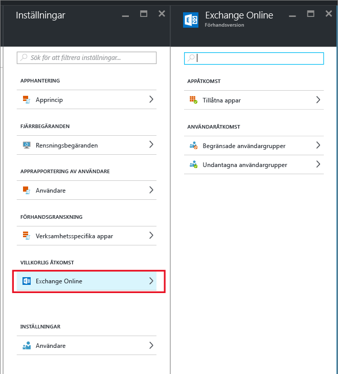
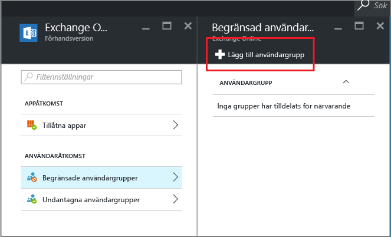

# Konfigurera villkorlig åtkomst för Exchange Online så att endast appar som stöds av MAM får åtkomst
Det här avsnittet innehåller stegvisa anvisningar för hur du konfigurerar villkorlig åtkomst för Exchange Online så att endast mobila appar som stöder MAM (Hantering av mobilprogram i Intune)-principer tillåts åtkomst.

## Skapa en Exchange Online-princip
1.  Logga in på [Azure Portal](https://portal.azure.com) som innehåller appåtkomstfunktionen. Om du inte har använt Azure Portal tidigare kan du läsa avsnittet [Azure portal for MAM policies](azure-portal-for-microsoft-intune-mam-policies.md) (Azure Portal för MAM-principer).

2.  Välj **Bläddra > Intune > Hantering av mobilprogram i Intune > Inställningar**, och i avsnittet **villkorlig åtkomst**, väljer du **Exchange Online**.

  

3.  På bladet **Tillåtna appar** väljer du alternativet **Allow apps that support Intune app policies** (Tillåt appar som stöder Intunes apprinciper) för att endast tillåta att appar som stöds av Intunes MAM-principer får åtkomst till Exchange Online. När du väljer det här alternativet visas listan över appar som stöds.

  >[!NOTE]
  >Alla Exchange Active Sync-e-postklienter, inklusive inbyggda e-postklienter på iOS och Android som ansluter till Exchange Online, kommer inte att kunna skicka eller ta emot e-post. I stället får användarna ett enda e-postmeddelande som informerar dem om att de måste använda e-postprogrammet Outlook. 
4.   Om du vill tillämpa den här principen på användare öppnar du bladet **Begränsade användargrupper** och väljer **Lägg till användargrupp**. Välj en eller flera användargrupper som du vill tillämpa den här principen på.

  

5.  Du kanske vill att vissa användare i den grupp du valde i föregående steg inte ska påverkas av den här principen. I sådana fall måste du lägga till dessa användare till listan över undantagna användare. Välj **Exempted user groups** (Undantagna användargrupper) på bladet **Exchange Online**. Välj **Lägg till användargrupp** för att öppna en lista med användargrupper. Välj de grupper som du vill undanta från den här principen.  

## Ändra en befintlig princip
### Lägg till eller ta bort användargrupper

För att **delete a user group** (ta bort en användargrupp) från listan **begränsade användargrupper** öppnar du bladet **Begränsade användargrupper**, markerar den grupp du vill ta bort och klickar sedan på **ellipserna (...)** för att se alternativet **ta bort**. Välj **Ta bort** att ta bort användargruppen från listan. Du kan använda samma procedur för att ta bort en grupp från listan **exempted user group** (undantagna användargrupper).

## Nästa steg
[Blockera appar som inte har modern autentisering](block-apps-with-no-modern-authentication.md)
### Se även
[Skydda appdata med MAM-principer](protect-app-data-using-mobile-app-management-policies-with-microsoft-intune.md)

<!--HONumber=Dec16_HO2-->

