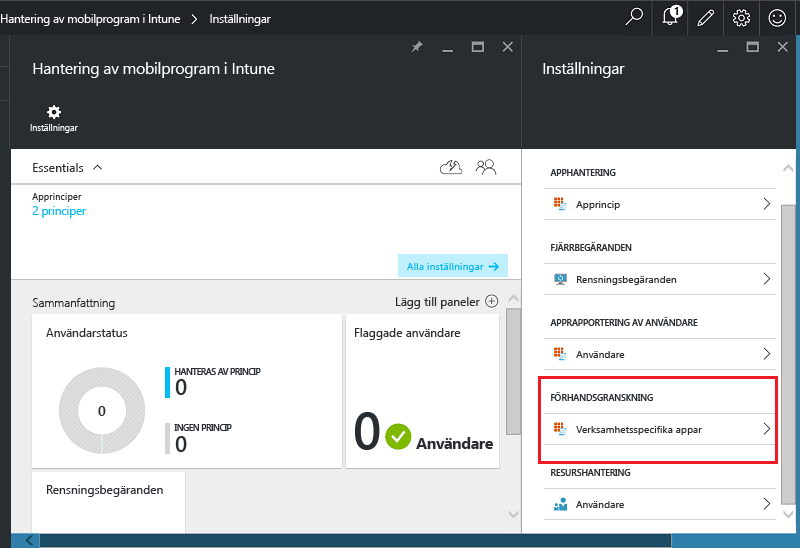
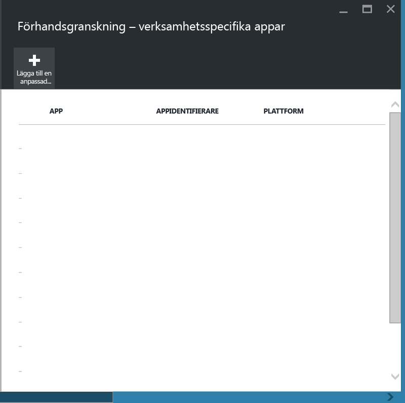
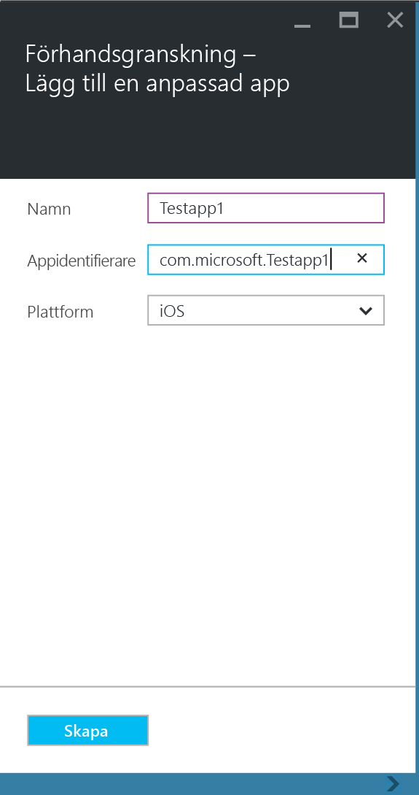
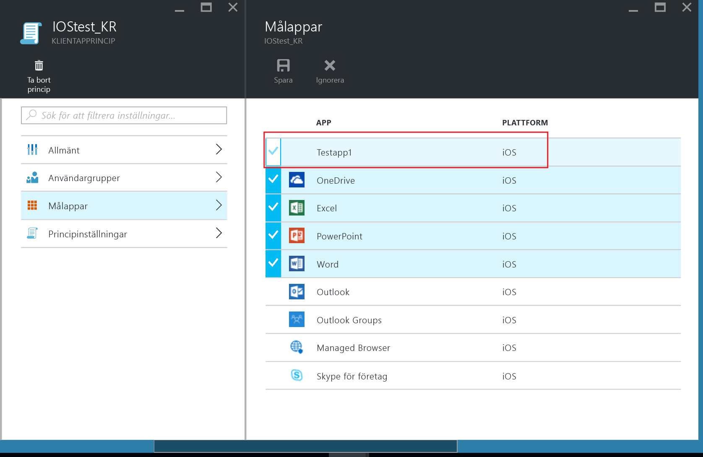
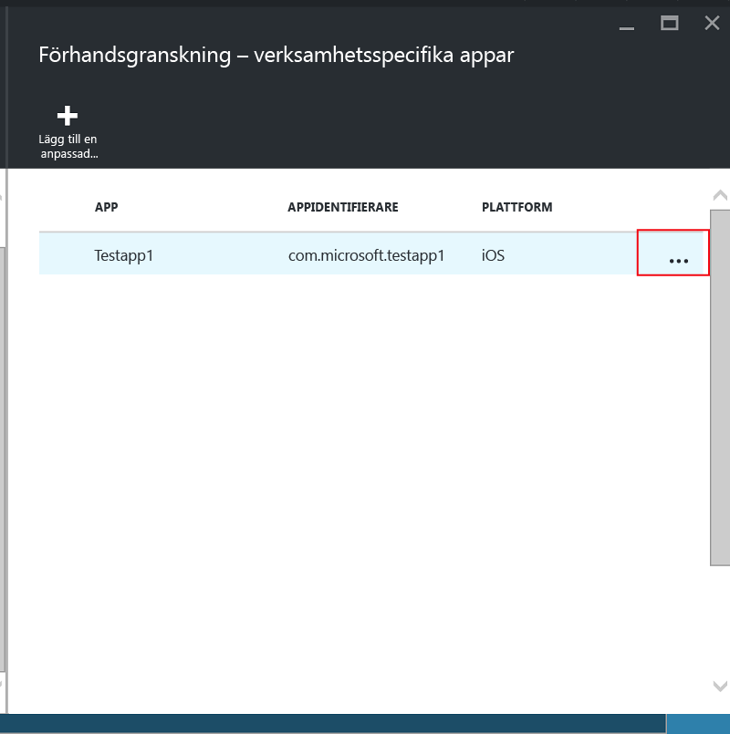
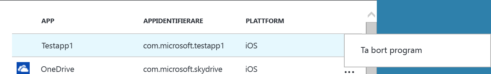

# Skydda branschspecifika appar och data på enheter som inte har registrerats i Microsoft Intune

Principer för hantering av mobila appar (MAM) skyddar företagsdata genom att begränsa åtgärder som kan läcka företagsdata och tillämpa krav för åtkomst till data, som t.ex. PIN-koder för appar. Om du vill tillämpa MAM-principer för branschspecifika iOS- och Android-appar måste du först omsluta appen med programhanteringsverktyget för Microsoft Intune. Appomslutning är en process för tillämpning av ett hanteringslager på en mobil app utan att det krävs några ändringar av det underliggande programmet. När appen har omslutits kan du tillämpa MAM-principer på den och distribuera den till användarna.  

I det här avsnittet beskrivs de steg som krävs för att tillämpa MAM-principer för de appar som användarna har åtkomst till på **medarbetarägda enheter som inte hanteras** och enheter som hanteras av en **lösning för hantering av mobila enheter från tredje part**.  Information om hur du förbereder verksamhetsspecifika appar som körs på **enheter som är registrerade i Intune MDM** finns i [Förbereda appar för hantering av mobilprogram med Microsoft Intune](decide-how-to-prepare-apps-for-mobile-application-management-with-microsoft-intune.md).

##  Steg 1: Förbered appen

Innan du kan tillämpa MAM-principer på en app, måste du först omsluta appen med hjälp av Microsoft Intunes appomslutningsverktyg för [iOS](prepare-ios-apps-for-mobile-application-management-with-the-microsoft-intune-app-wrapping-tool) och [Android](prepare-android-apps-for-mobile-application-management-with-the-microsoft-intune-app-wrapping-tool), eller använda [Intune App-SDK:n](/../develop/intune-app-sdk) för att integrera Intune-funktionerna för appskydd manuellt.

Mer information om hur du använder Intunes appomslutningsverktyg respektive SDK:n finns i [Förbereda appar för hantering av mobilprogram med Microsoft Intune](decide-how-to-prepare-apps-for-mobile-application-management-with-microsoft-intune).

## Steg 2: Lägg till appen

Om du vill associera verksamhetsspecifika appar med MAM-principer måste du lägga till appinformationen i din Intune-prenumeration/-klient på följande sätt:

1. Öppna [Azure Portal](https://portal.azure.com/) och gå till **Intunes hantering av mobila program** > **Inställningar** och välj **Verksamhetsspecifika appar**.

  

2. Välj **Lägg till en anpassad app** på bladet **Verksamhetsspecifika appar**.

  
3.  Ge appen ett namn och ange paket-ID i fältet App-ID och plattform (iOS eller Android).

  

  Med hjälp av det här steget kan du skapa en unik lista för din app. Appen visas även i listan över målappar för klientens MAM-princip, så som beskrivs i nästa steg.

## Steg 3: Tillämpa MAM-principer
När appmetadata har överförts till tjänsten visas appen i listan över appar. Du kan nu [skapa en ny princip eller använda en befintlig princip](create-and-deploy-mobile-app-management-policies-with-microsoft-intune.md) och tillämpa den på den verksamhetsspecifika app som du lade till i steg 2.

>[!IMPORTANT]
>Du måste använda MAM-principen för de användare som ska använda den omslutna appen.  Användare som inte har fått den här principen distribuerad till sig kan inte använda appen.

  
## Steg 4: Distribuera appen
Du kan distribuera appar till användarna på följande sätt:
* Du kan distribuera appar för enheter som har registreras i en MDM-lösning från tredje part via din MDM-lösning.
* För enheter som inte hanteras av någon MDM-lösning behöver du en anpassad lösning. Användarna måste hämta och installera appen på sina enheter.

## Ändra metadata
Om du behöver ändra appinformationen om en app, t.ex. appens namn eller paket-ID:t, måste du [ta bort appen](#remove-apps) och [lägga till den](#step-2-add-the-app) med nya metadata.

##  Ta bort appar
Du kan ta bort en verksamhetsspecifik app från applistan. Den här åtgärden tar bort appen från listan och tar bort kopplingen till MAM-principerna, men tar inte bort eller avinstallerar appen från användarens enhet.  

1.  Gå till **Intune-mobilapphantering** > **Inställningar** i [Azure Portal](https://portal.azure.com/). Välj **Branschspecifik** på bladet **Inställningar** så öppnas listan över befintliga appar.  
2.  Välj den app som du vill ta bort och välj menyn **(...) kontext**.

  
3.  Ta bort appen genom att välja **Ta bort program**.

  

  Detta tar bort apparna från listan över verksamhetsspecifika appar och mållistan över appar i MAM-principen.

<!--HONumber=Nov16_HO5-->

