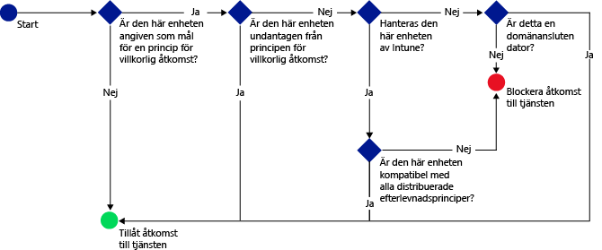

# Skydda åtkomsten till e-post, Office 365 och andra tjänster med Microsoft Intune

[!INCLUDE[classic-portal](../includes/classic-portal.md)]

Du kan skydda åtkomsten till företagsrelaterad e-post, Office 365-tjänster som **Exchange On-premises**, **Exchange Online**, **Exchange Online Dedicated**, **SharePoint Online**, **Skype for Business Online** och andra tjänster med hjälp av villkorlig åtkomst för Enterprise Mobility + Security (EMS). Med den här funktionen kan du se till att åtkomsten till företagsrelaterad e-post och Office 365-tjänster begränsas till enheter som är kompatibla med de regler för villkorlig åtkomst som du anger i Intune-administratörskonsolen eller den klassiska Azure-portalen.
## Hur fungerar villkorlig åtkomst?
Du kan utvärdera enhetens kompatibilitet med hjälp av inställningarna för efterlevnadsprinciper. En princip för villkorlig åtkomst använder utvärderingen för att begränsa eller tillåta åtkomst till en specifik tjänst. När du använder en princip för villkorlig åtkomst i kombination med en enhetsefterlevnadsprincip kommer endast kompatibla enheter åt tjänsten. Principen för efterlevnad och principen för villkorlig åtkomst distribueras till användaren. Alla enheter som användaren använder för att komma åt tjänsterna kontrolleras för att se att de följer principerna.

> [!IMPORTANT]
> Tänk på att en efterlevnadsprincip måste distribueras till enhetsanvändaren för att enhetens efterlevnad ska kunna utvärderas.
> Om ingen efterlevnadsprincip har distribuerats till användaren behandlas enheten som kompatibel och inga åtkomstbegränsningar tillämpas.

Om en enhet inte uppfyller de villkor som du har definierat i principerna vägleds användaren genom en process för att registrera enheten och åtgärda problemet som gör att enheten inte är kompatibel.

Så här ser ett typiskt flöde för villkorlig åtkomst ut:

## Att tänka på vid konfiguration

### Licensiering

Microsoft Intune och Azure Active Directory (Azure AD) fungerar sömlöst med varandra för att ge flera styrningslager genom villkorlig åtkomst med EMS. Om du vill distribuera villkorliga åtkomstprinciper med Intune måste du ha licens för båda produkterna.

**Azure AD Premium-licenser** kan köpas som en fristående tjänst eller kan köpas (tillsammans med Intune) som en del av Enterprise-avtalet. Om du har distribuerat principer för villkorlig åtkomst med Intune ser du till att du har hämtat rätt Azure AD Premium- eller **EMS-licenser**.

- Mer information finns på [sidan med priser för Enterprise Mobility](https://www.microsoft.com/cloud-platform/enterprise-mobility-pricing) eller [sidan med priser för Azure Active Directory](https://azure.microsoft.com/pricing/details/active-directory/).

Se även till att de användare som du vill använda villkorliga åtkomstprinciper för har [tilldelats Azure AD Premium- eller EMS-licenser](/Intune/get-started/start-with-a-paid-subscription-to-microsoft-intune-step-4.md).

### Enhetskompatibilitetsinställningar

Du konfigurerar villkorlig åtkomst genom att konfigurera en efterlevnadsprincip för enheter och en princip för villkorlig åtkomst. Efterlevnadsprincipen omfattar inställningar som lösenord och kryptering samt huruvida en enheten är jailbrokad. Enheten måste uppfylla dessa regler för att anses vara kompatibel.

- Läs mer om [principer för enhetsefterlevnad och hur de fungerar](introduction-to-device-compliance-policies-in-microsoft-intune.md).

### Princip för villkorlig åtkomst

Du kan ange en princip för villkorlig åtkomst för att skydda åtkomst baserat på:
- Enhetens efterlevnadsstatus.
- Den plattform som körs på enheten.
- Den typ av appar som används för att få åtkomst till tjänsterna.

Till skillnad från andra Intune-principer kan principer för villkorlig åtkomst inte distribueras. När du har konfigurerat principen och valt de användare som den ska gälla för, tillämpas principen i stället på alla målanvändare. När en användare är angiven som mål för en princip, måste varje enhet hen använder vara godkänd för att få åtkomst till resurserna.

## Nästa steg

2. [Skapa en enhetsefterlevnadsprincip](create-a-device-compliance-policy-in-microsoft-intune.md).

2.  Skapa en princip för villkorlig åtkomst för någon av följande tjänster/produkter för Microsoft-moln:

  - [Skapa en princip för villkorlig åtkomst för Exchange Online](restrict-access-to-exchange-online-with-microsoft-intune.md)
  - [Skapa en princip för villkorlig åtkomst för Exchange On-premises](restrict-access-to-exchange-onpremises-with-microsoft-intune.md)
  - [Skapa en princip för villkorlig åtkomst för nya Exchange Online Dedicated](restrict-access-to-exchange-online-with-microsoft-intune.md)
  - [Skapa en princip för villkorlig åtkomst för gamla Exchange Online Dedicated](restrict-access-to-exchange-onpremises-with-microsoft-intune.md)
  - [Skapa en princip för villkorlig åtkomst för SharePoint Online](restrict-access-to-sharepoint-online-with-microsoft-intune.md)
  - [Skapa en princip för villkorlig åtkomst för Skype för företag – Online](restrict-access-to-skype-for-business-online-with-microsoft-intune.md)
  - [Skapa en princip för villkorlig åtkomst för Dynamics CRM Online](restrict-access-to-dynamics-crm-online-with-microsoft-intune.md)

