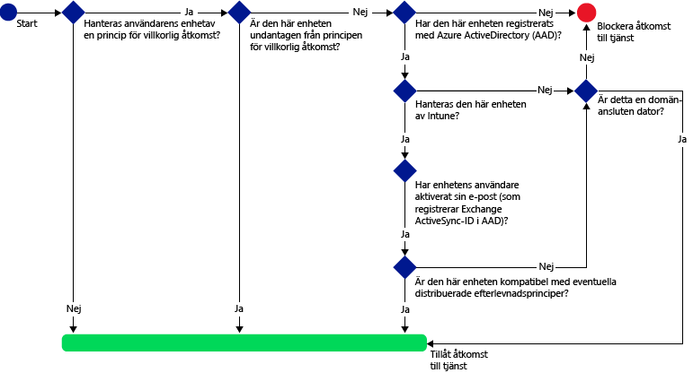
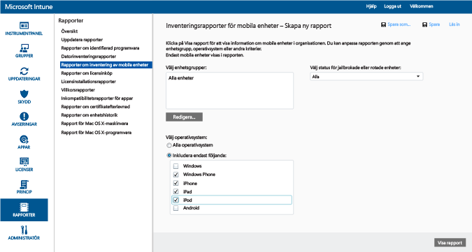
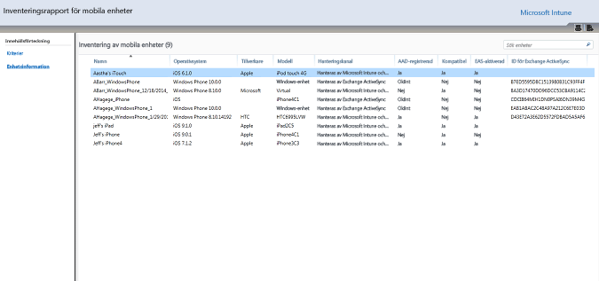
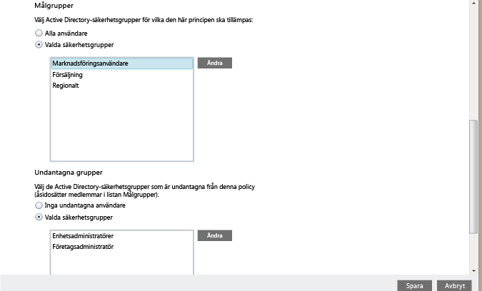
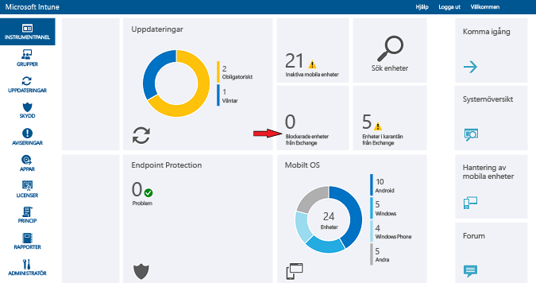

# Skydda åtkomsten för e-post till Exchange Online och nya Exchange Online Dedicated med Microsoft Intune

[!INCLUDE[classic-portal](../includes/classic-portal.md)]

Du kan konfigurera villkorlig åtkomstkontroll för Exchange Online eller Exchange Online Dedicated med hjälp av Microsoft Intune. Mer information om hur villkorlig åtkomst fungerar finns i artikeln [Skydda åtkomsten till e-post, O365 och andra tjänster](restrict-access-to-email-and-o365-services-with-microsoft-intune.md).

> [!NOTE]
>Om du har en Exchange Online Dedicated-miljö och vill veta om den har den nya eller gamla konfigurationen kontaktar du din kontoansvariga.

## Innan du börjar

För att konfigurera villkorlig åtkomst måste du:

-   Ha en **Office 365-prenumeration med Exchange Online (t.ex. E3)**, och användarna måste ha licens för Exchange Online.

- Ha en **Enterprise Mobility + Security-prenumeration (EMS)** eller en **Azure Active Directory Premium-prenumeration (Azure AD)**, och användarna måste ha licens för EMS eller Azure AD. Mer information finns på [sidan med priser för Enterprise Mobility](https://www.microsoft.com/cloud-platform/enterprise-mobility-pricing) eller [sida med priser för Azure Active Directory](https://azure.microsoft.com/pricing/details/active-directory/).

-  Överväg att konfigurera den valfria **tjänst-till-tjänst-anslutningen i Intune** som ansluter [!INCLUDE[wit_nextref](../includes/wit_nextref_md.md)] till Exchange Online och som gör att du kan hantera enhetsinformationen via [!INCLUDE[wit_nextref](../includes/wit_nextref_md.md)]-konsolen. Du måste inte använda anslutningen för att kunna använda efterlevnadsprinciper eller principer för villkorlig åtkomst, men den krävs för att köra rapporter som utvärderar effekten av villkorlig åtkomst.
    -  Läs mer om [Intune Service to Service Connector](intune-service-to-service-exchange-connector.md).

   > [!NOTE]
   > Konfigurera inte tjänst-till-tjänstanslutningen för Intune om du tänker använda villkorlig åtkomst för både Exchange Online och Exchange on-premises.

### Krav på efterlevnad för enhet

När du konfigurerar och tillämpar principer för villkorlig åtkomst för en användare, och innan användaren kan ansluta till sin e-post, måste användarens **enhet**:

-   Vara en domänansluten dator eller **registrerad** i [!INCLUDE[wit_nextref](../includes/wit_nextref_md.md)].

-  **Registreras i Azure Active Directory**. Detta sker automatiskt när enheten registreras med [!INCLUDE[wit_nextref](../includes/wit_nextref_md.md)]. Dessutom måste klientens Exchange ActiveSync-ID registreras med Azure Active Directory.

  Registreringstjänsten för Azure AD-enhet aktiveras automatiskt för Intune- och Office 365-kunder. Kunder som redan har använt ADFS Device Registration Service ser inte registrerade enheter i lokala Active Directory-kataloger.

-   Vara **kompatibel** med [!INCLUDE[wit_nextref](../includes/wit_nextref_md.md)]-efterlevnadsprinciper som distribuerats till enheten, eller vara domänansluten till en lokal domän.

### När enheten inte är kompatibel

Om en princip för villkorlig åtkomst inte uppfylls, sätts enheten omedelbart i karantän och användarna får ett e-postmeddelande med något av följande karantänmeddelanden när de loggar in:

- Om enheten inte är registrerad i [!INCLUDE[wit_nextref](../includes/wit_nextref_md.md)] eller i Azure Active Directory visas ett meddelande med instruktioner för att installera företagsportalappen, registrera enheten och aktivera e-post. Den här processen associerar även enhetens Exchange ActiveSync-ID med posten i Azure Active Directory.

-   Om enheten utvärderas som icke-kompatibel med reglerna för efterlevnadsprinciper dirigeras användaren till [!INCLUDE[wit_nextref](../includes/wit_nextref_md.md)]-företagsportalens webbplats eller företagsportalappen som innehåller information om problemet och hur det kan åtgärdas.

### Så här fungerar villkorlig åtkomst med Exchange Online

Följande diagram illustrerar flödet som används av principerna för villkorlig åtkomst för Exchange Online.

## Stöd för mobila enheter
Du kan skydda åtkomsten till e-post i Exchange Online från **Outlook** och andra **appar som använder modern autentisering**. Följande stöds:

- Android 4.0 och senare, Samsung Knox Standard 4.0 och senare samt Android for Work
- iOS 8.0 och senare

[!INCLUDE[wit_nextref](../includes/afw_rollout_disclaimer.md)]

Med **modern autentisering** kan Microsoft Office-klienter använda ADAL-baserad (Active Directory Authentication Library) inloggning.

-   ADAL-baserad autentisering gör det möjligt för Office-klienter att delta i webbläsarbaserad autentisering (även kallat passiv autentisering). Användare som vill autentiseras omdirigeras till en inloggningswebbsida.
-   Den här nya inloggningsmetoden ökar säkerheten med till exempel **multifaktorautentisering** och **certifikatbaserad autentisering**. Mer information finns i [Hur modern autentisering fungerar](https://support.office.com/article/How-modern-authentication-works-for-Office-2013-and-Office-2016-client-apps-e4c45989-4b1a-462e-a81b-2a13191cf517). Du kan konfigurera ADFS-anspråksregler och blockera protokoll som inte stöder modern autentisering. Detaljerade anvisningar finns i [Scenario 3: blockera all åtkomst till O365 förutom webbläsarbaserade program](https://technet.microsoft.com/library/dn592182.aspx).

Du kan skydda åtkomst till **Outlook Web Access (OWA)** i Exchange Online när en användare får åtkomst från en webbläsare på **iOS**- och **Android**-enheter. Åtkomst tillåts endast från webbläsare som stöds på kompatibla enheter:

* Safari (iOS)
* Chrome (Android)
* Intune Managed Browser (iOS, Android 5.0 och senare)

   > [!IMPORTANT]
   > **Webbläsare utan stöd blockeras**.

**OWA-appen för iOS och Android kan ändras så att modern autentisering inte används och inte stöds. Åtkomst från OWA-appen måste blockeras via ADFS-anspråksregler.**

Du kan skydda åtkomsten till Exchange-e-post från den inbyggda **Exchange ActiveSync-e-postklienten** på följande plattformar:

- Android 4.0 och senare, Samsung Knox Standard 4.0 och senare

- iOS 8.0 och senare

- Windows Phone 8.1 och senare

## Stöd för datorer

Du kan konfigurera villkorlig åtkomst för datorer som kör Office-datorprogram om du vill komma åt **Exchange Online** och **SharePoint Online** för datorer som uppfyller följande krav:

-   Datorn måste köra Windows 7.0, Windows 8.1 eller Windows 10.

  >[!NOTE]
  > Om du vill använda villkorlig åtkomst med Windows 10-datorer måste du uppdatera dessa datorer med Windows 10 Anniversary Update.

  Datorn måste antingen vara domänansluten eller kompatibel med reglerna för efterlevnadsprinciper.

  För att vara kompatibel måste datorn vara registrerad i [!INCLUDE[wit_nextref](../includes/wit_nextref_md.md)] och uppfylla principerna.

  För domänanslutna datorer måste du konfigurera villkorlig åtkomst på att [automatiskt registrera enheten](https://azure.microsoft.com/documentation/articles/active-directory-conditional-access-automatic-device-registration/) i Azure Active Directory.

  >[!NOTE]
    >Villkorlig åtkomst stöds inte på datorer som kör Intune-datorklienten.

-   [Modern Office 365-autentisering måste vara aktiverat](https://support.office.com/article/Using-Office-365-modern-authentication-with-Office-clients-776c0036-66fd-41cb-8928-5495c0f9168a) och alla de senaste Office-uppdateringarna måste vara installerade.

    Med modern autentisering kan Office 2013-/Windows-klienter använda ADAL-baserad (Active Directory Authentication Library) inloggning. Det ökar säkerheten med till exempel **multifaktorautentisering** och **certifikatbaserad autentisering**.

-   ADFS-anspråksregler konfigureras för att blockera protokoll som inte stöder modern autentisering. Detaljerade anvisningar finns i [Scenario 3: blockera all åtkomst till O365 förutom webbläsarbaserade program](https://technet.microsoft.com/library/dn592182.aspx).

## Konfigurera villkorlig åtkomst
### Steg 1: Konfigurera och distribuera en efterlevnadsprincip
Se till att du [skapar](create-a-device-compliance-policy-in-microsoft-intune.md) och [distribuerar](deploy-and-monitor-a-device-compliance-policy-in-microsoft-intune.md) en efterlevnadsprincip till de användargrupper som även ska omfattas av principen för villkorlig åtkomst.

> [!IMPORTANT]
> Om du inte har distribuerat någon efterlevnadsprincip betraktas enheterna som kompatibla och beviljas åtkomst till Exchange.

### Steg 2: Utvärdera effekten av principen för villkorlig åtkomst
Du kan använda **inventeringsrapporterna för mobila enheter** för att identifiera enheter som kan hindras från att komma åt Exchange när du har konfigurerat principen för villkorlig åtkomst.

Om du vill göra det konfigurerar du en anslutning mellan [!INCLUDE[wit_nextref](../includes/wit_nextref_md.md)] och Exchange med hjälp av [Microsoft Intunes tjänst-till-tjänst-anslutning](intune-service-to-service-exchange-connector.md).
1.  Gå till **Rapporter** > **Inventeringsrapporter för mobila enheter**.

2.  I rapportparametrarna väljer du den [!INCLUDE[wit_nextref](../includes/wit_nextref_md.md)]-grupp som du vill utvärdera och, om det behövs, de enhetsplattformar som principen ska gälla för.
3.  När du har valt kriterierna som uppfyller organisationens behov väljer du **Visa rapport**.
Rapportvisningsprogrammet öppnas i ett nytt fönster.

Efter att du har har kört rapporten, undersök dessa fyra kolumner för att avgöra om en användare kommer att blockeras:

-   **Hanteringskanal**: Anger om enheten sköts av Intune, Exchange ActiveSync eller bådadera.

-   **AAD-registrerad**: Anger om enheten är registrerad med Azure Active Directory (kallas Workplace Join).

-   **Kompatibel**: Anger om enheten är kompatibel med alla efterlevnadsprinciper som du har distribuerat.

-   **Exchange ActiveSync ID**: iOS- och Android-enheter måste ha Exchange ActiveSync ID kopplad till enhetsregistreringsposten i Azure Active Directory. Detta händer när en användare väljer länken **Aktivera e-post** i karantänmeddelandet.

    > [!NOTE]
    > Windows Phone enheter visar alltid ett värde i den här kolumnen.

Enheter som är en del av en målgrupp blockeras från att komma åt Exchange om kolumnvärdena matchar de som anges i följande tabell:

--------------------------
|Hanteringskanal|AAD-registrerad|Kompatibel|Exchange ActiveSync ID|Resulterande åtgärd|
|----------------------|------------------|-------------|--------------------------|--------------------|
|**Hanterad av Microsoft Intune and Exchange ActiveSync**|Ja|Ja|Ett värde visas|E-poståtkomst tillåten|
|Vilket som helst annat värde|Nej|Nej|Inget värde visas|E-poståtkomst blockerad|
----------------------
Du kan exportera innehållet i rapporten och använda kolumnen **E-postadress** för att meddela användarna att de kommer att blockeras.

### Steg 3: Konfigurera användargrupper för principen för villkorlig åtkomst
Principer för villkorlig åtkomst är avsedda för olika Azure Active Directory-säkerhetsgrupper med användare. Du kan också undanta vissa användargrupper från en princip för villkorlig åtkomst. När en användare är angiven som mål för en princip måste varje enhet de använder vara kompatibla för att få åtkomst till e-post.

Du kan konfigurera dessa grupper i **administrationscenter för Office 365**, eller i **Intune-kontoportal**.

Du kan ange två grupptyper i varje policy:

-   **Målgrupper**: Användargrupper som principen tillämpas på.

-   **Undantagna grupper**: Användargrupper som är undantagna från principen (valfritt).

Användare som finns i båda grupperna undantas från principen.

Endast de grupper som omfattas av principen för villkorlig åtkomst utvärderas.

### Steg 4: Konfigurera principen för villkorlig åtkomst

>[!NOTE]
> Du kan även skapa en princip för villkorlig åtkomst i Azure AD-hanteringskonsolen. Azure AD-hanteringskonsolen gör det möjligt att skapa principer för villkorlig åtkomst för Intune-enheter (kallas för **enhetsbaserad princip för villkorlig åtkomst** i Azure AD) utöver andra principer för villkorlig åtkomst som multifaktorautentisering.

>Du kan även ange principer för villkorlig åtkomst för tredje parters företagsappar som Azure AD stöder, som Salesforce och Box. Mer information finns i [How to set Azure Active Directory device-based conditional access policy for access control to Azure Active Directory connected applications](https://azure.microsoft.com/documentation/articles/active-directory-conditional-access-policy-connected-applications/) (Ställa in principer för Azure Active Directory-enhetsbaserad villkorlig åtkomst för åtkomstkontroll till program anslutna med Azure Active Directory).

1.  I [Microsoft Intune Administrationskonsol](https://manage.microsoft.com) väljer du **Princip** > **Villkorlig åtkomst** > **Exchange Online-princip**.

2.  På sidan **Exchange Online-princip policy** väljer du **Aktivera villkorlig åtkomstprincip för Exchange Online**.

    > [!NOTE]
    > Om du inte har distribuerat någon efterlevnadsprincip behandlas enheterna som kompatibla.
    >
    > Oavsett kompatibilitetstillstånd måste alla användare som principen tillämpas på registrera sina enheter i [!INCLUDE[wit_nextref](../includes/wit_nextref_md.md)].

3.  För appar som använder modern autentisering kan du välja vilka plattformar som principen ska gälla för på något av två sätt under **Programåtkomst**. Exempel på plattformar som stöds är Android, iOS, Windows och Windows Phone.

    -   **Alla plattformar**

        Detta kräver att alla enheter som används för att komma åt **Exchange Online** registreras i Intune och uppfyller principkraven. Klientprogram som använder **modern autentisering** omfattas av principen för villkorlig åtkomst. Om plattformen inte stöds av Intune för närvarande blockeras åtkomsten till **Exchange Online**.

        Om alternativet **Alla plattformar** väljs innebär det att Azure Active Directory använder denna princip på alla autentiseringsbegäranden, oavsett vilken plattform som rapporteras av klientprogrammet. Alla plattformar måste registreras och vara kompatibla, med undantag för:
        *    Windows-enheter, som måste registreras för att vara kompatibla, domänanslutna med lokal Active Directory, eller båda.
        * Plattformar som inte stöds, t.ex. Mac OS. Appar som använder modern autentisering som kommer från dessa plattformar blockeras dock fortfarande.

    -   **Vissa plattformar**

         Principen för villkorlig åtkomst gäller alla klientappar som använder **modern autentisering** på de enhetsplattformar som du anger.

4. Under **Outlook Web Access (OWA)** kan du välja att tillåta åtkomst till Exchange Online endast genom de webbläsare som stöds: Safari (iOS) och Chrome (Android). Åtkomst från andra webbläsare blockeras. De plattformsbegränsningar du valde för programåtkomst för Outlook gäller även här.

  På **Android**-enheter måste användare aktivera webbläsaråtkomst. Om du vill göra detta måste användaren aktivera alternativet **Aktivera webbläsaråtkomst** på den registrerade enheten enligt följande:
  1.    Öppna **företagsportalappen**.
  2.    Gå till sidan **Inställningar** från ellipsen (...) eller menyknappen för maskinvara.
  3.    Tryck på knappen **Aktivera webbläsaråtkomst**.
  4.    I webbläsaren Chrome loggar du ut från Office 365 och startar om Chrome.

  På **iOS**- och **Android**-plattformar utfärdar Azure Active Directory ett TLS-certifikat (Transport layer security) för enheten för att identifiera den enhet som används för att få åtkomst till tjänsten. Enheten visar certifikatet med en uppmaning till användaren om att markera certifikatet på det sätt som visas i följande skärmbilder. Användaren måste välja det här certifikatet innan det går att fortsätta att använda webbläsaren.

  **iOS**

  

  **Android**

  

5.  Under **Exchange ActiveSync-appar** kan du välja att hindra icke-kompatibla enheter från att komma åt Exchange Online. Du kan också välja om du vill tillåta eller blockera åtkomst till e-post om enheten inte kör en plattform som stöds. Exempel på plattformar som stöds är Android, iOS, Windows och Windows Phone.

 Exchange Active Sync-appar på **Android for Work**-enheter:
 -  Endast **Gmail** och **Nine Work**-appar i **arbetsprofilen** stöds på Android for Work-enheter. För villkorlig åtkomst till arbete på Android for Work-enheter måste du distribuera en e-postprofil för Gmail- eller Nine Work-appen och även distribuera den som en **nödvändig** installation.

6.  Under **Målgrupper** väljer du de Active Directory-säkerhetsgrupper med användare som policyn gäller för. Du kan välja att tillämpa principen på alla användare eller en vald lista med användargrupper.

    > [!NOTE]
    > För användare som finns i **Målgrupper** ersätter Intune-principerna Exchange-regler och Exchange-principer.
    >
    > Exchange kommer bara att verkställa Exchange-reglerna för att tillåta, blockera och sätta i karantän och Exchange-principer om:
    >
    > -   En användare inte är licensierad för Intune.
    > -   En användare är licensierad för Intune, men användaren inte tillhör någon säkerhetsgrupp som principer för villkorlig åtkomst riktas mot.

6.  Under **Undantagna grupper**, välj aktiva säkerhetsgrupper av användare som är undantagna från denna policy. Om en användare finns i båda grupperna är denna användare undantagen från principen.

7.  När du är klar väljer du **Spara**.

-   Du behöver inte använda principen för villkorlig åtkomst. Den träder i kraft omedelbart.

-   Efter att en användare skapar ett emailkonto, blockeras enheten omedelbart.

-   Om en blockerad användare registrerar enheten med [!INCLUDE[wit_nextref](../includes/wit_nextref_md.md)] och åtgärdar inkompatibilitetsproblem försvinner blockeringen av åtkomst till e-post inom två minuter.

-   Om användaren avregistrerar sin enhet blockeras e-posten efter cirka 6 timmar.

Några **exempelscenarier som beskriver hur du konfigurerar principer för villkorlig åtkomst som skyddar enhetsåtkomsten** finns i [Exempelscenarier för skydd av e-poståtkomst](restrict-email-access-example-scenarios.md).

## Övervaka efterlevnaden och villkorlig åtkomstpolicy

#### För att visa enheter som är blockerade från Exchange

På [!INCLUDE[wit_nextref](../includes/wit_nextref_md.md)]-instrumentpanelen väljer du rutan **Blockerade enheter från Exchange** för att visa antalet blockerade enheter och länkar till mer information.

## Nästa steg
- [Skydda åtkomsten till SharePoint Online](restrict-access-to-sharepoint-online-with-microsoft-intune.md)

- [Skydda åtkomsten till Skype för företag – Online](restrict-access-to-skype-for-business-online-with-microsoft-intune.md)

