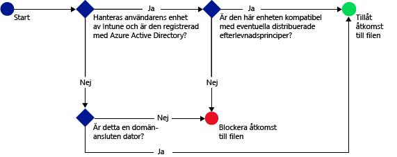

# Skydda åtkomsten till SharePoint Online med Microsoft Intune

[!INCLUDE[classic-portal](../includes/classic-portal.md)]

Använd villkorlig åtkomst i [!INCLUDE[wit_firstref](../includes/wit_firstref_md.md)] om du vill kontrollera åtkomsten till filer som finns i SharePoint Online.
Villkorlig åtkomst består av två komponenter:
- En princip för enhetsefterlevnad som enheten måste uppfylla för att anses vara kompatibel.
- En princip för villkorlig åtkomst där du anger de villkor som enheten måste uppfylla för att komma åt tjänsten.
Mer information om hur villkorlig åtkomst fungerar finns i avsnittet [Skydda åtkomsten till e-post, O365 och andra tjänster](restrict-access-to-email-and-o365-services-with-microsoft-intune.md).

Du distribuerar efterlevnaden och villkorlig åtkomstpolicy till användare. Alla enheter som en användare använder för att komma åt tjänsterna kontrolleras för att se att de följer principerna.

När en användare försöker ansluta till en fil med en app som stöds, till exempel OneDrive på sin enhet, görs följande utvärdering:

**Innan** du konfigurerar en princip för villkorlig åtkomst för SharePoint Online måste du:
- Ha en **SharePoint Online-prenumeration** och användarna måste ha licens för SharePoint Online.
- Ha en **Enterprise Mobility + Security-prenumeration (EMS)** eller en **Azure Active Directory Premium-prenumeration (Azure AD)**, och användarna måste ha licens för EMS eller Azure AD. Mer information finns på [sidan med priser för Enterprise Mobility](https://www.microsoft.com/en-us/cloud-platform/enterprise-mobility-pricing) eller [sida med priser för Azure Active Directory](https://azure.microsoft.com/en-us/pricing/details/active-directory/).

  För att kunna ansluta till de nödvändiga filerna måste enheten vara:
-   **Registrerad** i [!INCLUDE[wit_nextref](../includes/wit_nextref_md.md)] eller vara en domänansluten dator.

-   **Registrerad** i Azure Active Directory (detta sker automatiskt när enheten registreras med [!INCLUDE[wit_nextref](../includes/wit_nextref_md.md)]).

-   **Kompatibel** med alla distribuerade efterlevnadsprinciper för [!INCLUDE[wit_nextref](../includes/wit_nextref_md.md)].

Enhetens tillstånd lagras i Azure Active Directory som beviljar eller blockerar tillgång till filerna baserat på de villkor som du angivit.

Om ett villkor inte är uppfyllt, ser användaren något av följande meddelanden när hen loggar in:

-   Om enheten inte är registrerad i [!INCLUDE[wit_nextref](../includes/wit_nextref_md.md)], eller om den inte är registrerad i Azure Active Directory, så visas ett meddelande med instruktioner om hur du installerar företagsportalappen och registrerar dig.

-   Om enheten inte är kompatibel visas ett meddelande som leder användaren till [!INCLUDE[wit_nextref](../includes/wit_nextref_md.md)]-företagsportalens webbplats, som innehåller mer information om problemet och hur det kan åtgärdas.

**Villkorlig åtkomst gäller inte för extern delning**. Information om hur du förhindrar extern delning i din klientorganisation eller i en webbplatssamling finns i [Hantera extern delning i SharePoint Online-miljön](https://support.office.com/en-us/article/Manage-external-sharing-for-your-SharePoint-Online-environment-C8A462EB-0723-4B0B-8D0A-70FEAFE4BE85?ui=en-US&rs=en-US&ad=US).

>[!NOTE]
>Om du aktiverar villkorlig åtkomst för SharePoint Online rekommenderar vi att du inaktiverar domänen i listan enligt beskrivningen i [Remove-SPOTenantSyncClientRestriction](https://technet.microsoft.com/en-us/library/dn917451.aspx).  

## Stöd för mobila enheter
Följande stöds:
- iOS 8.0 och senare
- Android 4.0 och senare, Samsung Knox Standard 4.0 eller senare
- Windows Phone 8.1 och senare

Du kan skydda åtkomst till SharePoint Online när **iOS**- och **Android**-enheter får åtkomst via en webbläsare. Åtkomst tillåts endast från webbläsare som stöds på kompatibla enheter:
* Safari (iOS)
* Chrome (Android)
* Intune Managed Browser (iOS och Android 5.0 och senare)

**Webbläsare utan stöd blockeras**.

## Stöd för datorer
Följande stöds:
- Windows 8.1 och senare (efter att datorer har registrerats i Intune)
- Windows 7.0, Windows 8.1 eller Windows 10 (om datorn är domänansluten),
> [!NOTE]
>Om du vill använda villkorlig åtkomst med Windows 10-datorer måste du uppdatera dessa datorer med Windows 10 Anniversary Update.

  - Domänanslutna datorer måste vara konfigurerade att [registreras automatiskt](https://azure.microsoft.com/en-us/documentation/articles/active-directory-conditional-access-automatic-device-registration/) med Azure Active Directory. Registreringstjänst för Azure AD-enhet aktiveras automatiskt för Intune- och Office 365-kunder. Kunder som redan har använt ADFS Device Registration Service ser inte registrerade enheter i lokala Active Directory-kataloger.

  - Om principen är konfigurerad att kräva en domänanslutning och datorn inte är domänansluten visas ett meddelande som uppmanar användaren att kontakta IT-administratören.

  - Om principen är konfigurerad att kräva en domänsanslutning eller efterlevnad och datorn inte uppfyller något av kraven visas ett meddelande med instruktioner som hjälper användaren att installera företagsportalappen och registrera sig.
  >[!NOTE]
  >Villkorlig åtkomst stöds inte på datorer som kör Intune-datorklienten.

[Modern Office 365-autentisering måste vara aktiverat](https://support.office.com/en-US/article/Using-Office-365-modern-authentication-with-Office-clients-776c0036-66fd-41cb-8928-5495c0f9168a) och alla de senaste Office-uppdateringarna måste vara installerade.

Modern autentisering skapar stöd för ADAL-baserad (Active Directory Authentication Library) inloggning i Windows-baserade Office 2013-klienter och förbättrar säkerheten med bland annat **multifaktorautentisering** och **certifikatbaserad autentisering**.

## Konfigurera villkorlig åtkomst för SharePoint Online

### Steg 1: Konfigurera Active Directory-säkerhetsgrupper
Konfigurera säkerhetsgrupper för Azure Active Drive Directory för villkorlig åtkomstpolicy innan du börjar. Du kan konfigurera dessa grupper i **administrationscenter för Office 365 **, eller i **Intune-kontoportal**. Du använder de här grupperna när du vill fokusera på eller undanta användare från principen. När en användare är angiven som mål för en policy, måste varje enhet som de använder vara godkänd för att få åtkomst till resurser.

Du kan ange två grupptyper i en SharePoint Online policy:

-   **Målgrupper**: Innehåller användargrupper för vilka principen gäller.

-   **Undantagna grupper**: Innehåller användargrupper som är undantagna från principen.

Användare som finns i båda grupperna undantas från principen.

### Steg 2: Ställ in och distribuera en efterlevnadsprincip
Om du inte redan har gjort det skapar du en efterlevnadsprincip och distribuerar den för de användare som SharePoint Online-principen ska tillämpas på.

> [!NOTE]
> Medan efterlevnadsprinciper distribueras till [!INCLUDE[wit_nextref](../includes/wit_nextref_md.md)]-grupper är principer för villkorlig åtkomst avsedda för Azure Active Directory-säkerhetsgrupper.

Mer information om hur du konfigurerar efterlevnadsprincipen finns i [Skapa en efterlevnadsprincip](create-a-device-compliance-policy-in-microsoft-intune.md).

> [!IMPORTANT]
> Om du inte har distribuerat någon efterlevnadsprincip behandlas enheterna som kompatibla.

När du är klar, fortsätt till **Steg 3**.

### Steg 3: Ställ in SharePoint Online-principen
Konfigurera sedan policyn som kräver att enbart hanterade och godkända enheter kan komma åt SharePoint Online. Denna policy lagras i Azure Active Directory.

#### 

>[!NOTE]
> Du kan också skapa en princip för villkorlig åtkomst för Intune-enheter i Azure AD-hanteringskonsolen (principen kallas **enhetsbaserad villkorlig åtkomstpolicy** i Azure AD). Dessutom kan du skapa andra principer för villkorlig åtkomst som multifaktorautentisering. Du kan även ange principer för villkorlig åtkomst för tredje parters företagsappar som Azure AD stöder, som Salesforce och Box. Mer information finns i [How to set Azure Active Directory device-based conditional access policy for access control to Azure Active Directory connected applications](https://azure.microsoft.com/en-us/documentation/articles/active-directory-conditional-access-policy-connected-applications/) (Så ställer du in principer för Azure Active Directory-enhetsbaserad villkorlig åtkomst för åtkomstkontroll till program anslutna med Azure Active Directory).

1.  I [Microsoft Intune Administrationskonsol](https://manage.microsoft.com) väljer du **Princip** > **Villkorlig åtkomst** > **SharePoint Online-princip**.

2.  Välj **Aktivera princip för villkorlig åtkomst för SharePoint Online**.

3.  Under **Programåtkomst** kan du välja att använda principen för villkorlig åtkomst för:

    -   **Alla plattformar**

        Detta kräver att alla enheter som används för att komma åt **SharePoint Online** registreras i Intune och att de uppfyller principkraven. Klientprogram som använder **modern autentisering** omfattas av principen för villkorlig åtkomst. Om plattformen inte stöds av Intune för närvarande blockeras åtkomsten till **SharePoint Online**.

        Om alternativet **Alla plattformar** väljs innebär det att Azure Active Directory använder denna princip på alla autentiseringsbegäranden, oavsett vilken plattform som rapporteras av klientprogrammet. Alla plattformar måste registreras och vara kompatibla, med undantag för:
        *    Windows-enheter, som måste registreras för att vara kompatibla, domänanslutna med lokal Active Directory, eller båda.
        * Plattformar som inte stöds, t.ex. Mac. Appar med modern autentisering som kommer från dessa plattformar blockeras dock fortfarande.

    -   **Vissa plattformar**

         Principen för villkorlig åtkomst gäller alla klientappar som använder modern autentisering på de plattformar som du anger.

     För Windows-datorer måste en dator antingen vara domänansluten eller registrerad i [!INCLUDE[wit_nextref](../includes/wit_nextref_md.md)] och kompatibel. Du kan ange följande krav:

     -   **Enheter måste vara domänanslutna eller godkända.** Välj det här alternativet för att kräva att datorerna antingen måste vara domänanslutna eller godkända enligt de principer som angetts i [!INCLUDE[wit_nextref](../includes/wit_nextref_md.md)]. Om en dator inte uppfyller något av dessa krav uppmanas användaren att registrera enheten med [!INCLUDE[wit_nextref](../includes/wit_nextref_md.md)].

     -   **Enheter måste vara domänanslutna.** Välj det här alternativet om du vill kräva att datorerna ska vara domänanslutna för att få åtkomst till Exchange Online. Om en dator inte är domänansluten blockeras åtkomst till e-post och användaren uppmanas att kontakta IT-administratören.

     -   **Enheter måste vara godkända.** Välj det här alternativet om du vill kräva att datorerna ska vara registrerade i [!INCLUDE[wit_nextref](../includes/wit_nextref_md.md)] och kompatibla. Om en dator inte är registrerad visas ett meddelande med anvisningar om hur du registrerar.

4.   Under **Webbläsaråtkomst** till SharePoint Online och OneDrive för företag kan du välja att tillåta åtkomst till Exchange Online endast genom de webbläsare som stöds: Safari (iOS) och Chrome (Android). Åtkomst från andra webbläsare blockeras. De plattformsbegränsningar som du valde för programåtkomst för OneDrive gäller även här.

  På **Android**-enheter måste användare aktivera webbläsaråtkomst. Om du vill göra detta måste en slutanvändare välja alternativet **Aktivera webbläsaråtkomst** på den registrerade enheten enligt följande:
  1.    Öppna appen **Företagsportal**.
  2.    Gå till sidan **Inställningar** från ellips (...) eller menyknapp för maskinvara.
  3.    Tryck på knappen **Aktivera webbläsaråtkomst**.
  4.    I webbläsaren Chrome loggar du ut från Office 365 och startar om Chrome.

  På **iOS**- och **Android**-plattformar utfärdar Azure Active Directory ett TLS-certifikat (Transport layer security) för enheten för att identifiera den enhet som används för att få åtkomst till tjänsten. Enheten visar certifikatet med en uppmaning till användaren om att markera certifikatet på det sätt som visas i följande skärmbilder. Användarna måste välja det här certifikatet innan de kan använda webbläsaren.

  **iOS**

  

  **Android**

  
5.  Välj **Ändra** under **Målgrupper** och välj de Azure Active Directory-säkerhetsgrupper som principen gäller för. Du kan välja att omfatta alla användare eller bara en viss grupp med användare.

6.  Under **Undantagna Grupper** kan du alternativt välja **Modifiera** om det finns säkerhetsgrupper i Azure Active Directory som ska vara undantagna principen.

7.  När du är klar väljer du **Spara**.

Du behöver inte använda principen för villkorlig åtkomst. Den träder i kraft omedelbart.

### Steg 4: Övervaka efterlevnaden och principer för villkorlig åtkomst
På arbetsytan **Grupper** kan du visa enheternas status.

Välj en mobil enhetsgrupp. Klicka på fliken **Enheter**, välj något av följande **Filter**:

-   **Enheter som inte är ADD-registrerade**. Enheterna blockeras från SharePoint Online.

-   **Enheter som inte är kompatibla**. Enheterna blockeras från SharePoint Online.

-   **Enheter som är AAD-registrerade och uppfyller kraven**. Enheterna kan komma åt SharePoint Online.

### Se även
[Skydda åtkomsten till e-post och O365-tjänster med Microsoft Intune](restrict-access-to-email-and-o365-services-with-microsoft-intune.md)

<!--HONumber=Feb17_HO1-->

