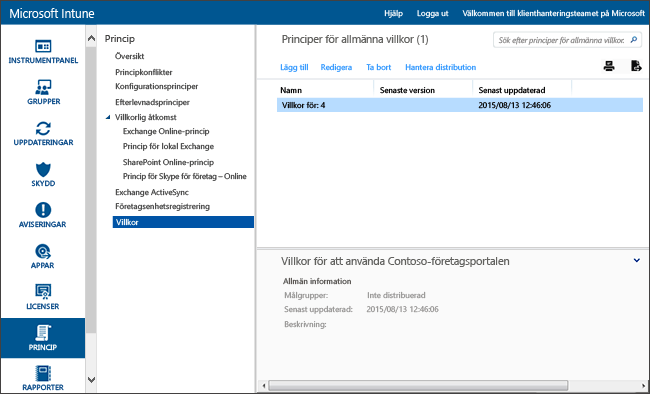

# Inställningar för användarvillkor i Microsoft Intune

[!INCLUDE[classic-portal](../includes/classic-portal.md)]

Du kan distribuera de allmänna villkoren för Intune till användargrupper och förklara hur registrering, åtkomst till arbetsresurser och företagsportalappen påverkar enheter och användare. Användare måste godkänna de allmänna villkoren innan de kan använda företagsportalen för att registrera sig och komma åt sina arbeten.

Du kan skapa och distribuera flera policys med olika användarvillkor. Du kan också skapa versioner av samma användarvillkor på olika språk och sen distribuera dessa till relevanta grupper.

## Skapa princip för allmänna villkor

1.  I [Microsoft Intune-administratörskonsolen](https://manage.microsoft.com) klickar du på **Policy** &gt; **Villkor**.

    

2.  Klicka på **Lägg till** för att skapa en ny villkorsprincip.

    Du kan också **Redigera** eller **Ta bort** en befintlig princip.

3.  På sidan **Skapa allmänna villkor** anger du följande information:

    -   **Namn** – Ett unikt namn på principen som visas i Intune-konsolen.

    -   **Beskrivning** – Information som hjälper dig att identifiera principen i Intune-konsolen.

    -   **Rubrik** – Rubriken som användarna ser på företagsportalen.

    -   **Text som förklarar vad det innebär att användaren godkänner** – Texten som användarna ser angående godkännande. Exempel: ”Jag godkänner de allmänna villkoren.”

4.  När du är klar klickar du på **Spara**. Den nya principen sparas i noden **Allmänna villkor** i arbetsytan **Princip**.

## Distribuera en princip för allmänna villkor

1.  I [Microsoft Intune-administrationskonsolen](https://manage.microsoft.com) klickar du på **Princip** &gt; **Villkor**.

2.  I listan **Principer för allmänna villkor** väljer du den princip du vill distribuera och klickar på **Hantera distribution**.

3.  I dialogrutan **Hantera distribution** väljer du de användargrupper som du vill distribuera principen till och klickar på **OK**.

    När målanvändare sen går in på företagsportalen, så visar Intune användarvillkoren som du distribuerat ut. Användare måste då acceptera villkoren innan de får åtkomst till företagsresurser.

## Övervaka en princip för allmänna villkor

1.  I [Microsoft Intune-administrationskonsolen](https://manage.microsoft.com) klickar du på **Princip** &gt; **Villkor**.

2.  I fönstret **Skapa ny rapport** klickar du sedan på **Visa rapport**. Rapporten öppnas med detaljer om vilka användare som godkänt de distribuerade användarvillkoren.

### Uppdateringar och versionskontroll för användarvillkor
När du redigerar en befintlig policy för användarvillkor kan du välja vad som ska hända när du distribuerar den. Använd följande procedur för att uppdatera befintliga användarvillkorspolicys.

## Arbeta med flera versioner av användarvillkor

1.  I [Microsoft Intune-administrationskonsolen](https://manage.microsoft.com) klickar du på **Princip** &gt; **Villkor**.

2.  Välj den princip för allmänna villkor som du vill redigera och klicka på **Redigera**.

3.  På sidan **Redigera allmänna villkor** gör du alla nödvändiga ändringar och anger sedan om den nya versionen kräver att alla användare godkänner villkoren eller om det räcker att nya användare ser den nya versionen.

    Vi rekommenderar att du ökar versionsnumret och kräver godkännande varje gång du gör betydande ändringar i din användarvillkorspolicy. Behåll det nuvarande versionsnumret om du exempelvis bara fixar stavfel eller ändrar formateringen.

### Se även
[Hantera inställningar och funktioner på dina enheter med Microsoft Intune-principer](manage-settings-and-features-on-your-devices-with-microsoft-intune-policies.md)

