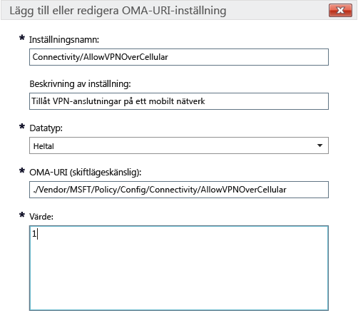

# Intune-principinställningar för Windows 10-enheter i Microsoft Intune

Det här avsnittet innehåller information om de Intune-principinställningar som du kan använda för att hantera Windows 10-enheter. Läs det här avsnittet och metoderna i [Hantera inställningar och funktioner på enheter med Microsoft Intune-principer](manage-settings-and-features-on-your-devices-with-microsoft-intune-policies.md) om du vill konfigurera inbyggda och anpassade inställningar för registrerade Windows 10 Desktop- och Windows 10 Mobile-enheter. Du kan inte använda dessa principer för datorer som kör [Intune-klientprogrammet](/intune/get-started/windows-pc-management-capabilities-in-microsoft-intune).

Du kan välja mellan två principtyper:

- **Anpassad princip**: Använd Microsoft Intunes **anpassade princip** för Windows 10 och Windows 10 Mobile för att distribuera inställningar för OMA-URI (Open Mobile Alliance Uniform Resource Identifier) som kan användas för att styra funktioner på enheter. I Windows 10 är många inställningar tillgängliga via [Princip-CSP (Configuration Service Provider)](https://technet.microsoft.com/itpro/windows/manage/how-it-pros-can-use-configuration-service-providers).
- **Allmän konfigurationspolicy**: Använd den här principtypen om du vill välja inställningar från den inbyggda listan som medföljer Microsoft Intune.

## Anpassade principinställningar

Ange följande inställningar i en anpassad princip.

### Allmänt

Ange ett namn, och eventuellt en beskrivning, för principen så att du kan identifiera den i Intune-konsolen.

### OMA-URI-inställningar

Ange följande information för varje OMA-URI-inställning som du vill lägga till. Läs [URI-inställningar för Windows 10](/intune/deploy-use/windows-10-policy-settings-in-microsoft-intune#Windows-10-URI-settings) i det här avsnittet om du vill veta mer om vilka inställningar du kan använda:

- **Inställningsnamn**: Ange ett unikt namn för OMA-URI-inställningen som hjälper dig att identifiera den i listan över inställningar.
- **Inställningsbeskrivning**: Ange en beskrivning för inställningen.
- **Datatyp**: Välj från följande datatyper:
    - **Sträng**
    - **Sträng (XML)**
    - **Datum och tid**
    - **Heltal**
    - **Flyttal**
    - **Boolesk**
- **OMA-URI (skiftlägeskänslig)**: Ange den OMA-URI som du vill tillhandahålla en inställning för.
- **Värde**: Ange det värde som ska associeras med den OMA-URI som du har angett.

### Exempel
I följande skärmbild har inställningen **Connectivity/AllowVPNOverCellular** aktiverats. Detta innebär att en Windows 10-enhet öppnar en VPN-anslutning när enheten använder ett mobilnät.

> 

## URI-inställningar för Windows 10
I det här avsnittet kan du läsa mer om OMA-URI-inställningar som du kan konfigurera med en **anpassad princip för Windows 10**.

### Princip

|Principnamn och URI|Information|
|---------------|------------|-----------|
|**Tillåt automatiskt uppdatering** ./Vendor/MSFT/Policy/Config/Update/AllowAutoUpdate|Endast Desktop **Datatyp:** heltal **Värden:** **0** - **5** (standard: **1**)|
|**Schemalägg installationsdag** ./Vendor/MSFT/Policy/Config/Update/ScheduledInstallDay|Endast Mobile **Datatyp:** heltal **Värden:** **0** – Varje dag (standard) **1** – Söndag **2** – Måndag **3** – Tisdag **4** – Onsdag **5** – Torsdag **6** – Fredag **7** – Lördag|
|**Schemalägg installationstid** ./Vendor/MSFT/Policy/Config/Update/ScheduledInstallTime|Desktop och Mobile **Datatyp:** heltal **Värden:**  **0**–**23** timmar (**0** är midnatt) (standard: **3**)|
|**DeviceLock/AllowIdleReturnWithoutPassword** ./Vendor/MSFT/Policy/Config/DeviceLock/AllowIdleReturnWithoutPassword|Endast Mobile **Datatyp:** heltal **Värden:** **0** – Användaren kan inte ange respittiden för lösenordet, värdet ställs in som ”varje gång” **1** – Användaren kan ställa in respittiden för lösenordet (standard)|
|**WiFi/AllowWiFi** ./Vendor/MSFT/Policy/Config/WiFi/AllowWiFi|Endast Mobile **Datatyp:** heltal **Värden:** **0** – Tillåt inte **användning av Wi-Fi-anslutning** **1** – Tillåt **användning av Wi-Fi-anslutning** (standard)|
|**WiFi/AllowInternetSharing** ./Vendor/MSFT/Policy/Config/WiFi/AllowInternetSharing|Desktop och Mobile **Datatyp:** heltal **Värden: ** **0** – Tillåt inte internetdelning   **1** – Tillåt internetdelning (standard)|
|**WiFi/AllowAutoConnectToWiFiSenseHotspots** ./Vendor/MSFT/Policy/Config/WiFi/AllowAutoConnectToWiFiSenseHotspots|Desktop och Mobile **Datatyp:** heltal **Värden: ** **0** – Inte tillåten  **1** – Tillåtet (standard)|
|**WiFi/AllowManualWiFiConfiguration** ./Vendor/MSFT/Policy/Config/WiFi/AllowManualWiFiConfiguration|Endast Mobile **Datatyp:** heltal **Värden:** **0** – Tillåt endast Wi-Fi-anslutningar som du konfigurerar med MDM. **1** – Tillåt att lägga till nya SSID för nätverk utöver de SSID som redan har skapats av en MDM (standard)|
|**System/AllowLocation** ./Vendor/MSFT/Policy/Config/System/AllowLocation|Desktop och Mobile **Datatyp:** heltal **Värden: ** **0** – Inte tillåten  **1** – Tillåtet (standard)|
|**System/AllowTelemetry** ./Vendor/MSFT/Policy/Config/System/AllowTelemetry|Desktop och Mobile **Datatyp:** heltal **Värden:** **0** – Tillåts inte (endast Enterprise-inställningar) **1** – Begränsad **2** – Fullständig (standard) **3** – Fullständig information och diagnostikinformation|
|**System/AllowExperimentation** ./Vendor/MSFT/Policy/Config/System/AllowExperimentation|Desktop och Mobile **Datatyp:** heltal **Värden:** **0** – Inte tillåten **1** – Endast inställningar (standard) **2** – Inställningar och experiment|
|**Security/AntiTheftMode** ./Vendor/MSFT/Policy/Config/Security/AntiTheftMode|Endast Mobile **Datatyp:** heltal **Värden:** **0** – Tillåt inte stöldskyddsläge **1** – Användarpreferenser (standard)|
|**Connectivity/AllowUSBConnection** ./Vendor/MSFT/Policy/Config/Connectivity/AllowUSBConnection|Endast Mobile **Datatyp:** heltal **Värden ** **0** – Inte tillåten  **1** – Tillåtet (standard)|
|**System/AllowUserToResetPhone** ./Vendor/MSFT/Policy/Config/System/AllowUserToResetPhone|Endast Mobile **Datatyp:** heltal **Värden: ** **0** – Inte tillåten **1** – Tillåtet (standard)|
|**Connectivity/AllowCellularDataRoaming** ./Vendor/MSFT/Policy/Config/Connectivity/AllowCellularDataRoaming|Desktop och Mobile **Datatyp:** heltal **Värden: ** **0** – Inte tillåten  **1** – Tillåtet (standard)|
|**Connectivity/AllowVPNOverCellular** ./Vendor/MSFT/Policy/Config/Connectivity/AllowVPNOverCellular|Desktop och Mobile **Datatyp:** heltal **Värden:** **0** – VPN är inte tillåtet över mobilnät **1** – VPN kan använda alla anslutningar inklusive mobil anslutning (standard)|
|**Connectivity/AllowVPNRoamingOverCellular** ./Vendor/MSFT/Policy/Config/Connectivity/AllowVPNRoamingOverCellular|Endast Mobile **Datatyp:** heltal **Värden: ** **0** – Inte tillåten  **1** – Tillåtet (standard)|
|**Connectivity/AllowVPNRoamingOverCellular** ./Vendor/MSFT/Policy/Config/Connectivity/AllowVPNRoamingOverCellular|Endast Mobile **Datatyp:** heltal **Värden: ** **0** – Inte tillåten  **1** – Tillåtet (standard)|
|**Connectivity/AllowBluetooth** ./Vendor/MSFT/Policy/Config/Connectivity/AllowBluetooth|Desktop och Mobile **Datatyp:** heltal **Värden:** **0** – Tillåt inte att användaren aktiverar Bluetooth. **1** – Reserverad. Användaren kan aktivera och konfigurera Bluetooth (stöds inte i Windows Phone 8.1 för MDM, EAS, Windows 10 Desktop eller Windows 10 Mobile). **2** – Tillåts. Användaren kan aktivera och konfigurera Bluetooth (standard).|
|**Experience/AllowScreenCapture** ./Vendor/MSFT/Policy/Config/Experience/AllowScreenCapture|Endast Mobile **Datatyp:** heltal **Värden: ** **0** – Inte tillåten  **1** – Tillåtet (standard)|
|**Experience/AllowTaskSwitcher** ./Vendor/MSFT/Policy/Config/Experience/AllowTaskSwitcher|Endast Mobile **Datatyp:** heltal **Värden: ** **0** – Inte tillåten  **1** – Tillåtet (standard)|
|**Experience/AllowVoiceRecording** ./Vendor/MSFT/Policy/Config/Experience/AllowVoiceRecording|Endast Mobile **Datatyp:** heltal **Värden: ** **0** – Inte tillåten  **1** – Tillåtet (standard)|
|**Experience/AllowSyncMySettings** ./Vendor/MSFT/Policy/Config/Experience/AllowSyncMySettings|Endast Mobile **Datatyp:** heltal **Värden: ** **0** – Tillåt inte roaming  **1** – Tillåt roaming (standard)|
|**Experience/AllowManualMDMUnenrollment** ./Vendor/MSFT/Policy/Config/Experience/AllowManualMDMUnenrollment|Desktop och Mobile **Datatyp:** heltal **Värden: ** **0** – Inte tillåten  **1** – Tillåtet (standard)|
|**Accounts/AllowMicrosoftAccountConnection** ./Vendor/MSFT/Policy/Config/Accounts/AllowMicrosoftAccountConnection|Desktop och Mobile **Datatyp:** heltal **Värden:**  **0** – Inte tillåten  **1** – Tillåtet (standard)|
|**Accounts/AllowAddingNonMicrosoftAccountsManually** ./Vendor/MSFT/Policy/Config/Accounts/AllowAddingNonMicrosoftAccountsManually|Desktop och Mobile **Datatyp:** heltal **Värden:**  **0** – Inte tillåten  **1** – Tillåtet (standard)|
|**Security/AllowManualRootCertificateInstallation** ./Vendor/MSFT/Policy/Config/Security/AllowManualRootCertificateInstallation|Endast Mobile **Datatyp:** heltal **Värden: ** **0** – Inte tillåten  **1** – Tillåtet (standard)|
|**Security/AllowAddProvisioningPackages** ./Vendor/MSFT/Policy/Config/Security/AllowAddProvisioningPackages|Desktop och Mobile **Datatyp:** heltal **Värden: ** **0** – Inte tillåten  **1** – Tillåtet (standard)|
|**Search/DisableBackoff** ./Vendor/MSFT/Policy/Config/Search/DisableBackoff|Desktop och Mobile **Datatyp:** heltal **Värden:**  **0** (standard)  **1**|
|**Search/PreventRemoteQueries** ./Vendor/MSFT/Policy/Config/Search/PreventRemoteQueries|Desktop och Mobile **Datatyp:** heltal **Värden:**  **0**  **1** (standard)|
|**Search/AllowUsingDiacritics** ./Vendor/MSFT/Policy/Config/Search/AllowUsingDiacritics|Desktop och Mobile **Datatyp:** heltal **Värden:**  **0** (standard)  **1**|
|**Search/AlwaysUseAutoLangDetection** ./Vendor/MSFT/Policy/Config/Search/AlwaysUseAutoLangDetection|Desktop och Mobile **Datatyp:** heltal **Värden:**  **0** (standard)  **1**|
|**Search/DisableRemovableDriveIndexing** ./Vendor/MSFT/Policy/Config/Search/DisableRemovableDriveIndexing|Desktop och Mobile **Datatyp:** heltal **Värden: ** **0** (standard)  **1**|
|**Search/PreventIndexingLowDiskSpaceMB** ./Vendor/MSFT/Policy/Config/Search/PreventIndexingLowDiskSpaceMB|Desktop och Mobile **Datatyp:** heltal **Värden:**  **0**  **1** (standard)|
|**Search/AllowIndexingEncryptedStoresOrItems** ./Vendor/MSFT/Policy/Config/Search/AllowIndexingEncryptedStoresOrItems|Desktop och Mobile **Datatyp:** heltal **Värden:**  **0** (standard)  **1**|
|**Security/AllowRemoveProvisioningPackage** ./Vendor/MSFT/Policy/Config/Security/AllowRemoveProvisioningPackage|Desktop och Mobile **Datatyp:** heltal **Värden: ** **0** – Inte tillåten  **1** – Tillåtet (standard)|
|**Security/RequireProvisioningPackageSignature** ./Vendor/MSFT/Policy/Config/Security/RequireProvisioningPackageSignature|Desktop och Mobile **Datatyp:** heltal **Värden: ** **0** (standard)  **1**|
|**AboveLock/AllowActionCenterNotifications** ./Vendor/MSFT/Policy/Config/AboveLock/AllowActionCenterNotifications|Desktop och Mobile **Datatyp:** heltal **Värden: ** **0** – Inte tillåten  **1** – Tillåtet (standard)|
|**TextInput/AllowIMENetworkAccess** ./Vendor/MSFT/Policy/Config/TextInput/AllowIMENetworkAccess|Endast Desktop **Datatyp:** heltal **Värden:** **0** – Tillåt inte. Öppen utökad ordbok är avstängd. En användare kan inte: - Lägga till en ny öppen utökad ordbok. - Lägga till en ny konfigurationsfil för sökintegration. - Använd molnkandidatfunktionen. -Skicka användarregistrerat ord. **1** – Tillåt Öppen utökad ordbok kan läggas till och användas som standard. Dessutom kan integrationsfunktionssökningen användas som standard. En användare kan: - Använd molnkandidatfunktionen.|
|**TextInput/AllowIMELogging** ./Vendor/MSFT/Policy/Config/TextInput/AllowIMELogging|Endast Desktop **Datatyp:** heltal **Värden:** **0** – Loggning av felkonverteringar är inaktiverat **1** – Loggning av felkonverteringar är aktiverat (standard).|
|**TextInput/AllowJapaneseNonPublishingStandardGlyph** ./Vendor/MSFT/Policy/Config/TextInput/AllowJapaneseNonPublishingStandardGlyph|Endast Desktop **Datatyp:** heltal **Värden: ** **0** – Inte tillåten  **1** – Tillåtet (standard)|
|**TextInput/AllowJapaneseIVSCharacters** ./Vendor/MSFT/Policy/Config/TextInput/AllowJapaneseIVSCharacters|Endast Desktop **Datatyp:** heltal **Värden: ** **0** – Inte tillåten  **1** – Tillåtet (standard)|
|**TextInput/AllowJapaneseUserDictionary** ./Vendor/MSFT/Policy/Config/TextInput/AllowJapaneseUserDictionary|Endast Desktop **Datatyp:** heltal **Värden: ** **0** – Inte tillåten  **1** – Tillåtet (standard)|
|**TextInput/AllowJapaneseIMESurrogatePairCharacters** ./Vendor/MSFT/Policy/Config/TextInput/AllowJapaneseIMESurrogatePairCharacters|Endast Desktop **Datatyp:** heltal **Värden: ** **0** – Inte tillåten  **1** – Tillåtet (standard)|
|**TextInput/ExcludeJapaneseIMEExceptShiftJIS** ./Vendor/MSFT/Policy/Config/TextInput/ExcludeJapaneseIMEExceptShiftJIS|Endast Desktop **Datatyp:** heltal **Värden:** **0** – Inga tecken filtreras (standard) **1** – Alla tecken utom JIS-skifttecken filtreras|
|**TextInput/ExcludeJapaneseIMEExceptJIS0208** ./Vendor/MSFT/Policy/Config/TextInput/ExcludeJapaneseIMEExceptJIS0208|Endast Desktop **Datatyp:** heltal **Värden:** **0** – Inga tecken filtreras (standard) **1** – Alla tecken utom JIS0208-tecken filtreras|
|**TextInput/ExcludeJapaneseIMEExceptJIS0208andEUDC** ./Vendor/MSFT/Policy/Config/TextInput/ExcludeJapaneseIMEExceptJIS0208andEUDC|Endast Desktop **Datatyp:** heltal **Värden:** **0** – Inga tecken filtreras (standard) **1** – Alla tecken utom JIS0208-tecken och EUDC-tecken filtreras|
|**TextInput/AllowInputPanel** ./Vendor/MSFT/Policy/Config/TextInput/AllowInputPanel|Endast Desktop **Datatyp:** heltal **Värden: ** **0** – Inte tillåten  **1** – Tillåtet (standard)|
|**Bluetooth/AllowDiscoverableMode** ./Vendor/MSFT/Policy/Config/Bluetooth/AllowDiscoverableMode|Desktop och Mobile **Datatyp:** heltal **Värden: ** **0** – Inte tillåten  **1** – Tillåtet (standard)|
|**Bluetooth/AllowAdvertising** ./Vendor/MSFT/Policy/Config/Bluetooth/AllowAdvertising|Desktop och Mobile **Datatyp:** heltal **Värden: ** **0** – Inte tillåten  **1** – Tillåtet (standard)|
|**Settings/AllowDataSense** ./Vendor/MSFT/Policy/Config/Settings/AllowDataSense|Desktop och Mobile **Datatyp:** heltal **Värden: ** **0** – Inte tillåten  **1** – Tillåtet (standard)|
|**Settings/AllowVPN** ./Vendor/MSFT/Policy/Config/Settings/AllowVPN|Desktop och Mobile **Datatyp:** heltal **Värden: ** **0** – Inte tillåten  **1** – Tillåtet (standard)|
|**Settings/AllowWorkplace** ./Vendor/MSFT/Policy/Config/Settings/AllowWorkplace|Endast Desktop **Datatyp:** heltal **Värden ** **0** – Inte tillåten  **1** – Tillåtet (standard)|
|**Settings/AllowDateTime** ./Vendor/MSFT/Policy/Config/Settings/AllowDateTime|Desktop och Mobile **Datatyp:** heltal **Värden ** **0** – Inte tillåten  **1** – Tillåtet (standard)|
|**Settings/AllowLanguage** ./Vendor/MSFT/Policy/Config/Settings/AllowLanguage|Endast Desktop **Datatyp:** heltal **Värden: ** **0** – Inte tillåten  **1** – Tillåtet (standard)|
|**Settings/AllowRegion** ./Vendor/MSFT/Policy/Config/Settings/AllowRegion|Endast Desktop **Datatyp:** heltal **Värden: ** **0** – Inte tillåten  **1** – Tillåtet (standard)|
|**Settings/AllowSignInOptions** ./Vendor/MSFT/Policy/Config/Settings/AllowSignInOptions|Endast Desktop **Datatyp:** heltal **Värden: ** **0** – Inte tillåten  **1** – Tillåtet (standard)|
|**Settings/AllowYourAccount** ./Vendor/MSFT/Policy/Config/Settings/AllowYourAccount|Desktop och Mobile **Datatyp:** heltal **Värden: ** **0** – Inte tillåten  **1** – Tillåtet (standard)|
|**Settings/AllowPowerSleep** ./Vendor/MSFT/Policy/Config/Settings/AllowPowerSleep|Endast Desktop **Datatyp:** heltal **Värden: ** **0** – Inte tillåten  **1** – Tillåtet (standard)|
|**Settings/AllowAutoPlay** ./Vendor/MSFT/Policy/Config/Settings/AllowAutoPlay|Endast Desktop **Datatyp:** heltal **Värden: ** **0** – Inte tillåten  **1** – Tillåtet (standard)|
|**Experience/AllowCortana** ./Vendor/MSFT/Policy/Config/Experience/AllowCortana|Desktop och Mobile **Datatyp:** heltal **Värden: ** **0** – Inte tillåten  **1** – Tillåtet (standard)|
|**Search/SafeSearchPermissions** ./Vendor/MSFT/Policy/Config/Search/SafeSearchPermissions|Endast Mobile **Datatyp:** heltal **Värden:** **0** – Strikt, högsta filtrering mot vuxet innehåll **1** – Måttlig filtrering av vuxeninnehåll (giltiga sökresultat filtreras inte) (standard)|
|**Experience/AllowCopyPaste** ./Vendor/MSFT/Policy/Config/Experience/AllowCopyPaste|Endast Desktop **Datatyp:** heltal **Värden: ** **0** – Inte tillåten  **1** – Tillåtet (standard)|
|**Forcerad startstorlek** ./Vendor/MSFT/Policy/Config/Start/ForceStartSize|Endast Mobile **Datatyp:** heltal **Värden:** **0** – Tillåt användaren att ändra storlek (standard) **1** – Framtvinga skärm som inte är helskärm **2** – Framtvinga helskärm|
|**Update/RequireDeferUpgrade** ./Vendor/MSFT/Policy/Config/Update/RequireDeferUpgrade|Desktop och Mobile **Datatyp:** heltal **Värden:** **0** – Skjut inte upp uppgradering (stanna i aktuell gren, CB) (standard) **1** – Tillåt att uppdateringar och uppgraderingar skjuts upp (enheten följer aktuell gren för företag, CBB, regler) Mer information finns i: [Introduktion till Windows 10-installation](https://technet.microsoft.com/library/mt598226.aspx) [Planera för distribution av Windows 10](https://technet.microsoft.com/library/mt574241.aspx)|
|**Update/DeferUpdatePeriod** ./Vendor/MSFT/Policy/Config/Update/DeferUpdatePeriod|Desktop och Mobile **Beskrivning:** Princip för att skjuta upp programuppdateringar i upp till fyra veckor **Datatyp:** heltal **Värden:**  **0** – Tillämpa uppdateringar direkt (standard) **1**-**4** – Antal veckor som programvaruuppdateringarna ska skjutas upp Mer information finns i: [Introduktion till Windows 10-installation](https://technet.microsoft.com/library/mt598226.aspx) [Planera för distribution av Windows 10](https://technet.microsoft.com/library/mt574241.aspx)|
|**Update/DeferUpgradePeriod** ./Vendor/MSFT/Policy/Config/Update/DeferUpgradePeriod|Desktop och Mobile **Beskrivning:** Princip för att skjuta upp funktionsuppgraderingar i upp till åtta månader **Datatyp:** heltal **Värden:** **0** – Tillämpa uppdateringar direkt (standard) **1**-**8** – Antal månader som funktionsuppgraderingar ska skjutas upp Mer information finns i: [Introduktion till Windows 10-installation](https://technet.microsoft.com/library/mt598226.aspx) [Planera för distribution av Windows 10](https://technet.microsoft.com/library/mt574241.aspx)|
|**Update/PauseDeferrals** ./Vendor/MSFT/Policy/Config/Update/PauseDeferrals|Desktop och Mobile **Beskrivning:** Tillåter att en enheter slutar få uppdateringar och uppgraderingar i fem veckor. **Datatyp:** heltal **Värden:** **0** – Tillämpa uppdateringar direkt (standard) **1** – Pausa uppdateringar och uppgraderingar (upphör att gälla efter fem veckor)|

### Windows försvarare

|Principnamn och URI|Information|
|---------------|-----------|
|**AllowRealtimeMonitoring** ./Vendor/MSFT/Policy/Config/Defender/AllowRealtimeMonitoring|Endast Desktop **Datatyp:** heltal **Värden: ** **0** – Inte tillåten  **1** – Tillåtet (standard)|
|**AllowBehaviorMonitoring** ./Vendor/MSFT/Policy/Config/Defender/AllowBehaviorMonitoring|Endast Desktop **Datatyp:** heltal **Värden: ** **0** – Inte tillåten  **1** – Tillåtet (standard)|
|**AllowIntrusionPreventionSystem** ./Vendor/MSFT/Policy/Config/Defender/AllowIntrusionPreventionSystem|Endast Desktop **Datatyp:** heltal **Värden: ** **0** – Inte tillåten  **1** – Tillåtet (standard)|
|**AllowIOAVProtection** ./Vendor/MSFT/Policy/Config/Defender/AllowIOAVProtection|Endast Desktop **Datatyp:** heltal **Värden:**  **0** – Inte tillåten  **1** – Tillåtet (standard)|
|**AllowScriptScanning** ./Vendor/MSFT/Policy/Config/Defender/AllowScriptScanning|Endast Desktop **Datatyp:** heltal **Värden: ** **0** – Inte tillåten  **1** – Tillåtet (standard)|
|**AllowOnAccessProtection** ./Vendor/MSFT/Policy/Config/Defender/AllowOnAccessProtection|Endast Desktop **Datatyp:** heltal **Värden: ** **0** – Inte tillåten  **1** – Tillåtet (standard)|
|**RealTimeScanDirection** ./Vendor/MSFT/Policy/Config/Defender/RealTimeScanDirection|Endast Desktop **Datatyp:** heltal **Värden:** **0** – Övervaka alla filer (standard) **1** – Övervaka inkommande filer **2** – Övervaka utgående filer|
|**DaysToRetainCleanedMalware** ./Vendor/MSFT/Policy/Config/Defender/DaysToRetainCleanedMalware|Endast Desktop **Datatyp:** heltal **Värden:** **0** - **90** – Visar hur länge skadlig programvara kommer att hållas kvar **0** – Behåller skadlig kod i karantänmappen för alltid och tar inte bort den automatiskt (standard)|
|**AllowUserUIAccess** ./Vendor/MSFT/Policy/Config/Defender/AllowUserUIAccess|Endast Desktop **Datatyp:** heltal **Värden: ** **0** – Inte tillåten  **1** – Tillåtet (standard)|
|**ScanParameter** ./Vendor/MSFT/Policy/Config/Defender/ScanParameter|Endast Desktop **Datatyp:** heltal **Värden:** **1** – Snabbsökning (standard) **2** – Full scanning|
|**ScheduleScanDay** ./Vendor/MSFT/Policy/Config/Defender/ScheduleScanDay|Endast Desktop **Datatyp:** heltal **Värden:** **0** – Varje dag (standard) **1** – Måndag **2** – Tisdag **3** – Onsdag **4** – Torsdag **5** – Fredag **6** – Lördag **7** – Söndag **8** – Ingen schemalagd scanning|
|**ScheduleScanTime** ./Vendor/MSFT/Policy/Config/Defender/ScheduleScanTime|Endast Desktop **Datatyp:** heltal **Värden:** **0** – 12:00 am **60** – 1:00 am **120** – 02:00 (standard) **180** – 3:00 am **240** – 4:00 am **300** – 5:00 am **360** – 6:00 am **420** – 7:00 am **480** – 8:00 am **540** – 9:00 am **600** – 10:00 am **660** – 11:00 am **720** – 12:00 pm **780** – 1:00 pm **840** – 2:00 pm **900** – 3:00 pm **960** – 4:00 pm **1020** – 5:00 pm **1080** – 6:00 pm **1140** – 7:00 pm **1200** – 8:00 pm **1260** – 9:00 pm **1320** – 10:00 pm **1381** – Underhållsfönster|
|**ScheduleQuickScanTime** ./Vendor/MSFT/Policy/Config/Defender/ScheduleQuickScanTime|Endast Desktop **Datatyp:** heltal **Värden:** **0** – 12:00 am **60** – 1:00 am **120** – 02:00 (standard) **180** – 3:00 am **240** – 4:00 am **300** – 5:00 am **360** – 6:00 am **420** – 7:00 am **480** – 8:00 am **540** – 9:00 am **600** – 10:00 am **660** – 11:00 am **720** – 12:00 pm **780** – 1:00 pm **840** – 2:00 pm **900** – 3:00 pm **960** – 4:00 pm **1020** – 5:00 pm **1080** – 6:00 pm **1140** – 7:00 pm **1200** – 8:00 pm **1260** – 9:00 pm **1320** – 10:00 pm **1380** – 11:00 pm|
|**AVGCPULoadFactor** ./Vendor/MSFT/Policy/Config/Defender/AVGCPULoadFactor|Endast Desktop **Datatyp:** heltal **Värden: ** **0** - **100** (standard: **50**)|
|**AllowArchiveScanning** ./Vendor/MSFT/Policy/Config/Defender/AllowArchiveScanning|Endast Desktop **Datatyp:** heltal **Värden: ** **0** – Inte tillåten  **1** – Tillåtet (standard)|
|**AllowEmailScanning** ./Vendor/MSFT/Policy/Config/Defender/AllowEmailScanning|Endast Desktop **Datatyp:** heltal **Värden: ** **0** – Tillåts inte (standard)  **1** – Tillåten|
|**AllowFullScanRemovableDriveScanning** ./Vendor/MSFT/Policy/Config/Defender/AllowFullScanRemovableDriveScanning|Endast Desktop **Datatyp:** heltal **Värden: ** **0** – Tillåts inte (standard)  **1** – Tillåten|
|**AllowFullScanOnMappedNetworkDrives** ./Vendor/MSFT/Policy/Config/Defender/AllowFullScanOnMappedNetworkDrives|Endast Desktop **Datatyp:** heltal **Värden: ** **0** – Inte tillåten  **1** – Tillåtet (standard)|
|**AllowScanningNetworkFiles** ./Vendor/MSFT/Policy/Config/Defender/AllowScanningNetworkFiles|Endast Desktop **Datatyp:** heltal **Värden: ** **0** – Inte tillåten  **1** – Tillåten (standard) – Körs även när RTP är aktiverad om den är inställd på tillåten|
|**SignatureUpdateInterval** ./Vendor/MSFT/Policy/Config/Defender/SignatureUpdateInterval|Endast Desktop **Datatyp:** heltal **Värden:** **0** – Kontrollera inte signaturer i ett intervall **1** – Kontrollera om signaturer finns varje timme **2** – Kontrollera varannan timme  **24** – Kontrollera varje dag **8** – Kontrollera var åttonde timme (standard)|
|**AllowCloudProtection** ./Vendor/MSFT/Policy/Config/Defender/AllowCloudProtection|Endast Desktop **Datatyp:** heltal **Värden: ** **0** – Inte tillåten  **1** – Tillåtet (standard)|
|**SubmitSamplesConsent** ./Vendor/MSFT/Policy/Config/Defender/SubmitSamplesConsent|Endast Desktop **Datatyp:** heltal **Värden:** **0** – Fråga alltid (default) **1** – Skicka säkra prover automatiskt **2** – Skicka aldrig **3** – Skicka alla prover automatiskt|
|**ExcludedExtensions** ./Vendor/MSFT/Policy/Config/Defender/ExcludedExtensions|Endast Desktop **Datatyp:** Sträng **Värden:** *&lt;Lista över tillägg avgränsade med semikolon&gt;* Exempel: **obj;lib** **Standard –** Inga tillägg utesluts|
|**ExcludedPaths** ./Vendor/MSFT/Policy/Config/Defender/ExcludedPaths|Endast Desktop **Datatyp:** Sträng **Värden:** *&lt;Lista över sökvägar avgränsade med semikolon&gt;* Exempel: **c:\test;c:\test1.exe** **Standard –** Inga sökvägar utesluts|
|**ExcludedProcesses** ./Vendor/MSFT/Policy/Config/Defender/ExcludedProcesses|Endast Desktop **Datatyp:** Sträng **Värden:** *&lt;Lista över sökvägar avgränsade med semikolon&gt;* Exempel: **c:\test.exe;c:\test1.exe** **Standard –** Inga processer utesluts|

### Edge-webbläsare

|Principnamn och URI|Information|
|---------------|------------|-----------|
|**Tillåt webbläsare** ./Vendor/MSFT/Policy/Config/Browser/AllowBrowser|Endast Mobile **Datatyp:** heltal **Värden: ** **0** – Webbsökning inaktiverat  **1** – Webbsökning aktiverat (standard)|
|**AllowSearchSuggestionsinAddressBar** ./Vendor/MSFT/Policy/Config/Browser/AllowSearchSuggestionsinAddressBar|Desktop och Mobile **Datatyp:** heltal **Värden: ** **0** – Visa inte förslag  **1** – Visa förslag (standard)|
|**SendIntranetTraffictoInternetExplorer** ./Vendor/MSFT/Policy/Config/Browser/SendIntranetTraffictoInternetExplorer|Endast Desktop **Datatyp:** heltal **Värden:** **0** – Inaktiverad (öppna intranätsplatser i Microsoft Edge-webbläsare – standard) **1** – Aktiverad (öppna intranätsplatser i Internet Explorer)|
|**Tillåt Spåra inte** ./Vendor/MSFT/Policy/Config/Browser/AllowDoNotTrack|Desktop och Mobile) **Datatyp:** heltal **Värden: ** **0** – Inaktiverad (DNT skickas inte (standard))  **1** – Aktiverad (skicka DNT)|
|**Konfigurera SmartScreen** ./Vendor/MSFT/Policy/Config/Browser/AllowSmartScreen|Desktop och Mobile **Datatyp:** heltal **Värden: ** **0** – Tillåt inte  **1** – Tillåt (standard)|
|**Tillåt popup-fönster** ./Vendor/MSFT/Policy/Config/Browser/AllowPopups|Endast Desktop **Datatyp:** heltal **Värden: ** **0** – Blockera popup-fönster (standard)  **1** – Tillåt popup-fönster|
|**Tillåt cookies** ./Vendor/MSFT/Policy/Config/Browser/AllowCookies|Desktop och Mobile **Datatyp:** heltal **Värden:** **0** – Tillåt cookies från alla webbplatser (standard) **1** – Blockera endast cookies från tredje part **2** – Blockera alla cookies|
|**Tillåt att spara lösenord** ./Vendor/MSFT/Policy/Config/Browser/AllowPasswordManager|Desktop och Mobile **Datatyp:** heltal **Värden:** **0** – Lösenordshanteraren är inaktiverad  **1** – Lösenordshanteraren är aktiverad (standard)|
|**Tillåt autofyll** ./Vendor/MSFT/Policy/Config/Browser/AllowAutofill|Endast Desktop **Datatyp:** heltal **Värden**:  **0** – Inaktiverad (standard)  **1** – Aktiverad|
|**Konfigurera företagswebbplatslista** ./Vendor/MSFT/Policy/Config/Browser/EnterpriseModeSiteList|Endast Desktop **Datatyp:** Sträng **Värden:** **0** – Inte konfigurerat **1** – Använd Internet Explorers webbplatslista för företagsläge om den är konfigurerad (standard) **2** – Ange plats för företagswebbplatslista|

## Generella inställningar för konfigurationsprinciper

Använd den **allmänna konfigurationsprincipen** för Windows Intune för Windows 10 om du vill konfigurera inbyggda inställningar för registrerade Windows 10 Desktop- och Windows 10 Mobile-enheter.

### Lösenord

|Inställningsnamn|Ytterligare information (om det behövs)|
|----------------|----------------------|
|**Kräv ett lösenord för att låsa upp enheter**|-|
|**Lösenordstyp krävs**|Anger om lösenordet måste vara alfanumeriskt eller endast numeriskt|
|**Krav på lösenordstyp** - **Minsta antal teckenuppsättningar**| Anger hur många teckenuppsättningar (gemener, versaler, siffror och symboler) som måste ingå i lösenordet|
|**Minsta längd på lösenord**|Gäller endast för Windows 10 Mobile|
|**Antal tillåtna, upprepade felinloggningar innan enheten rensas**.|För enheter som kör Windows 10: Om BitLocker är aktiverat på enheten placeras den i återställningsläget för BitLocker efter den gräns för antal misslyckade inloggningar som du har angett. Om BitLocker inte är aktiverat på enheten tillämpas inte den här inställningen. För enheter som kör Windows 10 Mobile: Om inloggningen misslyckas ett visst antal gånger (som du angett) rensas enheten.|
|**Antal minuter av inaktivitet innan skärmen stängs av**|Anger hur lång tid en enhet måste vara inaktiv innan skärmen låses|
|**Lösenordets giltighetstid (i dagar)**|Anger efter hur lång tid enhetens lösenord måste ändras|
|**Kom ihåg tidigare lösenord**|Anger om du vill förhindra att användaren återanvänder tidigare använda lösenord|
|**Spara lösenordshistorik** - **Förhindra återanvändning av tidigare lösenord **|Anger antalet tidigare använda lösenord som enheten sparar|
|**Kräv lösenord när enheten återgår från viloläge**|Anger att användaren måste ange ett lösenord för att låsa upp enheten (endast Windows 10 Mobile)|

### Kryptering

|Inställningsnamn|Ytterligare information (om det behövs)|
|----------------|----------------------|
|**Filkryptering på mobil enhet**|Aktiverar kryptering på målenheter (endast Windows 10 Mobile)|

### System

|Inställningsnamn|Ytterligare information (om det behövs)|
|----------------|----------------------|
|**Tillåt skärmbild**|Användaren kan ta en skärmbild av enhetens skärm (endast Windows 10 Mobile)|
|**Tillåt manuell avregistrering**|Tillåter att användaren manuellt raderar sitt arbetsplatskonto från enheten|
|**Tillåt manuell installation av rotcertifikat**|Gäller för Windows 10 Mobile|
|**Tillåt att diagnostik- och användardata skickas till Microsoft**|Möjliga värden är:  **Nej** – Inga data skickas till Microsoft **Grundläggande** – Begränsad information skickas till Microsoft **Utökad** – Utökade diagnostikdata skickas till Microsoft **Fullständig (rekommenderas)** –Skickar samma data som **Utökad**, plus ytterligare information om enhetens tillstånd|

### Konto och synkronisering

|Inställningsnamn|Ytterligare information (om det behövs)|
|----------------|----------------------|---------------------|
|**Tillåt Microsoft-konto**|Låter användaren associera ett Microsoft-konto med enheten|
|**Tillåt att andra konton än Microsoft-konton får läggas till manuellt**|Låter användaren lägga till e-postkonton till enheten som inte är associerade med ett Microsoft-konto|
|**Tillåt synkronisering av inställningar för Microsoft-konton**|Tillåt att enhets- och appinställningar som associeras med ett Microsoft-konto synkroniseras mellan enheter|

### Microsoft Edge

|Inställningsnamn|Ytterligare information (om det behövs)|
|----------------|----------------------|
|**Tillåt webbläsare**|Tillåter användningen av Microsoft Edge-webbläsaren på enheten (endast Windows 10 Mobile)|
|**Tillåt sökförslag i adressfältet**|Tillåter att din sökmotor föreslår platser när du skriver sökord|
|**Tillåt att intranättrafik skickas till Internet Explorer**|Tillåter att användarna öppnar intranätsplatser i Internet Explorer (endast Windows 10 Desktop)|
|**Tillåt Spåra inte**|Konfigurerar Microsoft Edge-webbläsaren så att Do Not Track-huvuden skickas till webbplatser som användarna besöker|
|**Aktivera SmartScreen**||
|**Tillåt Active scripting**|Tillåter att skript (exempelvis JavaScript) körs i webbläsaren Edge|
|**Tillåt popup-fönster**|Gäller endast för Windows 10 Desktop|
|**Tillåt cookies**||
|**Tillåt autofyll**|Tillåter att användarna kan ändra inställningarna för att automatiskt komplettera i webbläsaren (endast Windows 10 Desktop)|
|**Tillåt lösenordshanteraren**|Aktiverar eller inaktiverar lösenordshanteraren i Edge|
|**Listplats för Företagsläge-webbplats**|Anger var du hittar listan över webbsidor som öppnas i Enterprise-läge. Användare kan inte redigera den här listan. (endast Windows 10 Desktop)|

### Appar

|Inställningsnamn|Ytterligare information (om det behövs)|
|----------------|----------------------|---------------------|
|**Tillåt appbutik**|Gäller endast för Windows 10 Mobile|

### Mobilnät

|Inställningsnamn|Ytterligare information (om det behövs)|
|----------------|----------------------|---------------------|
|**Tillåter datanätverksväxling**|Tillåt växling mellan nätverk vid åtkomst till data.|
|**Tillåt VPN via mobilnät**|Styr huruvida enheten kan komma åt VPN-anslutningar när den är ansluten till ett mobilnät.|
|**Tillåt VPN-roaming via mobilnät**|Styr huruvida enheten kan komma åt VPN-anslutningar vid roaming i ett mobilnät.|

### Maskinvara

|Inställningsnamn|Ytterligare information (om det behövs)|
|----------------|----------------------|
|**Tillåt kamera**|-|
|**Tillåt flyttbara lagringsmedier**|Anger om externa lagringsenheter, till exempel ett SD-kort, kan användas med enheten.|
|**Tillåt Wi-Fi**|Gäller endast för Windows 10 Mobile|
|**Tillåt internetdelning**|Tillåter användningen av internetanslutningsdelning på enheten|
|**Tillåt manuell Wi-Fi konfiguration**|Styr huruvida användarna kan konfigurera egna trådlösa anslutningar eller om de endast kan använda anslutningar som konfigurerats med en Wi-Fi-profil. (endast Windows 10 Mobile)|
|**Tillåt automatisk anslutning till kostnadsfria trådlösa surfzoner**|Tillåter att enheten ansluter automatiskt till kostnadsfria trådlösa surfzoner och att den godkänner eventuella villkor för anslutningen automatiskt.|
|**Tillåt geolokalisering**|Anger om enheten kan använda tjänsterna för platsinformation.|
|**Tillåt NFC**|Tillåter att enheten använder funktioner för närfältskommunikation.|
|**Tillåt Bluetooth**|-|
|**Tillåt läge för identifierbart Bluetooth**|Tillåter att enheten kan upptäckas av andra Bluetooth-aktiverade enheter.|
|**Tillåt Bluetoothreklam**|Tillåter att enheter tar emot meddelanden via Bluetooth.|
|**Tillåt telefonåterställning**|Styr om användaren kan göra en fabriksåterställning på enheten eller inte|
|**Tillåt USB-anslutning**|Styr huruvida enheter kan komma åt externa lagringsenheter via en USB-anslutning.|
|**Tillåt AntiTheft läge**|Ange om stöldskyddsläge i Windows är aktiverat|

### Funktioner

|Inställningsnamn|Ytterligare information (om det behövs)|
|----------------|----------------------|---------------------|
|**Tillåt kopiera och klistra in**|Gäller endast för Windows 10 Mobile|
|**Tillåt röstinspelning**|Gäller endast för Windows 10 Mobile|
|**Tillåt Cortana**|Aktivera eller inaktivera röstassistenten Cortana.|
|**Tillåt action center meddelanden**|Aktivera eller inaktivera aviseringar från Åtgärdscenter på enhetens låsskärm. (endast Windows 10 Mobile)|

### Windows försvarare

Alla inställningar gäller endast Windows 10 Desktop.

|Inställningsnamn|Ytterligare information (om det behövs)|
|----------------|----------------------|---------------------|
|**Tillåt realtidsövervakning**|Tillåter genomsökning i realtid efter skadlig programvara, spionprogram och annan oönskad programvara|
|**Tillåt beteendeövervakning**|Tillåter att Defender söker efter kända mönster på misstänkt aktivitet på enheter|
|**Aktivera kontrollsystem för nätverk**|Kontrollsystemet för nätverk (NIS) hjälper till att skydda enheter mot nätverksbaserade kryphål genom att använda signaturerna för kända säkerhetsrisker från Microsoft Endpoint Protection Center för att identifiera och blockera skadlig trafik|
|**Sök igenom alla hämtningar**|Kontrollerar om Defender söker igenom alla filer som hämtas från Internet|
|**Tillåt skriptgenomsökning**|Tillåter att Defender genomsöker skript som används i Internet Explorer|
|**Övervaka fil- och programaktivitet**|Tillåter att Defender övervakar fil- och programaktivitet på enheter|
|**Dagar som löst skadlig kod ska spåras**|Tillåter att Defender fortsätter spåra åtgärdad skadlig kod det antal dagar som du anger så att du kan kontrollera tidigare berörda enheter manuellt. Om du ställer in antalet dagar till **0** finns skadlig kod kvar i karantänmappen och tas inte bort automatiskt. |
|**Tillåt användargränssnittsåtkomst för klient**|Styr huruvida Windows Defender-användargränssnittet är dolt från användarna. När den här inställningen ändras börjar den gälla nästa gång användarens dator startas om.|
|**Schemalägg daglig snabbsökning**|Tillåter att du schemalägger en snabbgenomsökning som körs varje dag vid den tidpunkt som du väljer|
|**Schemalägg en systemsökning**|Tillåter att du schemalägger en fullständig sökning eller en snabbsökning som körs regelbundet på den dag och vid den tidpunkt som du väljer|
|**Begränsa processoranvändning under en sökning**|Tillåter att du begränsar hur mycket processorkraft som genomsökningarna får använda (från **1** till **100**)|
|**Sök igenom arkivfiler**|Tillåter att Defender söker igenom arkiverade filer, till exempel ZIP- eller CAB-filer.|
|**Sök igenom e-postmeddelanden**|Tillåter att Defender söker igenom e-postmeddelanden när de tas emot på enheten|
|**Sök igenom flyttbara enheter**|Tillåter att Defender söker igenom flyttbara enheter, t.ex. USB-minnen|
|**Sök igenom mappade nätverksenheter**|Tillåter att Defender söker igenom filer på mappade nätverksenheter. Om filerna på enheten är skrivskyddade kan Defender inte ta bort eventuell skadlig kod i dem.|
|**Sök igenom filer öppnade från delade nätverksmappar**|Tillåter att Defender söker igenom filer på delade nätverksenheter, till exempel de som nås från en UNC-sökväg. Om filerna på enheten är skrivskyddade kan Defender inte ta bort eventuell skadlig kod i dem.|
|**Intervall för signaturuppdatering**|Ange med vilket intervall som Defender ska söka efter nya signaturfiler.|
|**Tillåt molnskydd**|Tillåt eller förhindra att Microsoft Active Protection Service tar emot information om skadlig kod från enheter som du hanterar. Den här informationen används för att förbättra tjänsten i framtiden.|
|**Be användarna att skicka exempel**|Styr huruvida filer som kan kräva ytterligare analys av Microsoft för att avgöra om de är skadliga ska skickas automatiskt till Microsoft|
|**Identifiering av potentiellt oönskade program**|Skyddar registrerade Windows Desktop-enheter mot aktiv programvara som klassificerats som oönskad av Windows Defender. Du kan skydda dig mot att dessa program körs eller använda granskningsläget för att rapportera att ett potentiellt oönskat program har installerats.|
|**Filer och mappar som ska undantas när en sökning körs eller när realtidsskyddet används**|Lägger till en eller flera filer och mappar som **C:\Sökväg** eller **%ProgramFiles%\Sökväg\filnamn.exe** i undantagslistan. Dessa filer och mappar tas inte med i realtidsgenomsökningar eller schemalagda genomsökningar.|
|**Filnamnstillägg att undanta när en sökning körs eller när realtidsskyddet används**|Lägg till ett eller flera filnamnstillägg som **jpg** eller **txt** i undantagslistan. Filer med dessa filnamnstillägg tas inte med i realtidsgenomsökningar eller schemalagda genomsökningar.|
|**Processer att undanta när en sökning körs eller när realtidsskyddet används**|Lägger till en eller flera processer av typen **.exe**, **.com** eller **.scr** i undantagslistan. Dessa processer tas inte med i realtidsgenomsökningar eller schemalagda genomsökningar.|

### Updates

|Inställningsnamn|Ytterligare information (om det behövs)|
|----------------|---------------|
|**Tillåt automatiska uppdateringar**|Tillåt automatiska uppdateringar. Konfigurera någon av följande inställningar för att kontrollera uppdateringsbeteendet: **Meddela om hämtning** **Automatisk installation vid underhållstidpunkt** **Automatisk installation och omstart vid underhållstidpunkt** **Installera automatiskt och starta om enligt schema**: Om det här alternativet har valts kan du också konfigurera följande inställningar: **Meddela inte slutanvändare** och **Definiera installationsdag för schemalagda uppdateringar**. (endast Windows 10 Desktop)|
|**Tillåt förhandsfunktioner**|Låter Microsoft distribuera förhandsversionsinställningar och -funktioner till Windows 10-enheter. Du kan välja att tillåta att endast inställningar eller alla förhandsversionsinställningar och -funktioner installeras.|

### Se även
[Hantera inställningar och funktioner på dina enheter med Microsoft Intune-principer](manage-settings-and-features-on-your-devices-with-microsoft-intune-policies.md)

<!--HONumber=Nov16_HO4-->

