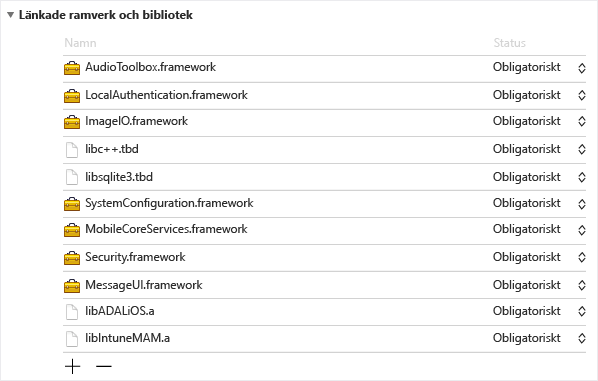
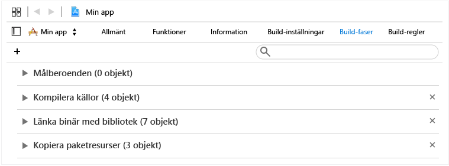
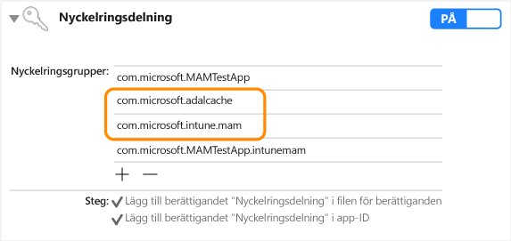

# Utvecklarhandbok för Microsoft Intune App SDK för iOS

> [!NOTE]
> Börja gärna med att läsa guiden [Komma igång med Intune App SDK](intune-app-sdk-get-started.md). Den här guiden beskriver hur du förbereder för integrering på de plattformar som stöds.* 

Med Microsoft Intune App SDK för iOS kan du lägga till mobilappshantering (MAM, Mobile App Management) med Intune i din iOS-app. Ett MAM-aktiverat program är integrerat i Intune App SDK och gör att IT-administratörer kan distribuera principer till mobilappen när den hanteras aktivt.

# Vad innehåller SDK?

Intune App SDK för iOS innehåller ett statiskt bibliotek, resursfiler, API-rubriker, en plist-fil med inställningar för felsökning samt ett konfigurationsverktyg. Mobilappar kan bara innehålla resursfiler och statiskt länka till biblioteken i de flesta tillämpningarna av principer. Avancerade MAM-funktioner i Intune aktiveras via API:er.
I den här handboken beskrivs hur du använder följande när du integrerar Intune App SDK för iOS:

* **`libIntuneMAM.a`**: Intune App SDK-biblioteket. Länka det här biblioteket till projektet att göra din mobilapp MAM-aktiverad. Anvisningar finns i avsnittet Skapa en app med Intune App SDK.

* **`IntuneMAMResources.Bundle`**: En resurssamling som innehåller resurser som SDK bygger på. 

* **Rubriker**: visar API:er för Intune App SDK. Om du använder ett API måste du inkludera huvudfilen som innehåller API:et. 

# Så fungerar Intune App SDK

Målet med Intune App SDK för iOS är att lägga till hanteringsfunktioner i iOS-program med minimala kodändringar. Genom att minska antalet kodändringar minskar du tiden det tar att marknadsföra produkten samtidigt som mobilappen blir mer konsekvent och stabil. 

Programmet måste länkas till det statiska biblioteket och inkludera resurspaketet. Filen MAMDebugSettings.plist är valfri och kan tas med i paketet för att simulera MAM-principer som tillämpas på programmet utan att behöva distribuera programmet via Microsoft Intune. Dessutom kan principerna i filen MAMDebugSettings.plist tillämpas i felsökningsversioner genom att överföra filen till programmets dokumentkatalog via iTunes fildelning.

# Skapa en app med Intune App SDK 

Följ stegen nedan för att aktivera Intune App SDK:

1. Länka till biblioteket `libIntuneMAM.a` på följande sätt:

    Dra och släpp biblioteket libIntuneMAM.a till listan Linked Frameworks and Libraries (Länkade ramverk och bibliotek) i projektets målkatalog.  

    
 
    **Obs!**När du lanserar appen i butiken bör du använda den version av libIntuneMAM.a som skapats för lanseringen, alltså inte felsökningsversionen. Versionen ligger i versionsmappen. Felsökningsversionen innehåller utförliga data som är bra för felsökningsproblem i Intune App SDK.

2. Lägg till följande iOS-ramverk i projektet (om de saknas).
    * `MessageUI.framework`
    * `Security.framework`
    * `MobileCoreServices.framework`
    * `SystemConfiguration.framework`
    * `libsqlite3.dylib`
    * `libc++.dylib`
    * `ImageIO.framework`
    * `LocalAuthentication.Framework`
    * `AudioToolbox.framework` 

    **Obs!**Om programmet är avsett för iOS7 anger du attributet Status i `LocalAuthentication.Framework` som Valfri. 

    Om inget värde har angetts för Status kan inte programmet starta i iOS7.

    **Obs!**Xcode 7 har bytt `.dylib` -tilläggen till `.tbd`.

3. Lägg till resurspaketet `IntuneMAMResources.bundle` i projektet genom att dra resurspaketet till Copy Bundle Resources (Kopiera paketresurser) i Build Phases (Versionsfaser). 

    

4. Lägg till `-force_load {PATH_TO_LIB}/libIntuneMAM.a` i någon av följande och ersätt `{PATH_TO_LIB}` med platsen för Intune App SDK:
    * projektets konfigurationsinställning för versionen OTHER_LDFLAGS 
    * användargränssnitten Other Linker Flags (Andra länkarflaggor) 

    **Obs!**Leta reda på `PATH_TO_LIB`genom att välja filen `libIntuneMAM.a` och välja Get Info (Hämta information) från menyn Arkiv. Kopiera och klistra in sökvägen från avsnittet Allmänt i fönstret Information.

5. Om mobilappen definierar Main Nib eller Storyboard i filen `info.plist`tar du bort fälten för filen Main Storyboard eller Main Nib. Lägg till värdena för Storyboard eller Nib som du tidigare tog bort under en ny ordlista som heter `IntuneMAMSettings` med följande namn, i tillämpliga fall:
    * `MainStoryboardFile`
    * `MainStoryboardFile~ipad`
    * `MainNibFile`
    * `MainNibFile~ipad `
    
    Om mobilappen inte definierar något värde för Main Nib eller Storyboard i filen `info.plist`är dessa inställningar **inte obligatoriska**. 

    **Obs!**Du kan visa filen `info.plist` i obearbetat format (för att visa nyckelnamnen) genom att högerklicka någonstans i dokumentets brödtext och ändra visningstypen till Show Raw Keys/Values (Visa obearbetade nycklar/värden).

6. Aktivera delning av nyckelringar (om det inte redan är aktiverat) genom att klicka på Funktioner i varje projektmål och aktivera reglaget för delning av nyckelringar. Delning av nyckelringar krävs för att kunna fortsätta till nästa steg.

    **Obs!**Etableringsprofilen måste ha stöd för nya värden för delning av nyckelringar. Åtkomstgrupper för nyckelringar ska ha stöd för jokertecken. Du kan bekräfta det genom att öppna filen `.mobileprovision` i en textredigerare, söka efter keychain-access-groups och se till att du har ett jokertecken, t.ex.: 

       <key>keychain-access-groups</key>
       <array>
       <string>YOURBUNDLESEEDID.*</string>
       </array>

7. När du har aktiverat delning av nyckelringar följer du dessa steg för att skapa en separat åtkomstgrupp där data i Intune App SDK kommer att sparas. Du kan skapa en åtkomstgrupp för nyckelringar med hjälp av användargränssnittet eller med behörighetsfilen:

    Använda användargränssnittet för att skapa en åtkomstgrupp för nyckelringar: 
    
    * Om mobilappen inte har definierat några åtkomstgrupper för nyckelringar lägger du till appens paket-ID som den första gruppen.
    * Lägg till den delade nyckelringsgruppen com.microsoft.intune.mam. Den här åtkomstgruppen används av Intune App SDK för att spara data.  
    * Lägg till resurspaketet `com.microsoft.adalcache` i dina befintliga åtkomstgrupper. 
 
    

    Om du använder behörighetsfilen för att skapa en åtkomstgrupp för nyckelringar istället för det vanliga användargränssnittet måste du lägga till åtkomstgruppen för nyckelringar med `$(AppIdentifierPrefix)` i behörighetsfilen. Exempel: `$(AppIdentifierPrefix)com.microsoft.intune.mam` och `$(AppIdentifierPrefix)com.microsoft.adalcache`.

    **Obs!**En behörighetsfil är en XML-fil som är unik för mobilappen som används för att ange särskilda behörigheter och funktioner i din iOS-app.

8. För mobilappar som utvecklas för iOS 9 och senare måste du inkludera varje protokoll som mobilappen skickar till `UIApplication canOpenURL` i matrisen `LSApplicationQueriesSchemes` i mobilappens `info.plist` -fil. Dessutom måste ett nytt protokoll läggas till med `-intunemam`. Du måste även inkludera `http-intunemam`, `https-intunemam`och `ms-outlook-intunemam` i matrisen. 

9. Om appen definierar URL-scheman i `info.plist file`lägger du till ytterligare ett schema med suffixet `-intunemam` för varje URL-schema.

10. Om appen har definierade appgrupper i sina behörigheter lägger du till dessa grupper i ordlistan `IntuneMAMSettings` under nyckeln `AppGroupIdentitifiers` som en matris med strängar.

11. Länka mobilappen till ADAL-biblioteket. ADAL-biblioteket för Objective C [finns på Github](https://github.com/AzureAD/azure-activedirectory-library-for-objc).

    **Obs!**Intune App SDK har testats enligt ADAL-hanterarens kod från 19 juni 2015. Se till att du länkar till den senaste fungerande versionen av ADAL-biblioteket.

12. Inkludera paketet `ADALiOSBundle.bundle resource` i projektet genom att dra resurspaketet till Copy Bundle Resources (Kopiera paketresurser) i Build Phases (Versionsfaser).

13. Använd länkaralternativet `-force_load PATH_TO_ADAL_LIBRARY` när du länkar till biblioteket.

    Lägg till `-force_load {PATH_TO_LIB}/libADALiOS.a` i projektets konfigurationsinställning för versionen OTHER_LDFLAGS eller Other Linker Flags (Andra länkarflaggor) i användargränssnittet. PATH_TO_LIB ska ersättas med platsen för ADAL-binärfilerna. 

Om mobilappen använder ADAL för sin egen autentisering läser du avsnittet Konfigurera inställningarna för Azure Directory Authentication Library (ADAL) som finns här.

## Telemetri 

Intune App SDK för iOS loggar telemetridata vid användningshändelser som standard och skickar dem till Microsoft Intune.

Data loggas på följande användningshändelser: 

1. Starta appen för att hjälpa Microsoft Intune att få veta mer om MAM-aktiverad appanvändning efter hanteringstyp.

2. Anropa API:et EnrollApplication för att hjälpa Microsoft Intune att förstå lyckade resultat och andra typer av resultatstatistik för anropet enrollApplication från klienten.

**Obs!**Om du väljer att inte skicka Intune App SDK-telemetridata till Microsoft Intune från din mobilapp **måste du inaktivera** Intune App SDK-telemetriinsamlingen genom att ge egenskapen `MAMTelemetryDisabled` värdet YES (JA) i `IntuneMAMSettings`.

## Konfigurera inställningarna för Azure Directory Authentication Library (ADAL) (valfritt)

Intune App SDK använder ADAL för autentisering och villkorliga startscenarier. Oftast kräver ADAL att appar registreras och erhåller ett unikt ID, även kallat `ClientID`, och andra identifierare, för att garantera säkerheten för token som beviljats appen. Intune App SDK använder standardvärden för registrering vid kontakt med Azure Active Directory.  Om själva appen använder ADAL för autentiseringsscenariot måste appen använda de befintliga registreringsvärdena och åsidosätta standardvärdet för Intune App SDK för att se till att slutanvändare inte behöver autentiseras två gånger (en gång av Intune App SDK och en gång av appen). 

Stegen nedan krävs om själva appen använder ADAL för autentisering. Om mobilappen inte är beroende av ADAL krävs inga fler åtgärder. 

1. I filen `Info.plist`i projektet, under ordlistan `IntuneMAMSettings` med nyckelnamnet `ADALClientId`anger du det `ClientID` som ska användas för ADAL-anrop. 

2. I filen `Info.plist`i projektet, under ordlistan `IntuneMAMSettings` med nyckelnamnet `ADALRedirectUri`anger du den omdirigerings-URI som ska användas för ADAL-anrop. Du kan även behöva ange `ADALRedirectScheme` beroende på formatet för appens omdirigerings-URI.

## Skapa tillägg (valfritt) 

När du skapar tillägg följer du samma anvisningar som när du skapade mobilappen som beskrivs i avsnittet Skapa en app med Intune App SDK. Dessutom uppdaterar du filen info.plist för varje tillägg för att lägga till nyckeln ContainingAppBundleId i ordlistan IntuneMAMSettings med värdet för programmets paket-ID.

## Skapa ramverk (valfritt)

Med de senaste ändringarna i Intune App SDK behöver du inte kompilera mobilappen med några särskilda länkarflaggor om mobilappen innehåller inbäddade ramverk för programmet. 

## Bildfiler vid start (valfritt)

När en MAM-aktiverad app aktivt hanteras av Microsoft Intune visas en startskärm i Intune App SDK när appen startas för att visa användaren att appen hanteras. Om du vill kan du lägga till bildfiler som kan visas på startsidan Hanteras av ditt företag. Använd följande riktlinjer för bilder:

* Lägg till filnamnen i ordlistan `IntuneMAMSettings` i filen info.plist i appen med nyckelnamnen `SplashIconFile` och `SplashIconFile~ipad`. 

* Storlekar och krav för bilder:

    * 180 x 180 för iPhone 6s Plus och iPhone 6 Plus, 120 x 120 för andra iPhone-modeller och 152 x 152 för iPad. 
    
    * Ta bort tillägget `.png` från filnamnen 
    
    * Använd länkaralternativet `@2x` för en version som är förminskad två gånger och suffixet `@3x` för en version som är förminskad tre gånger för bildfilerna. Om bilderna inte har rätt storlek kommer de att anpassas. Om värdena för SplashIconFile inte anges kommer Intune App SDK att välja en av appens ikoner (60 x 60 för alla iPhone-modeller, 76 x 76 för iPad).

**Obs!**Den här skärmen visas vid starten, men kan ignoreras permanent av användaren.

# Konfigurera inställningarna för Intune App SDK

Ordlistan `IntuneMAMSettings` i filen `info.plist` i programmet används för att konfigurera Intune App SDK. Följande är en lista över konfigurationer som stöds: 

Några av de här inställningarna kan ha beskrivits i föregående avsnitt och vissa gäller inte för alla program. 

Inställningar  | Typ  | Definition | Obligatoriskt?
--|--|--|--
ADALClientId  | Sträng  | Programmets klient-ID för AAD. | Krävs om programmet använde ADAL.
ADALRedirectUri  | Sträng  | Programmets omdirigerings-URI för AAD. | Krävs om programmet använde ADAL. 
AppGroupIdentifier | Strängmatris  | Matris med appgrupper från appens behörigheter i avsnittet com.apple.security.application-groups  | Krävs om appen använder programgrupper.
ContainingAppBundleId  | Sträng | Anger paket-id:t för programmet som ingår i tillägget. | Krävs för iOS-tillägg.
MainNibFile MainNibFile~ipad  | Sträng  | Den här inställningen ska innehålla programmets namn på filen för Main Nib.  | Krävs om programmet definierar MainNibFile i filen info.plist.
MainStoryboardFile MainStoryboardFile~ipad  | Sträng  | Den här inställningen ska innehålla programmets namn på filen för Main Storyboard. | Krävs om programmet definierar UIMainStoryboardFile i filen info.plist
SplashIconFile  SplashIconFile~ipad  | Sträng  | Anger filen för Intunes ikon för välkomstskärmen. I avsnittet Bildfiler vid start finns mer information. | Valfritt.
SplashDuration | Antal | Kortaste tid i sekunder som välkomstskärmen för Intune visas när programmet startas. Standardvärdet är 1,5. | Valfritt.
ADALLogOverrideDisabled | Boolesk  | Anger om SDK:t dirigerar alla ADAL-loggar (inklusive eventuella ADAL-anrop från appen) till den egna loggfilen. Standardvärdet är NO (NEJ). Ange YES (JA) om appen ska ange egna återanrop i ADAL-loggen. | Valfritt.

# Huvuden för Intune App SDK 

Följande huvuden innehåller API-funktionsanrop som krävs för att aktivera funktionerna i Intune App SDK. 

    IntuneMAMAsyncResult.h
    IntuneMAMDataProtectionInfo.h
    IntuneMAMDataProtectionManager.h
    IntuneMAMFileProtectionInfo.h
    IntuneMAMFileProtectionManager.h
    IntuneMAMPolicyDelegate.h
    IntuneMAMLogger.h

# Felsökning av Intune App SDK i Xcode

Innan du testar den MAM-aktiverade appen med Microsoft Intune kan du använda `Settings.bundle` i Xcode. På så sätt kan du ange testprinciper utan att det krävs någon anslutning till Intune. Så här aktiverar du det:

* Lägg till `Settings.bundle` genom att högerklicka på den översta mappen i projektet. Välj Lägg till -> Ny fil i menyn. Välj mallen Settings Bundle (Inställningspaket) under Resurser för att lägga till den.

* I felsökningsversioner kopierar du `MAMDebugSettings.plist` till `Settings.bundle`.

* I `Root.plist` (i Settings.bundle) lägger du till inställningen för typ, underordnad ruta eller filnamn i `MAMDebugSettings`.

* Under Inställningar -> Appens namn växlar du till Enable Test Policies (Aktivera testprinciper).

* Starta appen (antingen i eller utanför Xcode). 

* Under Inställningar -> Appens namn -> Enable Test Policies (Aktivera testprinciper) byter du princip, t.ex. PIN-KOD.

* Starta appen (antingen i eller utanför Xcode). Kontrollera att PIN-koden fungerar som väntat.

> [!NOTE]
> Nu kan du använda Inställningar -> Appens namn -> Aktivera testprinciper för att aktivera och växla mellan inställningar.

# Rekommenderade metoder för iOS

Följande är några rekommenderade metoder när du utvecklar för iOS:

iOS-filsystemet är skiftlägeskänsligt. Se till att versaler och gemener stämmer för filnamn som `libIntuneMAM.a` och `IntuneMAMResources.bundle`.

Om Xcode har problem med att hitta `libIntuneMAM.a`kan du åtgärda problemet genom att lägga till sökvägen till biblioteket i sökvägarna för länkare.

<!--HONumber=Jun16_HO4-->

