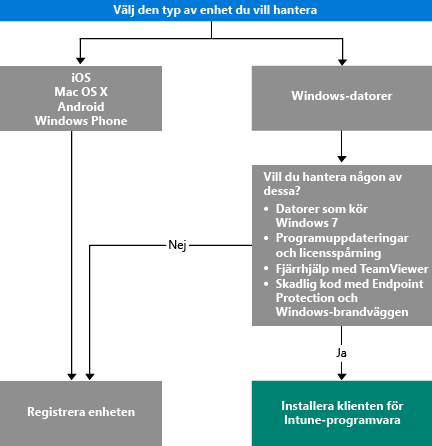

# Välj hur du vill hantera enheter

[!INCLUDE[classic-portal](../includes/classic-portal.md)]

Om du vill kunna utnyttja alla funktioner i Intune, t.ex. appdistribution och kontroll av enhetsinställningar, måste enheterna vara *hanterade*. Hur du hanterar enheter beror på vilka Intune-funktioner som du vill använda. Det här avsnittet hjälper dig att välja den metod som passar dina behov.

Om du vill hantera enheter som kör iOS, Mac OS X, Android eller Windows Phone, måste du *registrera* dem.

Om du vill hantera Windows-datorer har du två alternativ:

1. Registrera enheten **eller**
2. Installera *Intune-klientprogrammet*.

## Bestämma vilken metod du ska använda
Använd det här beslutsflödet för att avgöra hur du ska få enheterna hanterade.

Du får mest funktioner om du registrerar Windows-datorerna. Intune-klientprogrammet kan dock passa bättre för:

- Windows 7
- Windows-uppdateringar och licensanvändning
- Endpoint Protection och Windows-brandväggen
- Fjärrhjälp till användare med programmet TeamViewer

En detaljerad lista över de hanteringsfunktioner som du får med varje metod finns i [Funktioner för hantering av mobilenheter](mobile-device-management-capabilities-in-microsoft-intune.md) och [Funktioner för Intune PC-klientprogrammet](windows-pc-management-capabilities-in-microsoft-intune.md).
Information om vilka enheter och datorer som Intune stöder finns i [Mobila enheter och datorer som stöds](https://docs.microsoft.com/intune/get-started/what-to-know-before-you-start-microsoft-intune#intune-supported-devices).

## Nästa steg

- [Välj hur du vill registrera mobila enheter](/intune/get-started/choose-how-to-enroll-devices1)
- [Hantera Windows-datorer med Intune-klientprogramvara](/intune/deploy-use/manage-windows-pcs-with-microsoft-intune)
- [Exchange ActiveSync-hantering av mobila enheter med Microsoft Intune](/intune/deploy-use/mobile-device-management-with-exchange-activesync-and-microsoft-intune).

