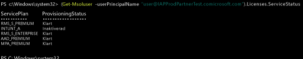

# Tilldela Intune-licenser till dina användarkonton

[!INCLUDE[classic-portal](../includes/classic-portal.md)]

Oavsett om du lägger till användare manuellt eller synkroniserar från din lokala Active Directory, så måste du först tilldela varje användare en Intune-licens innan de kan registrera sina enheter i Intune.

## Tilldela en Intune-licens i administrationscentret för Office 365

Du kan använda [Office 365-portalen](http://go.microsoft.com/fwlink/p/?LinkId=698854) för att manuellt lägga till molnbaserade användare och tilldela licenser till både molnbaserade användarkonton och konton som synkroniseras från din lokala Active Directory till Azure AD.

1.  Logga in på [Office 365-portalen](http://go.microsoft.com/fwlink/p/?LinkId=698854) med dina klientadministratörsuppgifter och välj sedan **Användare** > **Aktiva användare**.

2.  Markera det användarkonto som du vill tilldela en Intune-användarlicens och välj sedan **Produktlicenser** > **Redigera**.

3.  Växla **Intune** eller **Enterprise Mobility + säkerhet** till **På** och Välj **Spara**.

4. Användarkontot har nu de behörigheter som krävs för att använda tjänsten och registrera enheter för hantering.

> [!NOTE]
> Användarna visas i administratörskonsolen när de har registrerat en enhet. Du kan också välja en grupp användare som redigeras samtidigt, genom att välja att lägga till eller ersätta en licens för alla markerade användare.

## Använda PowerShell för att hantera EMS-användarlicenser selektivt
Organisationer som använder Microsoft Enterprise Mobility + Security (tidigare Enterprise Mobility Suite) kanske har användare som bara behöver Azure Active Directory Premium eller Intune-tjänster i EMS-paketet. Du kan tilldela en tjänst eller en delmängd tjänster med hjälp av [Azure Active Directory PowerShell-cmdlets](https://msdn.microsoft.com/library/jj151815.aspx).

Om du vill tilldela användarlicenser för EMS-tjänster öppnar du PowerShell som administratör på en dator där [Azure Active Directory-modulen för Windows PowerShell](https://msdn.microsoft.com/library/jj151815.aspx#bkmk_installmodule) är installerad. Du kan installera PowerShell på en lokal dator eller på en AD FS-server.

Du måste skapa en ny definition av licens-SKU:n som bara gäller önskade tjänstplaner. Det gör du genom att inaktivera planer som du inte vill använda. Du kan till exempel skapa en definition av licens-SKU:n som inte tilldelar en Intune-licens. Om du vill visa en lista över tjänster som är tillgängliga skriver du:

    (Get-MsolAccountSku | Where {$_.SkuPartNumber -eq "EMS"}).ServiceStatus

Du kan köra följande kommando om du vill undanta Intune-tjänstplanen. Du kan använda samma metod om du vill utöka till en hel säkerhetsgrupp eller använda mer detaljerade filter.

**Exempel 1** 
Skapa en ny användare på kommandoraden och tilldela en EMS-licens utan att aktivera Intune-delen av licensen:

    Connect-MsolService

    New-MsolUser -DisplayName “Test User” -FirstName FName -LastName LName -UserPrincipalName user@<TenantName>.onmicrosoft.com –Department DName -UsageLocation US

    $CustomEMS = New-MsolLicenseOptions -AccountSkuId "<TenantName>:EMS" -DisabledPlans INTUNE_A
    Set-MsolUserLicense -UserPrincipalName user@<TenantName>.onmicrosoft.com -AddLicenses <TenantName>:EMS -LicenseOptions $CustomEMS

Kontrollera med:

    (Get-MsolUser -UserPrincipalName "user@<TenantName>.onmicrosoft.com").Licenses.ServiceStatus

**Exempel 2** 
Inaktivera Intune-delen av EMS-licensen för en användare som redan har tilldelats en licens:

    Connect-MsolService

    $CustomEMS = New-MsolLicenseOptions -AccountSkuId "<TenantName>:EMS" -DisabledPlans INTUNE_A
    Set-MsolUserLicense -UserPrincipalName user@<TenantName>.onmicrosoft.com -LicenseOptions $CustomEMS

Kontrollera med:

    (Get-MsolUser -UserPrincipalName "user@<TenantName>.onmicrosoft.com").Licenses.ServiceStatus

>[!div class="step-by-step"]

>[&larr; **Synkronisera användare i Intune**](.\start-with-a-paid-subscription-to-microsoft-intune-step-2.md)     [**Ordna användare och enheter** &rarr;](.\start-with-a-paid-subscription-to-microsoft-intune-step-5.md)  

