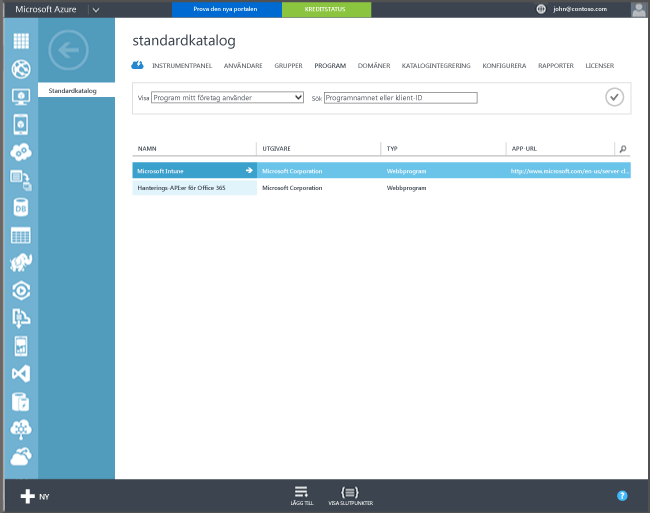

## Azure Active Directory-registrering

Den automatiska registreringen gör att användarna kan registrera sina företagsägda eller privata Windows 10-datorer och Windows 10 Mobile-enheter i Intune genom att lägga till ett arbetskonto eller skolkonto och godkänna att datorn/enheten hanteras. Svårare än så är det inte. Användarens enhet registreras och ansluts till Azure Active Directory i bakgrunden. När enheten har registrerats hanteras den med Intune.

**Krav**
- Azure Active Directory Premium-prenumeration ([provprenumeration](http://go.microsoft.com/fwlink/?LinkID=816845))
- Microsoft Intune-prenumeration

### Konfigurera automatisk MDM-registrering

1. Gå till noden **Active Directory** på [Azure-hanteringsportalen](https://manage.windowsazure.com) (https://manage.windowsazure.com) och välj din katalog.

2. Klicka på fliken **Program**. Nu ska **Microsoft Intune** visas i listan med program.

    

3. Klicka på pilen för **Microsoft Intune**. Nu ska en sida visas där du kan konfigurera Microsoft Intune.

4. Klicka på **Konfigurera** och börja konfigurera automatisk MDM-registrering med Microsoft Intune.

5. Ange URL: er för Intune:

  - **MDM Enrollment URL** (URL för MDM-registrering) – Använd standardvärdet.
  - **URL för MDM-villkor** – Använd standardvärdet. Denna URL visar villkoren för användarna när de registrerar enheter.
  - **URL för MDM-efterlevnad** – Använd standardvärdet. Om en enhet inte är kompatibel visas ett **Åtkomst nekas**-meddelande med denna URL. URL:en pekar till en sida som förklarar för användarna varför deras enhet inte uppfyller kraven för principen och vad de kan göra för att enheten ska uppfylla kraven.

6.  Ange vilka användares enheter som ska hanteras av Microsoft Intune. Dessa användares Windows 10-enheter registreras automatiskt för hantering med Microsoft Intune.

  - **Alla**
  - **GRUPPER**
  - **Inga**

7. Välj **Spara**.

<!--HONumber=Jan17_HO1-->

