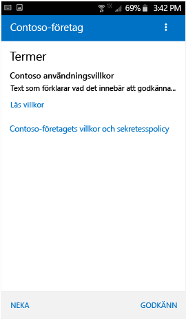
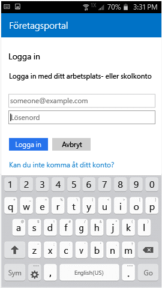

# Registrera en Android-enhet i Intune

Om företaget eller skolan använder Microsoft Intune kan du registrera din Android-enhet så att den får tillgång till företagets e-post, filer och andra resurser. När du registrerar dina enheter kan IT-avdelningen hantera deras arbets- eller skolresurser, skydda dem och samtidigt ge dig friheten att använda den enhet du önskar för att utföra ditt arbete. Mer information om registrering finns i [Vad händer när jag installerar företagsportalappen och registrerar min enhet?](what-happens-if-you-install-the-Company-Portal-app-and-enroll-your-device-in-intune-android.md)

> [!VIDEO https://channel9.msdn.com/Series/IntuneEnrollment/Android-Enrollment/player]

De här registreringsanvisningarna är avsedda för ursprungliga Android-enheter och Samsung KNOX Android-enheter. Samsung KNOX tillhandahåller en typ av säkerhet som vissa Samsung-enheter använder för att ge ytterligare skydd utöver vad den interna säkerheten i Android ger. Du kan kontrollera om du har en Samsung KNOX-enhet genom att välja **Inställningar** > **Om enheten**. Om du inte ser orden "Knox version" i listan har du en ursprunglig Android-enhet.

Före eller efter registreringen kan du bli ombedd att välja en kategori som bäst beskriver hur du använder enheten. Din IT-administratör använder den här kategorin för att se vilka appar du har åtkomst till.

Om du får ett felmeddelande när du försöker registrera enheten i Intune kan du [skicka registreringsfel till din IT-administratör](send-enrollment-errors-to-your-it-admin-android.md).

**Registrera en Android-enhet:**

1.  Installera den kostnadsfria Intune-företagsportalsappen från [Google Play](http://play.google.com/store/apps/details?id=com.microsoft.windowsintune.companyportal).

2.  Öppna Microsoft Intune företagsportalapp.

3.  På företagsportalens skärm **Välkommen** trycker du på **Logga in** och loggar sedan in med ditt arbets- eller skolkonto.

       

4.  Om IT-administratören konfigurerar allmänna villkor trycker du på **GODKÄNN** för att godkänna villkoren. Den här skärmen kan skilja sig från bilden nedan beroende på vilken version av Android som du använder.

    

5.  Logga in på företagsportalappen med ditt konto och lösenord för arbetet eller skolan och tryck sedan på **Logga in**.

    

6.  Tryck på **BÖRJA** på skärmen **Konfiguration av företagsåtkomst**.

    

    > [!NOTE]
    > De gula trianglarna innebär inte att du redan har råkat ut för ett fel. Ikonerna anger att det fortfarande finns oavslutade steg i registreringsprocessen.

7. På skärmen **Varför ska jag registrera enheten?** kan du läsa vad du kan göra när du har registrerat enheten. Tryck sedan på **FORTSÄTT**.

    

8.  Läs informationen om vad IT-administratören kan se och inte kan se på enheten och tryck sedan på **FORTSÄTT**.

    

9.  På skärmen **Vad kommer härnäst** läser du om vad som händer under registreringen och trycker sedan på **REGISTRERA**.

    

10.  Gör så här om du använder Android 6.0 eller senare. Annars går du till nästa steg.

    Följande meddelanden kan visas om IT-administratören har konfigurerat vissa principer:
    -   **Tillåt att företagsportalen kan ringa och hantera telefonsamtal?**

        

    Om det här meddelandet visas trycker du på **TILLÅT**. Det är säkert att trycka på TILLÅT eftersom **Microsoft aldrig ringer eller hanterar dina telefonsamtal**! Google styr meddelandetexten och Microsoft kan inte ändra den. Allt du gör när du ger åtkomst är att du låter din enhet skicka enhetens IMEI-nummer (International Mobile Station Equipment Identity) till Intune. IMEI är ett slags serienummer som är en unik identifierare för en mobil enhet.

    Om du nekar åtkomst visas meddelandet igen nästa gång du loggar in på företagsportalen, men du kan inaktivera framtida meddelanden genom att trycka på rutan **Fråga inte igen**. Om användare senare bestämmer sig för att tillåta åtkomst kan de gå till **Inställningar** &gt; **Appar** &gt; **Företagsportal** &gt; **Behörigheter** &gt; **Telefon** och sedan aktivera behörigheten.

    -   **Tillåt att företagsportalappen får åtkomst till dina kontakter?**

        

        Om det här meddelandet visas trycker du på **TILLÅT**. Det är säkert att trycka på TILLÅT eftersom **Microsoft aldrig bereder sig åtkomst till dina kontakter!** Google styr meddelandetexten och Microsoft kan inte ändra den. När du beviljar åtkomst låter det endast företagsportalappen att skapa, använda och hantera ditt arbetskonto.

        Om du nekar åtkomst visas meddelandet igen nästa gång du loggar in på företagsportalen, men du kan inaktivera framtida meddelanden genom att trycka på rutan **Fråga inte igen**. Om användare senare bestämmer sig för att tillåta åtkomst kan de gå till **Inställningar** &gt; **Appar** &gt; **Företagsportal** &gt; **Behörigheter** &gt; **Telefon** och sedan aktivera behörigheten.

11.  På skärmen **Aktivera enhetsadministratör** trycker du på **Aktivera**.

    

    Företagsportalen måste innehålla enhetsadministratörens roll för att kunna hantera enheten. Det innebär att administratören kan se vissa saker – t.ex. hur många gånger som du har försökt att låsa upp din skärm – och utföra vissa åtgärder.

    Det är viktigt att komma ihåg att dessa åtgärder vidtas av säkerhetsskäl. IT-administratören försöker inte inkräkta på din integritet eller radera din information utan anledning, utan vill se till att företagets data förblir säkra.

    Microsoft styr inte över det här meddelandet och vi förstår att dess formulering kan verka lite drastisk. Företagsportalen kan inte visa just de begränsningar och den åtkomst som gäller för din organisation. Alla beviljas samtidigt på den här skärmen. Kontakta IT-administratören med hjälp av kontaktinformationen på [Företagsportalen](http://portal.manage.microsoft.com) om du har frågor som är specifika för användningen i din organisation.

12.  Följ anvisningarna för att ange en PIN-kod eller ett lösenord. Om du redan har ställt in en PIN-kod eller ett lösenord på enheten, visas inte den här skärmen och du behöver inte ange en ny PIN-kod eller ett nytt lösenord.

    

13.  Om du använder en Samsung KNOX-enhet trycker du på **Bekräfta**, så visas ett meddelande om att enheten registreras. Se följande skärm som visar att enheten registreras om du använder en Android-enhet.

    

    Den här skärmen visar att enheten registreras.

    

14. När skärmen **Konfigurera företagsåtkomst** visas trycker du på **FORTSÄTT**. Om ett meddelande indikerar att enheten är inkompatibel följer du anvisningarna för att åtgärda problemet. Tryck sedan på **FORTSÄTT**.

    

    

    Du hittar mer information om problemen genom att trycka på dem.

    

      

15. På skärmen **Konfigurering av företagsåtkomst har slutförts** trycker du på **KLAR**. Enheten har nu registrerats.

    

Innan du försöker installera företagsappar besöker du **Inställningar** &gt; **Säkerhet**, och aktiverar **Okända källor**. Om du inte aktiverar det här alternativet innan du försöker installera apparna visas följande meddelande: "Installationen blockerades". Av säkerhetsskäl är enheten inställd på att blockera installationer av appar från okända källor. Du kan trycka på **Inställningar** i dialogrutan med felmeddelandet för att gå till alternativet **Okända källor**.

> [!Note]
> Om din organisation använder kostnad hanteringsprogramvara för telekomtjänster måste ytterligare ett part steg utföras innan enheten har registrerats fullständigt. Läs mer [här](enroll-your-device-with-telecom-expense-management-android.md).

Behöver du fortfarande hjälp? Kontakta IT-administratören (du hittar kontaktinformation på [företagsportalens webbplats](http://portal.manage.microsoft.com)) eller skriv till <a href="mailto:wintunedroidfbk@microsoft.com?subject=I'm having trouble with enrolling my Android device&body=Describe the issue you're experiencing here.">Microsoft Android-teamet</a>.
