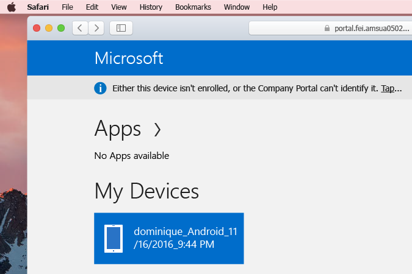

# Registrera din macOS-enhet i Intune på företagsportalappen

Med åtkomst till din organisations appar, data och resurser är det enklare för dig att göra ditt jobb. Din organisation använder Intune för att [hantera åtkomst till resurserna](what-happens-if-you-install-the-Company-Portal-app-and-enroll-your-device-in-intune-macos.md), vilket kräver att du kan ladda ned företagsportalappen för macOS. De här instruktionerna fungerar för macOS-enheter på OS X El Capitan 10.11+.

> [!NOTE]
> Du hittar anvisningar för att registrera macOS-enheter på tidigare versioner av macOS [här](enroll-your-device-in-intune-macos-legacy.md).

1. På din __Docka__, går du till __Safari__ och öppnar ett nytt fönster och öppnar sedan [företagsportalens webbplats](https://portal.manage.microsoft.com).

2. Logga in på företagsportalens webbplats med ditt arbets- eller skolkonto.

[!INCLUDE[wit_nextref](includes/end-user-password-guidance.md)]

3. När du har loggat in klickar du på **menyn** i det övre vänstra hörnet på sidan och väljer **Mina enheter**.

   

4. På sidan __Mina enheter__ visas antingen en lista med registrerade enheter eller bara ett popup-meddelande. Det beror på om du redan har registrerat en enhet, ett macOS eller annat. Om du vill registrera en enhet som inte finns i listan väljer du meddelandet som ser ut ungefär så här: __Identifiera enheten i listan genom att trycka på den. Du kan också trycka här för att registrera din enhet om den inte visas i listan__. Om du inte har några registrerade enheter anger banderollen **Du har inga registrerade enheter. Registrera den här genom att trycka här.**

    

5. Hämta företagsportalappen till macOS-enheten för att fortsätta med registreringen.

    

6. Mac-enheten kontrollerar att den nedladdade filen **CompanyPortal.pkg** är säker att öppna. Öppna installationsprogrammet och gå igenom installationen.

7. När installationsprogrammet har slutförts öppnar du mappen **Program** eller **Startfönster** och sedan **Företagsportalen**.

8. Mac-enheten visar ett felmeddelande om att **”CompanyPortal” är ett program som laddats ned från Internet. Vill du öppna det ändå?** Klicka på **Öppna**.

  > [!NOTE]
  > Intune behöver åtkomst till datorn för att se till att enheten är säker nog för att få åtkomst till organisationens resurser. Om datorn vägrar att öppna företagsportalappen kan du försöka att [inaktivera Gatekeeper](https://support.apple.com/HT202491) och sedan öppna appen.

9. På den första skärmen som visas i företagsportalappen uppmanas du att **Logga in** med samma arbets- eller skolkonto som du använde för att logga in på företagsportalens webbplats.

10. Företagsportalen bekräftar kontoinformationen och visar sedan statusen för **Enhetsregistrering** och **Enhetsefterlevnad**. En gul triangel indikerar att det finns åtgärder som du behöver utföra för att kontrollera att Mac-enheten är säker för användning i arbetet. Tryck på **Börja** för att starta [registreringen av din enhet till hantering](what-info-can-your-company-see-when-you-enroll-your-device-in-intune.md).

11. Mac-enheten börjar registreras för hantering. Du kan uppmanas att ange din dators inloggningsinformation under den här tiden. Det kan ta några minuter att registrera. Du kan göra andra saker på datorn under tiden. När du har slutfört konfigurationen av företagsåtkomst så visas ett meddelande som talar om att du är färdig.

Behöver du fortfarande hjälp? Kontakta företagets support. Du hittar kontaktinformationen på [Företagsportalens webbplats](https://portal.manage.microsoft.com).
