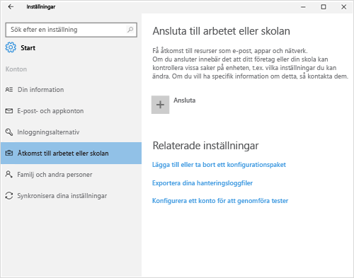
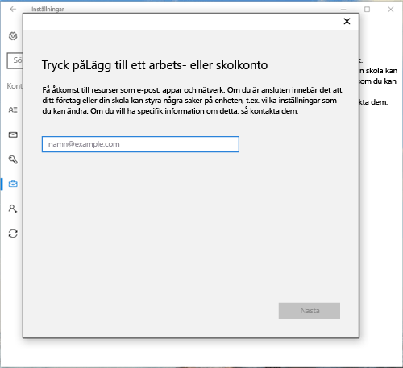
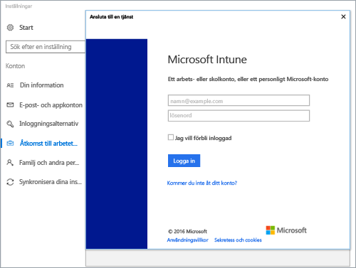
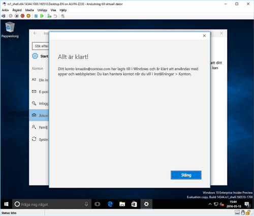
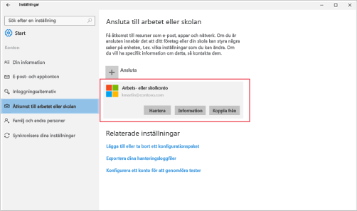

# Registrera din Windows 10-enhet i Intune

> [!NOTE]
> Windows 10 fungerar med alla typer av enheter. Du följer samma steg på datorn, mobiltelefonen eller surfplattan – även om de kan skilja sig något från bilderna på den här sidan.

> [!VIDEO https://channel9.msdn.com/Series/IntuneEnrollment/Windows-Enrollment/player]

1. Gå till **Start**.

   - Om du arbetar på en **Windows 10 Desktop**-enhet går du till **Start-menyn**.
   - Om du arbetar på en **Windows 10 Mobile**-enhet går du till **Startskärmen** och sveper till listan **Alla appar**.

2. Öppna appen **Inställningar** i Windows genom att söka efter ”inställningar” i sökfältet.

3. Välj **Konton** > **Åtkomst till arbete eller skola** > **Anslut**.

    

4. Ange e-postadressen för arbetet eller skolan och välj **Nästa**.

   

5. Logga in på Intune med ditt arbetskonto eller skolkonto.

    

    Ett meddelande visas som anger att ditt företag eller din skola registrerar din enhet.

6. När sidan **Allt är klart!** visas väljer du **Stäng**. Klart.

   

7. Om du vill kontrollera att anslutningen är korrekt går du tillbaka till **Inställningar**, där ditt arbets- eller skolkonto nu ska visas.

    

Om du har följt de föregående stegen, men ändå inte kan komma åt din e-post eller dina filer på arbetet eller i skolan, kan du följa anvisningarna i [Felsökningssteg att följa för Åtkomst för arbete eller skola](troubleshoot-your-windows-10-device-windows.md#troubleshooting-steps-to-follow-if-you-see-access-work-or-school).
