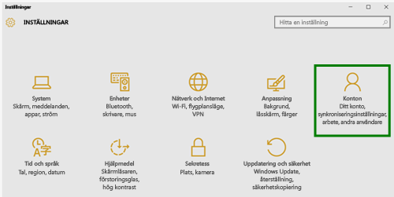
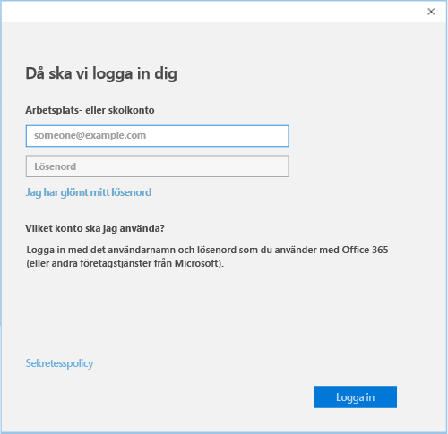

# Registrera din Windows 10-enhet i Intune

  > [!NOTE]
  > Windows 10 fungerar med alla typer av enheter. Du följer samma steg på datorn, mobiltelefonen eller surfplattan – även om de kan skilja sig något från bilderna på den här sidan.

1.  Gå till **Start**.

  - Om du arbetar på en **Windows 10 Desktop**-enhet går du till **Start-menyn**.
  - Om du arbetar på en **Windows 10 Mobile**-enhet går du till **Startskärmen** och sveper till listan **Alla appar**.

2. Öppna appen **Inställningar** i Windows genom att söka efter ”inställningar” i sökfältet.

3. Välj **Konton**.

    

4. Välj **ditt konto**.

    

5. Välj **Lägg till ett arbetsplats- eller skolkonto**.

    

6. Logga in med dina uppgifter för arbets- eller skolkontot.

    

Kan du fortfarande inte komma åt din e-post, dina filer eller andra data för skolan eller arbetet? Försök att åtgärda problemet genom att [felsöka problem med ditt konto](troubleshoot-your-windows-10-device-windows.md#troubleshooting-steps-to-follow-if-you-see-your-account). Om det fortfarande inte fungerar kontaktar du företagets support för ytterligare hjälp.

Ett enkelt sätt att få hjälp från företagets support är via kontaktinformationen som är tillgänglig i företagsportalappen, där du också kan söka efter och ladda ned rekommenderade och nödvändiga appar för ditt dagliga arbete. Det är möjligt att företagsportalappen redan är installerad på din enhet. Ett snabbt sätt att kontrollera detta är att söka på __företagsportalen__ i listan över __alla appar__.

Om du inte ser Företagsportalen i app-listan kan du följa de här stegen för att installera den.

1. Välj **Start** > **Store**.

2. Välj **Sök** och skriv sedan **företagsportal**.

3. I listan med resultat väljer du **Företagsportal** > **Installera**.

4. Välj antingen **Installera** eller på **Ledigt**. Det finns ingen skillnad mellan de här två alternativen. Vilket alternativ som visas beror på hur din organisation har konfigurerat företagsportalappen.
