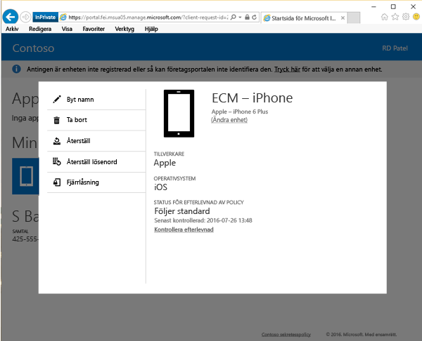

# Byta namn på enheten från företagsportalens webbplats

Du kanske vill byta namn på din enhet för att göra den enklare att identifiera. Du kan göra det från [företagsportalens webbplats](https://portal.manage.microsoft.com#HelpDeskDialog). Företagsportalens webbplats är en webbsida som du kan använda för att hantera datorer och enheter som du har registrerat för hantering med din IT-avdelning.

Så här byter du namn på din enhet:

1. På [webbplatsen för företagsportalen](https://portal.manage.microsoft.com#HelpDeskDialog) trycker du på __menyknappen__  och väljer __Mina enheter__.

2. På sidan __Mina enheter__ väljer du namnet på den enhet som du vill byta namn på.

   

3. Enheten öppnas i ett popup-fönster. Tryck på knappen **Byt namn**.

   

4. Skriv ett nytt namn för din enhet i rutan där enhetsnamnet visas och tryck sedan på knappen **Byt namn**. Nu visas enheten med det nya namnet.

Behöver du fortfarande hjälp? Kontakta företagssupporten. Titta efter IT-administratörens kontaktuppgifter på [företagsportalens webbplats](https://portal.manage.microsoft.com#HelpDeskDialog).
