---
title: Synkronisera Windows-enheten manuellt | Microsoft Docs
description: 
keywords: 
author: barlanmsft
ms.author: barlan
manager: angrobe
ms.date: 05/19/2017
ms.topic: article
ms.prod: 
ms.service: microsoft-intune
ms.technology: 
ms.assetid: 443c6de7-5187-4dc4-b844-6085a0c659bd
searchScope: User help
ROBOTS: 
ms.reviewer: priyar
ms.suite: ems
ms.custom: intune-enduser
ms.openlocfilehash: 1c1ade50ff6a458633598d2788d176dd79cbfebd
ms.sourcegitcommit: f2f147a1177d1cf5bbc8001701eb8f44dd833b7d
ms.translationtype: HT
ms.contentlocale: sv-SE
ms.lasthandoff: 12/12/2017
---
# Synkronisera Windows-enheten manuellt

Att försöka installera en app på en Windows-enhet kan ibland ta längre tid än du förväntar dig. Om det händer kan du prova att manuellt synkronisera din Windows-enhet. Synkronisering kan påskynda installationen.

> [!Note]
> Det kan ta en stund att installera appar om du är på ett nätverk med lägre hastigheter eller många enheter som laddar ner data på samma gång.

Följande versioner av Windows kan synkroniseras manuellt. Om din enhet använder en annan version av Windows kan du tyvärr inte starta en manuell synkronisering.

* [Synkronisera Windows 10 Desktop](#windows-10-desktop)
* [Synkronisera Windows 10 Mobil](#windows-10-mobile)
* [Synkronisera Windows Phone 8.1](#windows-phone-81)

## Windows 10 desktop
Det finns mer än en version av Windows 10, vilket innebär att det finns två uppsättningar steg. Om du är osäker på vilka steg du ska följa tittar du på skärmbilderna och följer de steg som liknar vad du ser på din enhet.

1. Välj **Start**-knappen och sedan **Inställningar**.

    

2. Välj **Konton** på sidan **Inställningar**.

    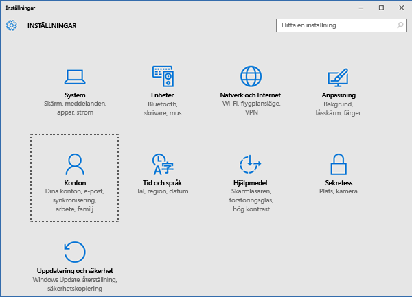

3. Ta en titt på följande två skärmar och se om någon av dem liknar den som visas på din enhet. Följ anvisningarna för den skärm som motsvarar den som visas på din enhet.

    Om du ser den här skärmen, som visar ”Åtkomst till arbete eller skola”, följer du anvisningarna i [Steg som du följer om du ser Åtkomst till arbete eller skola](#steps-to-follow-if-you-see-access-work-or-school).

    

    Om du ser den här skärmen, som visar ”Åtkomst till arbete”, följer du stegen i [Steg som du följer om du ser Åtkomst till arbete](#steps-to-follow-if-you-see-work-access).

    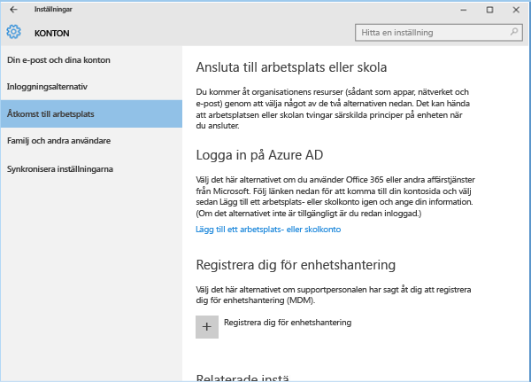

### Steg för att följa om du ser Åtkomst för arbete eller skola

1. Välj **Åtkomst till arbete eller skola** på sidan **Konton**.

    

2. Välj ditt arbets- eller skolkonto. Beroende på hur företagets support har konfigurerat inställningarna kanske du ser två konton som liknar de i exemplet nedan. Ett konto visas med en portfölj och det andra med Microsoft-logotypen.

    - Om du ser kontot med portföljen väljer du det och letar efter knappen **Information** under kontot.
    - Om du bara ser kontot med Microsoft-logotypen väljer du kontot och letar efter knappen **Information** under kontot.

    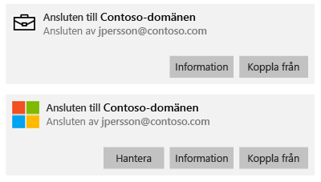

3. Välj knappen **Information**. En dialogruta öppnas som liknar den i exemplet nedan.

    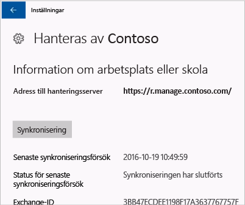

4. Välj knappen **Synkronisera**. Enheten kommer att synkroniseras med Intune.

### Steg som du följer om du ser Åtkomst till arbete

1. Välj **Åtkomst till arbetsplats** på sidan **Konton**.

    

2. Under avsnittet **Registrera dig för hantering av mobilenheter (MDM)** väljer du namnet på ditt företag.

    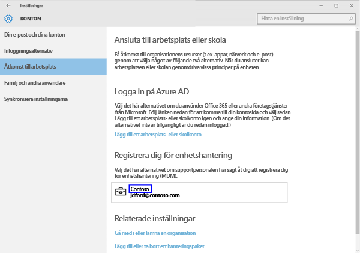

3. Välj knappen **Synkronisera**.

    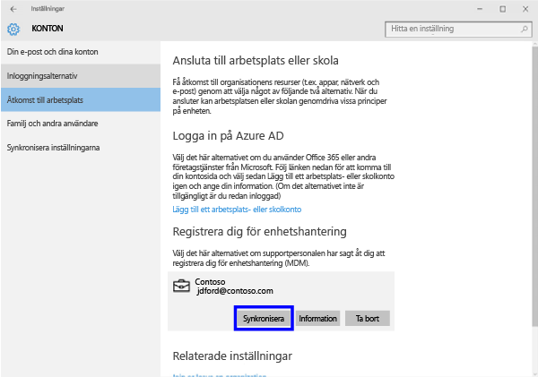

   Knappen är nedtonad tills synkroniseringen är färdig.

### Windows 10 Mobil
Så här synkroniserar du en Windows 10 Mobile-enhet manuellt för att påskynda en långsam appinstallation:

   1. Gå till **Alla appar** > **Inställningar** > **Konton**.

       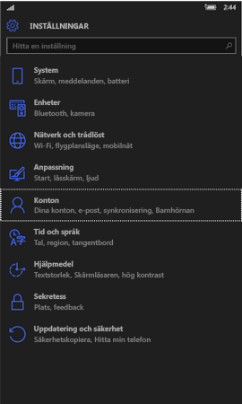

   2. Tryck på **Åtkomst till arbetsplats**.

       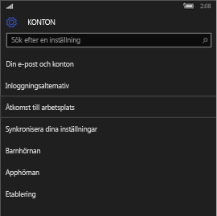

   3. Välj företagets namn under **Registrera dig för hantering av mobilenheter**.

       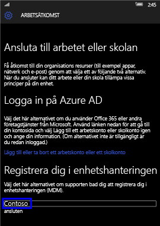

   4. Tryck på ikonen **Synkronisera**.

       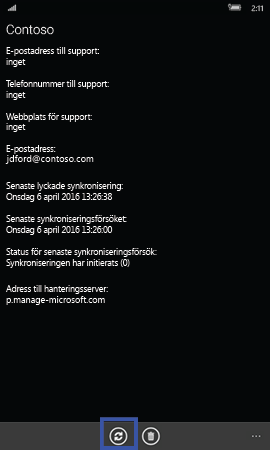

       Ett meddelande som anger att ditt konto synkroniseras visas längst upp på skärmen. Knappen **Synkronisera** är nedtonad tills synkroniseringen är klar.

## Windows Phone 8.1
Så här synkroniserar du en Windows Phone 8.1-enhet manuellt för att påskynda en långsam appinstallation:

1. Gå till **Alla appar** > **Inställningar** > **arbetsplats**.

    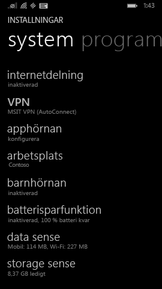

2. Välj namnet på ditt företag.

    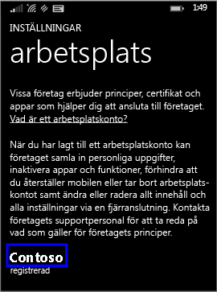

3. Tryck på ikonen **Synkronisera**.

    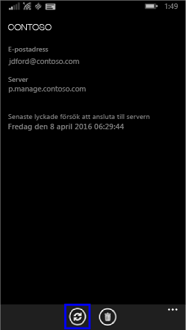

   Ett meddelande som anger att ditt konto synkroniseras visas längst upp på skärmen tills synkroniseringen är klar.

Behöver du fortfarande hjälp? Kontakta företagssupporten. Titta efter IT-administratörens kontaktuppgifter på [företagsportalens webbplats](https://portal.manage.microsoft.com#HelpDeskDialog).
