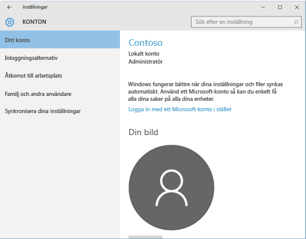

# Felsöka registreringen av din Windows 10-enhet
Om du har följt stegen i [Registrera din mobila eller stationära Windows 10-enhet i Intune](enroll-your-w10-phone-or-w10-pc-windows.md), men ändå inte har åtkomst till din e-post eller filer på arbetet eller i skolan, så försök med följande felsökningsåtgärder.

1.  Ta en titt på de två följande skärmarna och se om någon av dem liknar vad du ser på din enhet. Följ de steg som gäller för den skärm som du ser på din enhet.

    Om denna skärm visas följer du stegen i [Felsökningssteg att följa om du ser Åtkomst för arbete eller skola](#troubleshooting-steps-to-follow-if-you-see-access-work-or-school).

    

    Om denna skärm visas följer du stegen i [Felsökningssteg att följa om du ser Ditt konto](#troubleshooting-steps-to-follow-if-you-see-your-account).

    

## Felsökningssteg att följa om du ser ”Åtkomst till arbete eller skola”

1.  Om du följde stegen ovan men ändå inte har åtkomst till din e-post eller dina filer på arbetet eller i skolan går du tillbaka till **Åtkomst för arbete eller skola**.

2. Gör något av följande:

    - Om du ser en anslutning som liknar bilden nedan, så tryck på den och kontrollera sedan om alternativen Hantera, Information och Koppla från visas. Om dessa alternativ visas innebär det att du är registrerad och ansluten.

    

    - Om du anslutningsinformationen ovan inte visas, eller om det visas, men utan något eller några av alternativen, så tryck på **Anslut** och logga sedan in med autentiseringsuppgifterna för ditt arbets- eller skolkonto. Nu bör du vara ansluten.

## Felsökningssteg att följa om du ser ”Ditt konto”

Om du följde stegen ovan men ändå inte har åtkomst till din e-post, dina filer eller annan information på arbetet eller i skolan, så gå tillbaka till **Konton** och tryck på **Åtkomst till arbetsplats**.

- Ser du ditt konto för arbetet eller skolan? Grattis! Du är ansluten.

- Om du inte ser ditt arbets- eller skolkonto trycker du på **Anslut** och loggar in med dina användaruppgifter.

## Felsökningssteg att följa om du ser ”Skapa ett arbets- eller skolkonto”

Om du ser meddelandet __Det gick inte att automatiskt identifiera en hanteringsslutpunkt som matchar användarnamnet. Kontrollera användarnamnet och försök igen. Ange URL:en till hanteringsslutpunkten om du känner till den.__ ska du inte försöka ange ditt användarnamn och lösenord på nytt. Om det fortfarande inte fungerar ska du kontakta företagets support för att få information om den webbplats du ska ange i textrutan **Hanteringsslutpunkt**. Detta är en webbplats som troligtvis har formatet **www.dittföretag.onmicrosoft.com**.

Behöver du fortfarande hjälp? Kontakta företagssupporten. Titta efter IT-administratörens kontaktuppgifter på [företagsportalens webbplats](https://portal.manage.microsoft.com#HelpDeskDialog).
