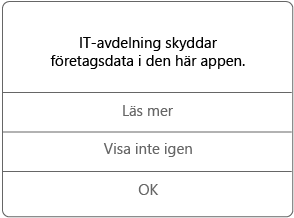

# Använda hanterade appar på Android-enheten

Hanterade appar är appar som företagets support kan konfigurera för att skydda företagsdata som du kan komma åt i appen. När du använder företagets data i en hanterad app på en Android-enhet kanske du märker att appen inte fungerar riktigt som du förväntat dig. Du kanske inte kan kopiera och klistra in skyddade företagsdata, eller så kanske du inte kan spara data på vissa platser.

Det kan också finnas flera hanterade appar som samverkar med varandra i enheten. Det gör att du kan utföra dina vardagsuppgifter samtidigt som företagets data skyddas. Om du till exempel öppnar en företagsfil i en hanterad app, och en annan hanterad app krävs för att visa filen, öppnas automatiskt den hanterade appen som gör att du kan visa filen. Om en nödvändig app inte är tillgänglig kanske du inte kan komma åt alla åtgärder. Du kanske inte kan öppna ett dokument eller använda en webblänk i ett hanterat dokument.

När du använder företagsdata i en hanterad app visas ett meddelande (se nedan) så att du vet att appen du öppnar är en hanterad app.

## Hur skaffar jag hanterade appar?
Du kan hämta hanterade appar på ett par olika sätt:

-   När enheten har registrerats i Microsoft Intune installerar du appen från företagsportalappen eller företagsportalwebbplatsen. Alternativt kan företagets support installera den på enheten. Mer information om registrering finns i [Registrera din enhet i Intune](enroll-your-device-in-Intune-android.md).

-   Du installerar en app från Play Store och loggar sedan in med ditt företagskonto som hanteras av Intune.

## Vad kan företagets support hantera i en app?
Följande är några exempel på vad företagets support kan hantera i en app och hur det kan påverka din användning av företagsdata på enheten:

-   Åtkomst till vissa webbplatser

-   Överföring av data mellan appar

-   Spara filer

-   Kopiera och klistra in

-   Krav på åtkomst via PIN-kod

-   Din inloggning, med företagets autentiseringsuppgifter

-   Möjligheten att säkerhetskopiera till molnet

-   Möjligheten att ta skärmdumpar

-   Krav på datakryptering

Några vanliga appar som IT-avdelningen kan hantera:

-   Intune Managed Browser

-   Intune Image Viewer

-   Intune PDF Viewer

-   Intune AV Player

-   Microsoft Word, Excel och PowerPoint

Kontakta företagets support om du vill ha mer information om hanterade appar på enheten. Titta efter IT-administratörens kontaktuppgifter på [företagsportalens webbplats](https://portal.manage.microsoft.com#HelpDeskDialog).
