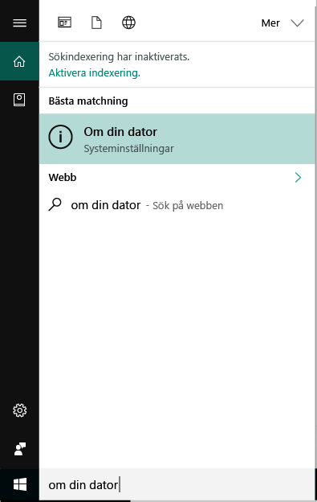
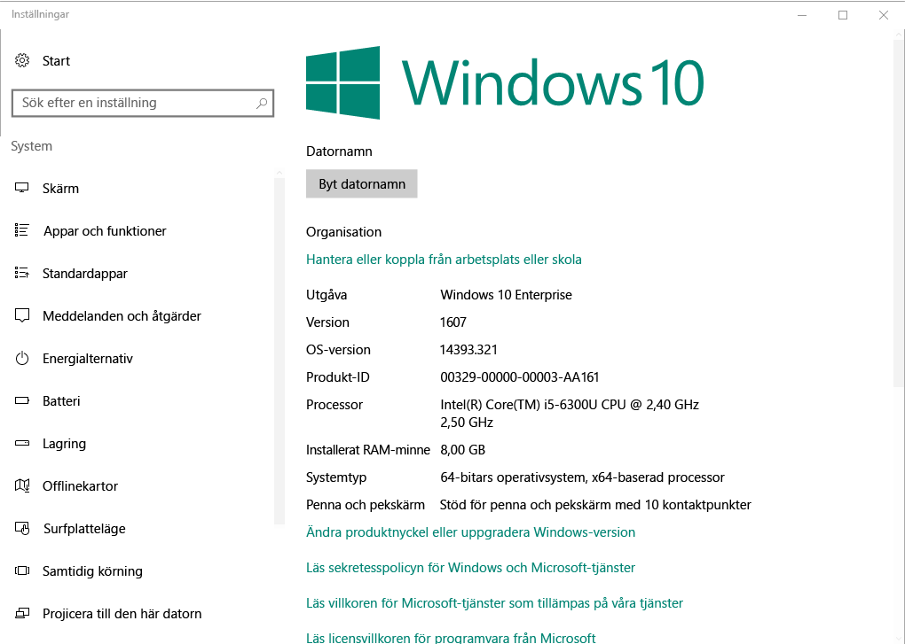

# Registrering av Windows-enheter i Intune-Företagsportalen  

Registrera din Windows-enhet i Intune-företagsportal-appen för att få säker åtkomst till arbete och skola appar, e-postmeddelanden och filer. Om din organisation kräver eller rekommenderar vissa appar, till exempel Office eller OneDrive, får antingen du dem under registreringen eller de är tillgängliga i Företagsportalen efter registreringen.  

Du kan registrera Windows 10-enheter via Företagsportalens webbplats *eller* app. Om du registrerar en enhet med en tidigare version av Windows, måste du registrera enheten via Företagsportalens webbplats.  

## Installera företagsportalappen  
Du kanske redan har företagsportalappen installerad på din enhet. Sök efter appen i din __alla appar__ lista.  Om du inte ser företagsportalen i applistan kan du följa de här stegen för att installera den.  

1. Öppna **Microsoft Store** på din enhet.

2. I den **Search** skriver **Företagsportalen**.

3. I listan med resultat väljer du **Företagsportal** > **Installera**.

4. Välj antingen **Installera** eller på **Ledigt**. Det finns ingen skillnad mellan de här två alternativen; orden visas baserat på hur din organisation har konfigurerat appen.  

## Hitta versionsnumret för Windows 10  
Registreringssteg skiljer sig åt för olika versioner av Windows 10-enheter. Följande steg beskriver hur du hittar det lägre versionsnumret för Windows 10 desktop och mobile-enheter. När du vet att din version kan fortsätta att rekommenderade registreringsanvisningarna.  

### Windows 10 Desktop-enheter  

1. Gå till **Start**.

2. I sökfältet, skriver du frasen ”om din dator”. Välj __om din dator__ från resultaten.  

     

3. Rulla ned till **Windows specifikationer** att hitta den **Version** av Windows 10 som är installerad på din dator.  

     

4. Om du har version  

    *  __1607 eller senare__: registrera din enhet med hjälp av den [ **inställningar** > **konto** > **åtkomst till arbete eller skola**väg](enroll-windows-10-device.md#enroll-windows-10-version-1607-and-later-device).   
    * __1511 eller tidigare__: registrera din enhet med hjälp av den [ **inställningar** > **konto** > **dina konton** väg](enroll-windows-10-device.md#enroll-windows-10-version-1511-and-earlier-device).  

### Windows 10 Mobile-enheter       

1.  Gå till __alla appar__ och välj den __inställningar__ app.  
2.  Välj __System__ > __Om__.      
3.  Under __enhetsinformation__, hitta den __Version__.  
4. Om du har version  

    *  __1607 eller senare__: registrera din enhet med hjälp av den [ **inställningar** > **åtkomst till arbete eller skola** väg](enroll-windows-10-device.md#enroll-windows-10-version-1607-and-later-device).   
    * __1511 eller tidigare__: registrera din enhet med hjälp av den [ **inställningar** > **konton** väg](enroll-windows-10-device.md#enroll-windows-10-version-1511-and-earlier-device).  

## Registrera icke Windows 10-enheter  
Använd följande artiklar för att registrera andra Windows-enheter som stöds via Företagsportalens webbplats:   
* [Windows 8.1- eller Windows RT 8.1-enhet](enroll-your-W81-or-rt81-windows.md)  
* [Windows Phone 8.1-enhet](enroll-your-wp81-windows.md)    

## Nästa steg  
Nu när du vet att enheterna som stöds och versionsnumret Windows 10, fortsätter du till artikeln rekommenderade registrering.  
 
Mer information om hantering av enheter finns Företagsportalen och hur både används i skolor och på jobbet, i följande artiklar:  
* [Använda hanterade enheter för att få åtkomst arbets- eller skolresurs](use-managed-devices-to-get-work-done.md)  
* [Vad händer när du registrerar din enhet i Intune](what-happens-if-you-install-the-company-portal-app-and-enroll-your-device-in-intune-windows.md)  
* [Vilken information kan min organisation se när jag registrerar min enhet?](what-info-can-your-company-see-when-you-enroll-your-device-in-intune.md)  

Behöver du hjälp? Kontakta företagssupporten. [Gå till webbplatsen för Företagsportalen](https://go.microsoft.com/fwlink/?linkid=2010980) att hitta din organisations IT kontaktinformation.  
