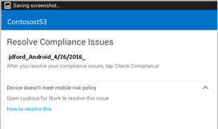

# Lösa ett hot som hittas av Symantec Endpoint Protection Mobile

Symantec Endpoint Protection Mobile har hittat ett potentiellt hot på enheten och du måste åtgärda problemet för att få åtkomst till din e-post, appar och filer för företaget eller skolan. Meddelandet som visas kan se ut ungefär så här:

Åtgärda problemet genom att öppna appen Symantec Endpoint Protection Mobile och följa anvisningarna som visas i appen.

## Vad som kan visas om den registrerade enhetens åtkomst till e-post eller filer blockeras

Om det finns ett virus eller andra säkerhetshot på den registrerade enheten och du försöker få åtkomst till ditt e-postkonto eller filer hos företaget visas ett meddelande som liknar detta:

Tryck på **enhetshanteringsportalens** länk till [företagsportalens webbplats](https://portal.manage.microsoft.com#HelpDeskDialog), där du får anvisningar om hur du kan lösa problemet.

## Exempel på en app som Symantec Endpoint Protection Mobile ser som ett hot

Om du har installerat en app som Symantec Endpoint Protection Mobile uppfattar som ett hot visas en skärmbild som liknar denna:

När du har avinstallerat appen återfår du omedelbart åtkomst till e-post och data hos företaget. Om du ignorerar rekommendationen om att avinstallera appen förlorar du åtkomsten till din e-post och dina data fram till dess att du avinstallerar appen.

Behöver du fortfarande hjälp? Kontakta företagssupporten. Titta efter IT-administratörens kontaktuppgifter på [företagsportalens webbplats](https://portal.manage.microsoft.com#HelpDeskDialog).

